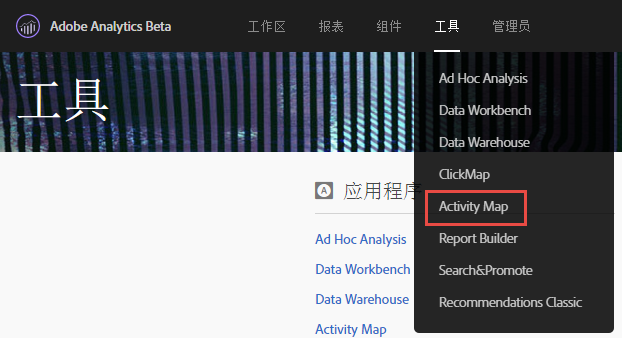
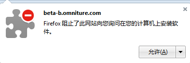
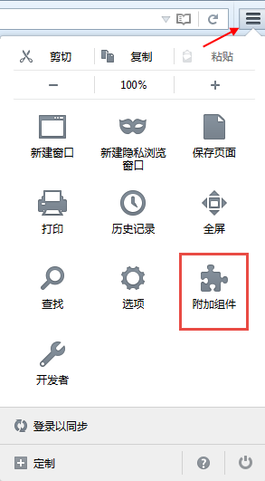

# 安 [!DNL Activity Map] 装浏览器插件{#install-activity-map-browser-plug-ins}

具体的安装过程会因为您所使用的浏览器而有所不同。

[!DNL Activity Map] 浏览器插件：

* 作为 Analytics 页面标签而手动插入。
* 通过浏览器工具栏中的按钮或菜单项启动。
* 仅与这些桌面浏览器的最新版本兼容：Internet Explorer、Firefox和Chrome。
* 支持&#x200B;**[!UICONTROL 请记住我的登录信息]功能。**
* ****[!DNL Activity Map]可以将 工具栏插入不包含 Analytics 页面代码的网页。如果页面不包含 Analytics 页面代码，则会显示错误消息。
* 要求您完成浏览器插件安装进程。

## Install [!DNL Activity Map] plug-in on Chrome {#section_6907253D5D5E4422967E6439207A013F}

1. Go to **[!UICONTROL Adobe Analytics]** &gt; **[!UICONTROL Tools]** &gt; **[!UICONTROL [!DNL Activity Map]]**.  

1. Click **[!UICONTROL Download[!DNL Activity Map]]**.
1. Click **[!UICONTROL Install the[!DNL Activity Map]Plug-in]**.
1. 当安全警告询问您是否要下载 浏览器插件时，请回答&#x200B;**[!UICONTROL 是]。**[!DNL Activity Map]
1. 下载完成后，找到 .zip 文件的位置并解压缩其内容。
1. Return to Chrome's address bar and enter `chrome://extensions`.
1. 选中“开发者模式”复选框。
1. 单击“加载已解压的扩展程序”，然后从弹出式窗口中选择已解压的文件夹。
1. If you see an Adobe Analytics icon  {width="70px"} added to your tool bar, your download was successful. You can now [launch [!DNL Activity Map]](/help/analyze/activity-map/activitymap-getting-started/activitymap-getting-started-users/activitymap-launch.md) from your page.

## Install [!DNL Activity Map] plug-in on Firefox {#section_1F69D3D22DB34D6992747B1A62C1D2DA}

1. 转到 **[!UICONTROL Analytics]** &gt; **[!UICONTROL [!DNL Activity Map]]**。

1. Click **[!UICONTROL Download[!DNL Activity Map]]**.
1. Click **[!UICONTROL Install the[!DNL Activity Map]Plug-in]**.
1. Click **[!UICONTROL Allow]** when this message appears: 

1. Click **[!UICONTROL Install Now]**.
1. Click the **[!UICONTROL Open Menu]** icon at the top right and select **[!UICONTROL Add-Ons]**. {width="250px"}

1. [!DNL Activity Map] 应该被列为 Firefox 的附加组件之一。
1. 如果您看到工具栏上新增了 Adobe Analytics 图标 You can now [launch [!DNL Activity Map]](/help/analyze/activity-map/activitymap-getting-started/activitymap-getting-started-users/activitymap-launch.md) from your page.

## Install [!DNL Activity Map] plug-in on Internet Explorer {#section_1A33705D7F784C4A88C9026ADC860FB8}

1. 转到 **[!UICONTROL Analytics]** &gt; **[!UICONTROL [!DNL Activity Map]]**。

1. Click **[!UICONTROL Download[!DNL Activity Map]]**.
1. Click **[!UICONTROL Install the[!DNL Activity Map]Plug-in]**.
1. Click **[!UICONTROL Run]** to initiate the [!DNL Activity Map] installation.
1. 单击弹出式窗口中的&#x200B;**[!UICONTROL 是]，以允许程序对计算机进行更改。**
1. 按照安装向导中的说明进行操作。
1. If [!DNL Activity Map] was successfully installed, you will see a notification in Internet Explorer saying that the [!DNL Activity Map] Toolbar is ready for use. 启用此工具栏以开始使用此应用程序。You can now [launch [!DNL Activity Map]](/help/analyze/activity-map/activitymap-getting-started/activitymap-getting-started-users/activitymap-launch.md) from your page.
