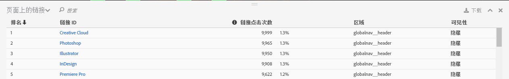
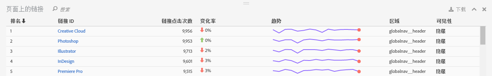

# 链接报告

链接报表可以针对在当前页面上找到的链接进行报告。它并非根据为此页面收集的所有链接进行报告。

“页面上的链接”报表可以提供链接的表格视图。有时，您或许希望在一个视图中查看链接点击次数（或其他量度）的排名。这可以让您更好地将某一个链接与其他链接进行比较。创建“页面上的链接”报表，其中包括页面上所有链接的排名列表（按链接 ID 排序）、点击信息（点击次数及百分比值），以及页面中的区域。单击 Activity Map 工具栏中的“页面上的链接”报表按钮。

**[!UICONTROL 页面上的链接]报表会在 Activity Map 功能板的浏览器框架下方打开。**

## Standard mode {#section_C8D2A1C07A2A4E3A8F84AC9240603FA7}

在标准模式下，“页面上的链接”报表可以显示某一天或多天范围的链接数据 - 在整个日期范围的基础上汇集而成。报表中将显示各个链接的以下信息：

<table id="table_3DE41B2CFA644B70AF802A3123CE51D9"> 
 <thead> 
  <tr> 
   <th colname="col1" class="entry"> 列 </th> 
   <th colname="col2" class="entry"> 描述 </th> 
  </tr> 
 </thead>
 <tbody> 
  <tr> 
   <td colname="col1"> 排名 </td> 
   <td colname="col2"> 在页面中的排名。在标准模式下，无论您点击哪一列，排名值都保持不变。 </td> 
  </tr> 
  <tr> 
   <td colname="col1"> 链接 ID </td> 
   <td colname="col2">链接的主要ID(有关主ID如何定义[新链接跟踪方法]的更多信息，请参阅/home/analyze/activity-map/activitymap-link-tracking/activitymap-link-tracking-method. md) </td> 
  </tr> 
  <tr> 
   <td colname="col1"> 点击量 </td> 
   <td colname="col2"> 特定链接的原始点击次数及其占页面上总点击次数的百分比。如果用户在工具栏中选择其他量度，则链接报表将改为针对该量度进行报告。 </td> 
  </tr> 
  <tr> 
   <td colname="col1"> 区域 </td> 
   <td colname="col2"> 表示链接在页面上所在的区域。 </td> 
  </tr> 
  <tr> 
   <td colname="col1"> 可见性 </td> 
   <td colname="col2">与链接的可见性状态相关。可能会出现以下两种值： 
    <ul id="ul_BABCC0F64145407C9D439150A6898E6D">
     <li id="li_9AF0479BDCEB4A44A37292FAABFA83A5"><b>隐藏</b>：链接当前位于页面中，但是最终用户看不到（就像导航菜单中的子菜单一样，仅当用户将鼠标悬停在父菜单上方时，才会显示出子菜单） </li>
     <li id="li_C6FA4EC27EDD4341AB9821E2B4BC9E60"><b>显示</b>：链接当前显示在页面上。但是，链接可能位于不明显的位置：用户必须滚动页面方可看到此链接。 </li>
    </ul>
注意：如果链接被设置为“隐藏”，则不会为此链接显示叠加图。 
</td> 
  </tr> 
 </tbody> 
</table>

**过滤数据**

如果您希望专门关注特定链接，则可以在&#x200B;**[!UICONTROL 过滤数据]字段中搜索相关词条。**&#x200B;只有与搜索条件相匹配的链接，才会拥有叠加图。如果没有过滤器，则会在 [Activity Map 设置](/help/analyze/activity-map/activitymap-overlay-settings.md)中显示指定的叠加图。

## Live mode {#section_AC1967217B5A4532ACB01D33636F6770}

在实时模式下，“页面上的链接”报告显示跨越几分钟的趋势数据。

<table id="table_61D1FB0F02894055A1AB394DE4FE4742"> 
 <thead> 
  <tr> 
   <th colname="col1" class="entry"> 列 </th> 
   <th colname="col2" class="entry"> 描述 </th> 
  </tr> 
 </thead>
 <tbody> 
  <tr> 
   <td colname="col1"> 排名 </td> 
   <td colname="col2"> 在页面中的排名。如果是渐变或气泡叠加图，无论您点击哪一列，排名值都保持不变。如果是获胜方/失败方叠加图，则排名值会根据哪些链接得/失最多而发生变化。 </td> 
  </tr> 
  <tr> 
   <td colname="col1"> 链接 ID </td> 
   <td colname="col2">链接的主 ID。有关主ID如何由新[链接跟踪方法]定义的更多信息，请(/help/analytics/activity-map/activitymap-link-tracking/activitymap-tracking-tracking-method. md)。 </td> 
  </tr> 
  <tr> 
   <td colname="col1"> 链接点击次数 </td> 
   <td colname="col2"> 选定时间段内的点击总次数。 </td> 
  </tr> 
  <tr> 
   <td colname="col1"> 变更率 </td> 
   <td colname="col2"> 当前时段链接量度与上一时段链接量度之间的变更率。负变更率显示为红色，正变更率显示为绿色。 </td> 
  </tr> 
  <tr> 
   <td colname="col1"> 趋势 </td> 
   <td colname="col2"> 由所有收集的时段构成的折线图。当前选定的时段用绿色的标记来指示。当前鼠标悬浮在上面的时段用红色的标记来指示。 </td> 
  </tr> 
  <tr> 
   <td colname="col1"> 区域 </td> 
   <td colname="col2"> 表示链接在页面上所在的区域。 </td> 
  </tr> 
  <tr> 
   <td colname="col1"> 可见性 </td> 
   <td colname="col2">与链接的可见性状态相关。可能会出现以下两种值： 
    <ul id="ul_B10C55ED4D3C4CF99506DC467E2E7CFB">
     <li id="li_EA646722A51041CC9E62C56DEF92C81F">隐藏：链接当前位于页面中，但是您看不到（例如，页面加载后出现的任何链接。） </li>
     <li id="li_F9543614C2894003AC9984A7404E2785">显示：链接当前显示在页面上。但是，链接可能位于不明显的位置：您必须滚动页面方可看到此链接。 </li>
    </ul></td> 
  </tr> 
 </tbody> 
</table>

## Sorting and filtering {#section_4B8E8233C21247CAA70DAEC2156548AD}

有时，您只需分析特定页面区域的结果（例如，左侧面板），即可决定如何组织网页中此特定区域的内容。

为此，我们在“页面上的链接”报表中创建了链接的排序和过滤功能。过滤可以通过过滤器字段实现，搜索词将应用在“链接 ID”列和“链接区域”列。排序可以通过单击调用项（排名、链接 ID、点击量、随时间变化、区域、可见性）来实现，并且可以按照升序和降序排列。将链接从“页面上的链接”报表过滤掉之后，叠加图就会从网站上消失。
