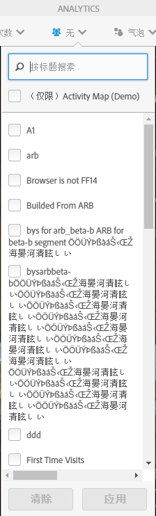
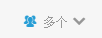

# 客户分段

允许您在 Activity Map 中应用多区段过滤器。

>[!NOTE]
>
>区段控制仅在标准模式下可用，因为Adobe Analytics平台不支持分段实时数据。

You can select one or several of the segments from the **[!UICONTROL Segments]**drop-down menu shown below. 列出的区段与您所拥有的区段或者通过“Reports &amp; Analytics”与您共享的区段（用于选定的报表包）相同。

更改区段选择后，以及关闭区段选择器后，会为应用程序中显示的所有量度启动新的 Analytics 数据检索进程。当从一个页面导航至另一个页面时，所选择的区段会被记录下来。

当选择多个区段时，区段选择标签（处于折叠状态）将显示“多个”。当您点击控件时，将显示完整的选定区段列表。

选定区段将被应用于 Activity Map 中存在的所有 Analytics 报表，例如叠加图、**[!UICONTROL 页面上的链接]**&#x200B;和&#x200B;**详细信息页面]报表。[!UICONTROL **
