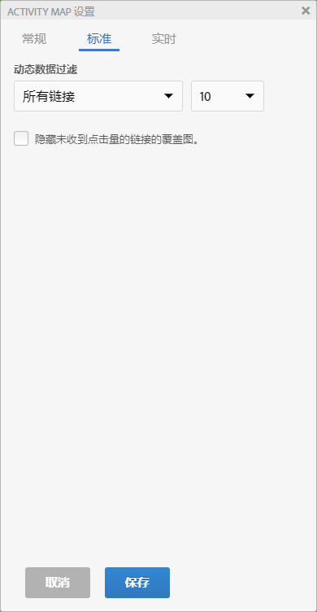
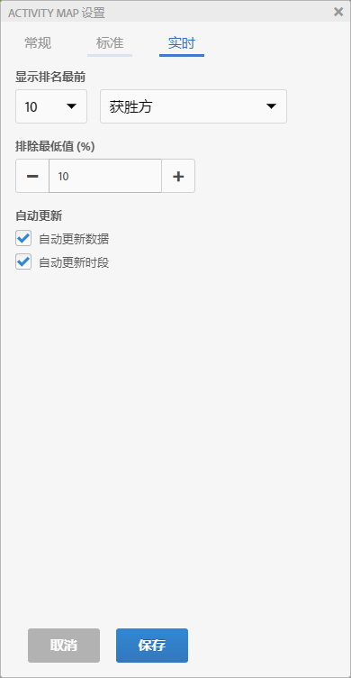
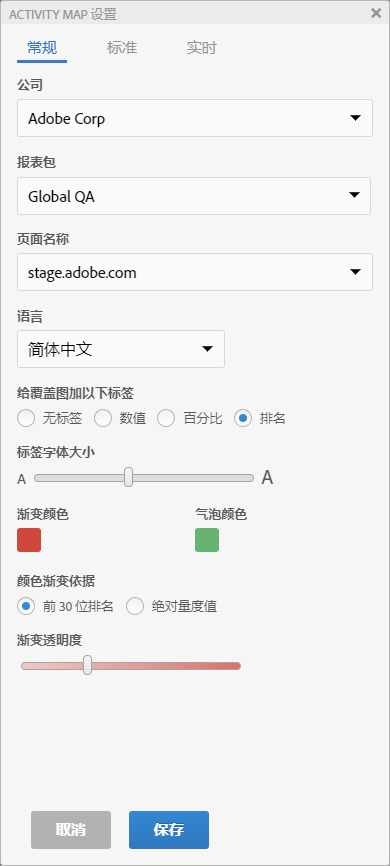

# 配置活动地图设置

您可以通过“Activity Map 设置”面板，为所有类型的叠加图可视化修改设置和属性。

通过单击 Activity Map 工具栏中的齿轮图标，可以访问“Activity Map 设置”面板。

设置面板会根据选定的应用程序模式，显示不同的内容。“其他”选项卡则包含的是一些常规设置。

| 标准 | **[!UICONTROL 渐变]**&#x200B;叠加图或&#x200B;**[!UICONTROL 气泡]叠加图** |
|---|---|
| 实时 | **[!UICONTROL Gainers&amp; Losers]**、 **[!UICONTROL Gradient]**、 **[!UICONTROL Bubble]** Overlays |
| 其他 | 报表包选择和语言选择 |

## Settings for standard mode overlay {#section_24DB95376E1A448494ECF3F57743FC19}

<table id="table_0244107DE6D142F2A1DA4882E0ED9826"> 
 <thead> 
  <tr> 
   <th colname="col2" class="entry"> 设置 </th> 
   <th colname="col3" class="entry"> 描述 </th> 
  </tr> 
 </thead>
 <tbody> 
  <tr> 
   <td colname="col2">  为叠加图添加以下标签 </td> 
   <td colname="col3"> 
    <ul id="ul_13AD02789F2D4904A35215A8FA230F3E"> 
     <li id="li_8DB71636D2074C69B0D94D3FB0CAFE28"> <b>没有标签</b>：仅适用于渐变叠加图。在这种情况下，叠加图的颜色用于显示链接的排名 </li> 
     <li id="li_39C98D7EA9514C1D8731B9D21C0E73A6"> <b>数值</b>：该链接的原始总量度 </li> 
     <li id="li_A5F583E45BCD4F2399398F9DCC7FE382"> <b>百分比</b>：该链接的量度与页面总量度的百分比。 </li> 
     <li id="li_E4BF7D3B863E4B6C8E737CF29ADA9D67"> <b>排名</b>：该链接在呈现的页面所展示的全部链接中的排名 </li> 
    </ul> </td> 
  </tr> 
  <tr> 
   <td colname="col2">  标签字体大小 </td> 
   <td colname="col3"> 允许您使用滑块来增加/缩减叠加图标签的字体大小，以改善可读性。 </td> 
  </tr> 
  <tr> 
   <td colname="col2">  显示 </td> 
   <td colname="col3">选择要显示在叠加图中的排名最前的、最低值或所有链接。如果您选择“排名最前的”或“最低值”，则必须同时选择要显示的链接个数。 </td> 
  </tr> 
  <tr> 
   <td colname="col2"> 隐藏未获得任何点击量的链接所对应的叠加图。 </td> 
   <td colname="col3"> 此复选框允许您隐藏未获得任何点击量的链接所对应的叠加图，以减少界面上的混乱。 </td> 
  </tr> 
  <tr> 
   <td colname="col2">  渐变颜色/气泡颜色 </td> 
   <td colname="col3">从一系列颜色中进行选择，以显示渐变或气泡叠加图可视化的叠加链接排名。 </td> 
  </tr> 
  <tr> 
   <td colname="col2">  颜色渐变依据 </td> 
   <td colname="col3"> 
    <ul id="ul_1B5C2A44A9EB465D8B8E9AD91AF79D69"> 
     <li id="li_C983CB68B90B492BB0774254292B5961"> 前 30 位排名：颜色浓度可以被标准化为前 30 位的值。 </li> 
     <li id="li_1E83431C8C734AB0BC82B5A66AED1189"> 绝对量度值：颜色浓度可以行使绝对量度值的作用。 </li> 
    </ul> </td> 
  </tr> 
  <tr> 
   <td colname="col2">  渐变透明度 </td> 
   <td colname="col3">为渐变叠加图选择透明度。 
此设置不会影响气泡叠加图。 
 </td> 
  </tr> 
 </tbody> 
</table>

## Settings for live mode overlays {#section_D30F6E62FB5D404090B588F396A460AF}

| 设置 | 描述 |
|---|---|
| **[!UICONTROL 显示排名最前的]** | Select number of links to display (or all) and the **[!UICONTROL Gainers]** or **[!UICONTROL Losers]** (or both) to display as overlays. |
| **[!UICONTROL 排除最低值 (%)]** | 选择此选项可利用稀疏数据排除获胜方-失败方链接。按照所需的百分比，将链接变更的最低值排除，以便专门查看拥有足够数据来显示相关得与失的链接。百分比是根据页面上的链接数量计算的。例如，要在包含 200 个链接的列表中筛选出 10% 的最低值，则需要筛选最后 20 个链接。 |
| **[!UICONTROL 自动更新数据]** | 允许您在计算新的时段时，确定是否要自动更新界面中显示的 Analytics 数据。 |
| **[!UICONTROL 自动更新时段]** | 选中此选项后，每次进行新的数据检索时就会刷新网页，这样页面中的链接就可以更加及时地与收集的数据保持同步。 |

## Other settings {#section_697A12F099494D699A4BF498598178C5}

<table id="table_0F560236F8844FA0928CBB9C50D5ABEF"> 
 <tbody> 
  <tr> 
   <td colname="col1"> 报表包 </td> 
   <td colname="col2"> 
您可以访问的报表包列表不再局限于网页标签中定义的报表包。现在，您可以将选定的报表包（对应于页面上的标签之一）替换为其他报表包。不需要将此新报表包链接到页面上的标签。如果您在“Activity Map 设置”中更改选定的报表包，则保存过程中所有受影响的 Analytics 报表都会被刷新。 
 
 
重要：虚拟报表包不兼容实时模式，仅兼容标准模式。如果您在标准报表包的实时模式下，但是在此对话框中选择了虚拟报表包，那么当您在此处单击确定后，将会显示标准模式。 
 
 
此外，日历控件将会被重新初始化，以匹配报表包的日历类型（公历、零售、自定义...）。 
 </td> 
  </tr> 
  <tr> 
   <td colname="col1"> 语言 </td> 
   <td colname="col2"> 语言选项对应于为 Adobe Analytics 提供的语言。 </td> 
  </tr> 
  <tr> 
   <td colname="col1"> 关于 </td> 
   <td colname="col2"> 指示应用程序名称和版本号。 </td> 
  </tr> 
 </tbody> 
</table>

