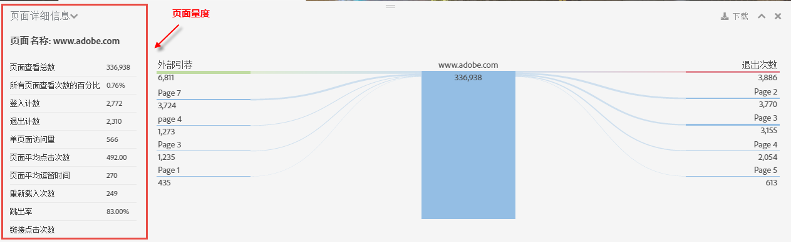

# 页面详细信息

“详细信息页面”选项卡可以将页面报表显示为表格，将页面流量报表显示为蝴蝶结报表。

## Page report {#section_2335A9EFE57B4A7687B397DF2098CC6B}

此面板显示与所访问网页相关的流量量度。如果您访问的网页没有实现 Analytics 页面标签，则不显示该面板。

## Page Flow report {#section_D6EDE78CF7124758BF846E57ADABA234}

左边显示“先前页面”和“引荐”（外部），您也可以扩大显示范围来显示各个类别的前四个条目。

右边显示排名前四的“后续页面”以及退出次数。

如果面向此区域显示的任意内部页面来跟踪 URL，则该页面将显示为链接。因此，您可以单击此页面，并继续访问与此页面关系最为密切的页面的路径。所以说，此报表可以让您从 Web 分析的角度，以交互方式浏览您的 Web 属性。

页面流量报表只能在标准模式下使用。

| **页面流量** | **描述** |
|---|---|
| 外部引荐 | 引荐至当前页面的其他网站的 URL。 |
| 先前页面 | 报表包中当前页面之前的内部页面的名称。 |
| 后续页面 | 离开当前页面后访问的页面。 |
| 网站退出量 | 查看网页后完全退出网站的访客数量。 |

