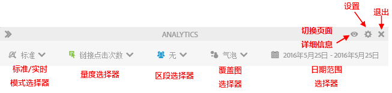
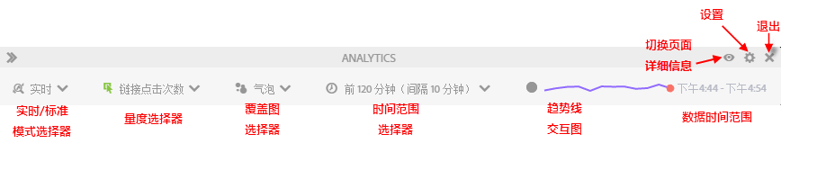

# 标准模式与实时模式的对比

Activity Map 提供了两种基本模式，它们可以在报告页面活动时进行相互补充。

* 标准模式。在这种模式下，[页面上的链接报表](/help/analyze/activity-map/activitymap-links-report.md)可以显示一天到多天的链接数据 - 在整个日期范围的基础上汇集而成。
* 实时模式。在这种模式下，可以实时显示活动趋势。

通过单击工具栏上的“模式”按钮，可以在这两种模式之间切换。

## 标准模式 {#section_0C755F30B7EC4A13A62AB9A391AF51E6}

在&#x200B;**标准模式**&#x200B;下，您可以在工具栏中选择日期范围，如下所示。

在此模式下，未启用“参与率”的商务量度是线性分配的。例如，假设用户单击主页上的“IPod mini”链接，然后浏览了 3 个以上的页面。在第 4 页上，他以 200 美元的价格购买了 IPod mini。“IPod mini”链接将获得 200 美元的参与收入和 50 美元（200 美元/4）的收入（线性分配收入）。

问：如果一个页面在不同区域中包含多个使用了相同链接名称的链接，会怎么样？两个链接在页面上属于不同的区域，但拥有相同链接名称，它们是否会分别获得信用？

答：这取决于您如何聚合链接数据。在 Activity Map 中，我们查看给定页面的链接 ID | 区域，因此分配的数据是针对“链接 ID | 区域”两者的组合。在这种情况下，由于区域不同，链接 | 区域也将不同，因此第一链接 | 区域分配的所有收入将不同于第二链接分配的所有收入。但是在 Adobe Analytics 用户界面中，您只能查看给定页面（按链接划分的页面）的链接 ID 报表（而不是链接 | 区域报表）。在这种情况下，将会汇总这两个区域的收入。

## 实时模式 {#section_D619B77D89A840F0B1C2DEA2715A516A}

在&#x200B;**实时模式**&#x200B;下，Analytics 数据会以 1 至 15 分钟的时间增量为间隔，来显示趋势。此模式的核心作用在于分析和监控网页的短期趋势。

实时模式能够响应出版组织的需求。这些组织需要针对一些关键的页面，监控链接受欢迎程度的微观趋势。对于您的出版业务而言，迅速辨别哪些链接不受欢迎或者哪些链接受欢迎的程度上升，是非常重要的。

>[!IMPORTANT]
>
>虚拟报告包与Live Mode不兼容，仅具有标准模式。

