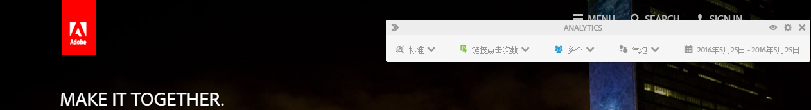
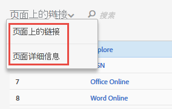

# 活动地图用户界面

Activity Map UI 由两部分组成：

* 顶部窗口，其中包含网页以及插入式叠加图和工具栏。
* 底部面板，用于显示报表。

## Top panel {#section_2DA8ACD35D4C4ACBA32C13EFB5317E7C}

在顶部面板中，您可以看到您的网页、[插入式工具栏](/help/analyze/activity-map/activitymap-standard-live.md)和[链接叠加图](/help/analyze/activity-map/activitymap-gainerslosers.md)。气泡排名会显示在链接上方，便于您识别点击总量。

对于其他的链接详细信息，您可以通过将鼠标悬停在各个链接叠加图的上方，进行访问：

## Bottom reports panel {#section_21B129D69B7A4F918E975E8E66DB02EE}

在页面底部，您可以看到[页面上的链接](/help/analyze/activity-map/activitymap-links-report.md)报表和[详细信息页面](/help/analyze/activity-map/activitymap-page-flow.md)报表，进而可以了解当前网页统计数据汇总以及页面流量信息。

页面上的链接报表让您能够以电子表格的形式查看当前页面上的链接，包括其他单击信息。详细信息页面报表则可以显示与导航至当前页面前后所访问的页面相关的分析数据。

