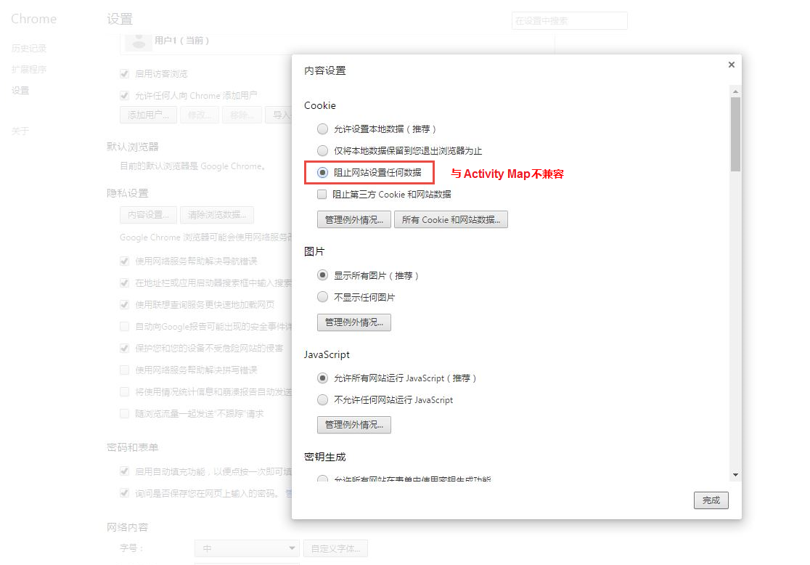
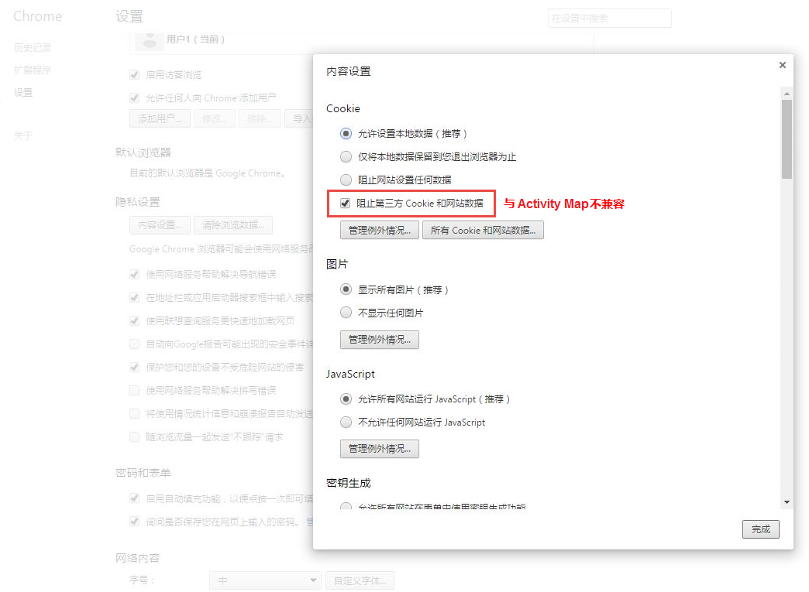
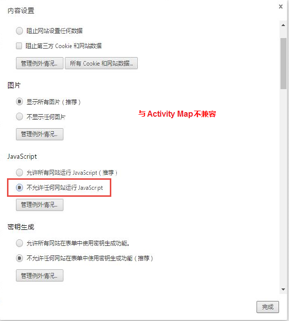
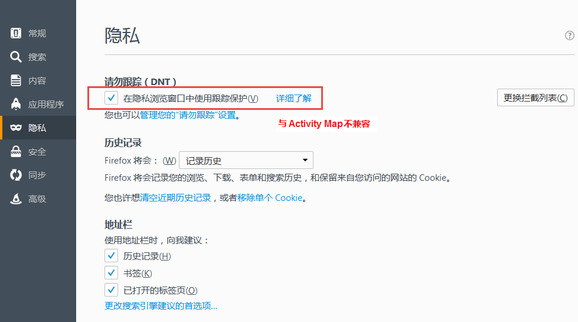
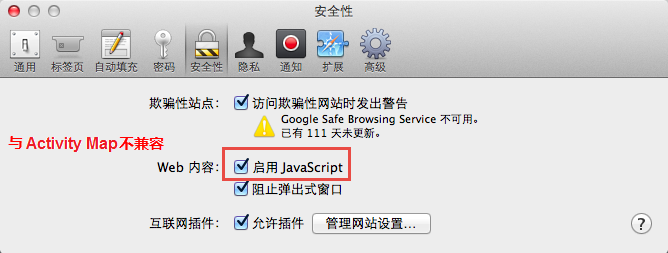
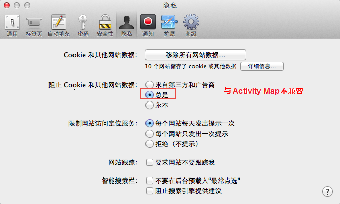
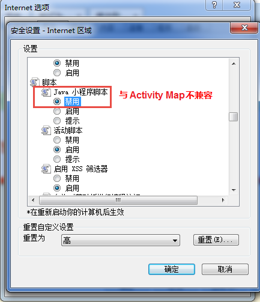

# Activity Map数据收集疑难解答

如果您没有看到Activity Map维度的数据，请使用此页帮助确定原因。

## 使用调试器确认数据收集

首先，确保AppMeasurement正确收集Activity Map数据。

1. 下载并安装[Adobe Experience Cloud Debugger Chrome扩展](https://experienceleague.adobe.com/zh-hans/docs/experience-platform/debugger/home)。
2. 导航到您的网页，然后单击链接。
3. 加载后续页面时，打开调试器。 验证您是否看到介于`activitymap.`和`.activitymap`之间的Activity Map上下文数据变量：

## Activity Map数据不存在的可能原因

检查以下各项以确保Activity Map组件存在：

* **AppMeasurement版本**： v1.6及更高版本支持Activity Map。 当您升级到最新稳定版本的AppMeasurement时，许多边缘案例问题都已得到解决。
* **Activity Map模块**：检查`AppMeasurement_Module_Activity_Map`文件中是否存在`AppMeasurement.js`模块。 如果您的实施使用Adobe Experience Platform收集数据，请确保在&#x200B;**[!UICONTROL 链接跟踪]**&#x200B;下配置Analytics扩展时选中&#x200B;**[!UICONTROL 启用ClickMap]**。
* **`s_sq` Cookie**： Activity Map依赖于`s_sq` Cookie进行数据收集。
   * 确保正确设置`cookieDomainPeriods`变量，尤其是为区域域，如`*.co.uk`或`*.co.jp`。
   * 确保`linkInternalFilters`变量设置为所需值。 如果点击的链接与内部过滤器不匹配，Activity Map会将其视为退出链接，因此不会收集数据。
* **Activity Map覆盖正在运行**：启用AppMeasurement覆盖后，Activity Map不会跟踪您网页的点击数据。

显示与 Activity Map 的使用不兼容的浏览器参数。Adobe建议禁用这些设置。

## Chrome

## Firefox

## Safari

## Internet Explorer

**验证**

使用 Developer Console“网络”选项卡来交互调用：

1. 在站点上加载 Development Launch 脚本。
1. 在“点击元素”上，在“网络”选项卡中搜索“/ee”

Adobe Experience Platform Debugger：

1. 下载并安装 [Adobe Experience Platform Debugger](https://chromewebstore.google.com/detail/adobe-experience-platform/bfnnokhpnncpkdmbokanobigaccjkpob)。
1. 转到[!UICONTROL 日志] > [!UICONTROL Edge] > [!UICONTROL 连接到 Edge]。

* **在“网络”选项卡中未触发interact调用**：收集调用中的click数据收集，请使用`"/ee"`或`"collect?"`进行筛选。
* **收集调用没有有效负载显示**：收集调用的设计方式不影响导航到其他站点，因此文档卸载功能适用于收集调用。 此功能不会影响您的数据收集，但如果您需要在页面上验证，请将`target="_blank"`添加到相应的元素。 该链接将在新选项卡中打开。
