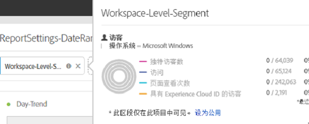
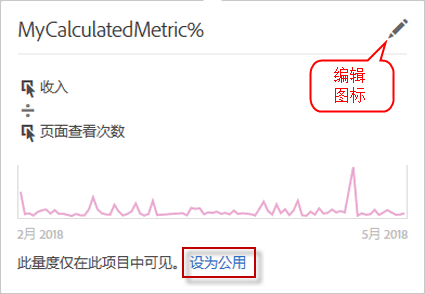

# 项目转换器常见问题解答

## 项目转换器常见问题解答 {#topic_8231595303AD403E9322645A63632D57}

* [已知转换问题](../../../analyze/ad-hoc-analysis/c-aha-project-converter/aha2aw-converter-faq.md#section_39C922A58B2E49C9877B363042801361)
* [转换常见问题解答](../../../analyze/ad-hoc-analysis/c-aha-project-converter/aha2aw-converter-faq.md#section_1E53FE373AF045978F939916124E194E)

## Known Conversion Issues {#section_39C922A58B2E49C9877B363042801361}

| 问题 | 描述 |
|--- |--- |
| 具有划分或列的分钟粒度 | 当分钟粒度应用于它时，或者如果列中存在分钟粒度，则项目无法转换为Analysis Workspace。解决方法是在分钟粒度上删除划分，并从列中删除该划分，然后转换项目。然后，您可以在Analysis Workspace的分钟粒度上应用分组讨论。 |
| 与列区段一起使用的内部计算量度 | 如果您将内部计算量度与列区段一起使用，则项目无法转换为Analysis Workspace。要解决此问题，请在转换之前从项目中删除内部计算的量度，然后在Analysis Workspace中重新添加这些量度。 |

## Conversion FAQ {#section_1E53FE373AF045978F939916124E194E}

<table id="table_48CC119236C94835A6A512E989BE4200"> 
 <thead> 
  <tr> 
   <th colname="col1" class="entry"> 问题 </th> 
   <th colname="col2" class="entry"> 回答 </th> 
  </tr>
 </thead>
 <tbody> 
  <tr> 
   <td colname="col1"> 
<b>问：在 Analysis Workspace 中，是否有任何 Ad Hoc Analysis 功能不受支持？</b> 
 </td> 
   <td colname="col2"> 
答：在 Analysis Workspace 中，网站分析报表不受支持。临时分析和工作区中的其他可视化之间略有差异。有关详细信息，请参阅下面的问题。 
 </td> 
  </tr> 
  <tr> 
   <td colname="col1"> 
<b>问：表格设置如何转换？</b> 
 </td> 
   <td colname="col2"> 
    <ul id="ul_A645A004FB094A1593439A6607FE9A6B"> 
     <li id="li_033CA771F08A4BC3B0BC52CDCCA03FF4"><b>显示的行数</b>：Workspace 的分页设置为每页仅显示 10 行（可自定义为最多同时显示 400 行），而 Ad Hoc 在每页中最多可显示 50,000 行。请注意，数据仍在 Workspace 中，只是默认分页为显示 10 行。 </li> 
     <li id="li_A8B8890149334032A56D8D1C0F8691EA"><b>高级搜索：</b>不支持同时使用多个搜索选项，但会将单项搜索选项（例如所有这些字、精确匹配短语、其中的任何字或不包含所有这些字) 转换到 Analysis Workspace。 </li> 
    </ul> </td> 
  </tr> 
  <tr> 
   <td colname="col1"> 
<b>问：如何转换图表/图形？</b> 
 </td> 
   <td colname="col2"> 
答：请注意，在 Workspace 中图表和图形称作“可视化图表”。 
 
    <ul id="ul_597F5AB826EF434295D0CABD0313CAD5"> 
     <li id="li_AFB2805418034721A9519D999128C0A8"><b>设置</b>：在 Workspace 中，不支持“项目数”或“行数”等可视化图表设置。 </li> 
     <li id="li_D5C7EA8815344EDB8585CBB8E1AF583E"><b>圆形分析图</b>：导出为<a href="https://marketing.adobe.com/resources/help/en_US/analytics/analysis-workspace/donut.html" format="html" scope="external">圆环图</a>可视化图表。Workspace 中的此可视化图表最多可包含 19 个区域。 </li> 
     <li id="li_91659FBFD77C4B3393D78447D658B7B4"><b>气泡图</b>：导出为<a href="https://marketing.adobe.com/resources/help/en_US/analytics/analysis-workspace/scatterplot.html" format="html" scope="external">散点图</a>可视化图表。默认情况下，散点图会在 x 轴上绘制第一个量度，在 y 轴上绘制第二个量度。如果只有一个量度，则气泡图将转换为折线图可视化图表。 </li> 
     <li id="li_FA05085FFB1747EBAF63616AC2B8D59C"><b>直方图</b>：在 Workspace 中支持的分段逻辑与 Ad Hoc Analysis 中不同。因此，直方图会转换为<a href="https://marketing.adobe.com/resources/help/en_US/analytics/analysis-workspace/bar.html" format="html" scope="external">条形图</a>可视化图表。 </li> 
     <li id="li_959499D20796459CA0F6BBC8F0A8D808"><b>散点图</b>：在 Analysis Workspace 中的导出项目内，会将 Y 轴设置为第一列，将 X 轴设置为第二列，将直径设置为第三列。 </li> 
     <li id="li_14E06D7A5106405A89A07B44FFD9A92D"><b>流失表格</b>：要显示流过或流失表格，请右键单击检查点，然后选择划分选项。 </li> 
     <li id="li_240F43C386F04111A7632A8FCA37832C"><b>流失报表级别的日期范围</b>：尚未对流失可视化图表应用自定义报表日期范围。 </li> 
     <li id="li_1FF5B3FD9E424E7190AF03FD4DD9D654"><b>流量报表</b>：会将流量移动到单独的面板中以保留范围和分段。 </li> 
     <li id="li_BE8F8F6EC2EA49E18EF52539BC1700E0"><b>转化漏斗</b>：将转换为自由格式表，因为 Analysis Workspace 中不支持转化漏斗。建议用流失可视化图表替换转化漏斗，但流失可视化图表的行为可能稍有不同。 </li> 
    </ul> </td> 
  </tr> 
  <tr> 
   <td colname="col1"> 
<b>问：如何转换区段？</b> 
 </td> 
   <td colname="col2"> 
    <ul id="ul_15D5B17461E2402DB07DF8B0A10AAC37"> 
     <li id="li_CF9C3D235A664B15B21D9F89DC5EF7D3">区段是转换项目的内部元素（非公用）。您可以选择将区段设置为公用元素，如下所示： 
 
 </li> 
     <li id="li_AE61DAEC5C0047349DD192EFEEDB0BF9">在 Workspace 中，会在项目/工作区级别应用 Ad Hoc Analysis 工作区级别的区段。 </li> 
     <li id="li_B1559E2C18724FE189AF87D0BEF16811">在 Workspace 中，会在表列级别应用 Ad Hoc Analysis 报表级别的区段。 </li> 
     <li id="li_0E6DF6D44EA448A4A212BA2BB8E342CF">在 Workspace 中，会在列级别应用 Ad Hoc Analysis 表区段。 </li> 
    </ul> 
您可以在<a href="https://marketing.adobe.com/resources/help/en_US/analytics/segment/" format="https" scope="external">区段生成器</a>中编辑区段。 
 </td> 
  </tr> 
  <tr> 
   <td colname="col1"> 
<b>问：日期范围如何转换？</b> 
 </td> 
   <td colname="col2"> 
    <ul id="ul_A24AB597F3CE4847AF00D49A9A72A395"> 
     <li id="li_24FD18AF64114445939C4FBC03F2D406">Ad Hoc Analysis 中的“最近 X 天”日期范围<i>不包含</i>当天，但在 Analysis Workspace 中，该日期范围<i>“包含”</i>当天。因此，像“最近 90 天”这样的日期范围在两个工具中可能并不完全一致。可使用自定义日期范围在 Analysis Workspace 中检索相同的时间段。 </li> 
     <li id="li_AA4390470C494748B4B12030B1226720">在 Workspace 中，会在项目/工作区级别应用 Ad Hoc Analysis 工作区级别的日期范围。 </li> 
     <li id="li_B8F0CDD413154856A315D087FEC4D418">在 Workspace 中，会在表列级别应用 Ad Hoc Analysis 报表级别的日期范围。 </li> 
    </ul> 
您可以在 Analytics &gt; 组件 &gt; 日期范围下编辑自定义日期范围。 
 </td> 
  </tr> 
  <tr> 
   <td colname="col1"> 
<b>问：计算量度如何转换？</b> 
 </td> 
   <td colname="col2"> 
    <ul id="ul_ADA380D5D09B4223AAE4853D4C64F679"> 
     <li id="li_010572F793F54680ABE64117DAB7E800">计算量度是导出项目的内部元素（非公用）。您可以选择将计算量度设为公用元素，方法是右键单击相应量度，然后单击设为公用。 
 
 </li> 
     <li id="li_930546EC8FEB432C8810FAF93556FC9A">所有类型的计算量度均支持导出。 </li> 
     <li id="li_DFF7C6F8BB2344928D49194DA0F6EC38"><b>分配类型</b>：即使 Analysis Workspace 未明确显示计算量度的分配类型，导出也会创建并匹配 Ad Hoc Analysis 中存在的分配类型。 </li> 
    </ul> 
您可以通过单击编辑（铅笔）图标，在<a href="https://marketing.adobe.com/resources/help/en_US/analytics/calcmetrics/" format="https" scope="external">计算量度生成器</a>中编辑分配类型。 
 </td> 
  </tr> 
  <tr> 
   <td colname="col1"> 
<b>问：Ad Hoc 中的全局数据设置如何应用到转换的项目？</b> 
 </td> 
   <td colname="col2"> 
全局数据设置可能会导致两次导出的同一项目在行为上出现差异。 
 
    <ul id="ul_E3827883DD8045FAAB359D7E85E3EEFA"> 
     <li id="li_1056CA4813C44638BEB070228AE6914C"><b>计数重复实例。</b>无论导出时应用了什么设置，都会应用到 Analysis Workspace 中的已导出项目。 </li> 
     <li id="li_D5405E2862CF434CA82AA9DE000F4BBC"><b>数据源。</b>在 Analysis Workspace 中，会显示所有 Analytics 数据，包括数据源。 </li> 
    </ul> </td> 
  </tr> 
  <tr> 
   <td colname="col1"> 
<b>问：如果我的 Ad Hoc Analysis 项目已设置计划，该计划是否会转换到 Analysis Workspace？</b> 
 </td> 
   <td colname="col2"> 
否，不会转换计划。在 Analysis Workspace 中，打开要计划的项目，然后前往共享 &gt; 按计划发送文件以设置新计划。请务必在 Ad Hoc Analysis 中取消该计划项目。 
 </td> 
  </tr> 
  <tr> 
   <td colname="col1"> 
<b>问：这两个工具之间是否存在命名方面的差异？</b> 
 </td> 
   <td colname="col2"> 
答：兼容。请参阅 Analysis Workspace 文档中的<a href="https://marketing.adobe.com/resources/help/en_US/analytics/analysis-workspace/adhocanalysis_vs_analysisworkspace.html" format="html" scope="external">关键术语的比较</a>。 
 </td> 
  </tr> 
 </tbody> 
</table>

