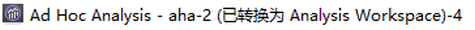
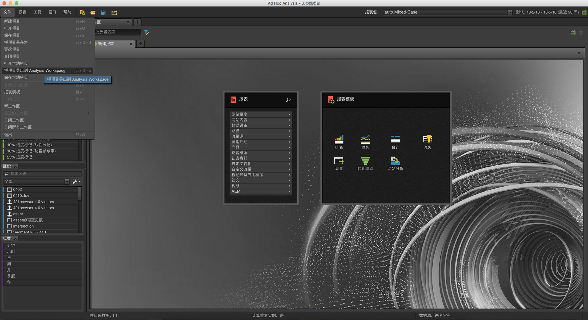
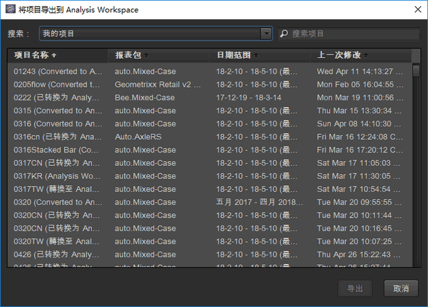
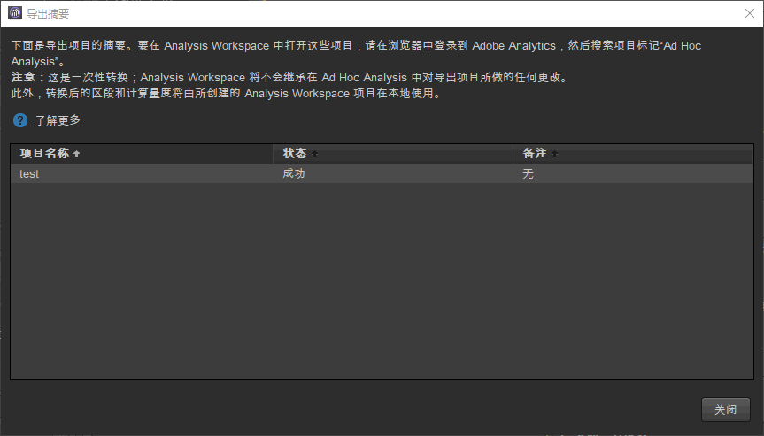
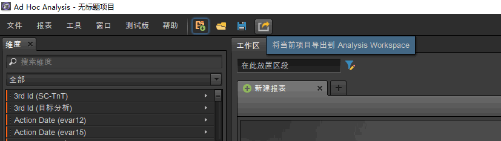

# 在临时分析中转换项目

## Convert your projects in Ad Hoc Analysis {#topic_5A55F73488704C5D8E42CDD04B5984DE}

在转换项目之前，请注意以下事项：

* 要转换项目，您必须以管理员身份或以具备 Analysis Workspace 使用权限的非管理员身份登录 Ad Hoc Analysis。
* 由于这是一次性转换，因此如果您对 Ad Hoc 项目进行任何更改，该更改并不会反映到 Analysis Workspace 中。但是，您可以选择重新转换项目。
* 已转换的任何 Ad Hoc Analysis 项目都将会继续存在于 Ad Hoc 中，但是其标题中会带有圆括号，表示该项目已经转换及其转换次数。示例：

   

在转换 Ad Hoc Analysis 项目时可使用以下两个选项：

* 从列表中选择要转换的项目。
* 仅转换当前已打开的项目。

**从列表中选择项目**

1. In Ad Hoc Analysis, click **[!UICONTROL File]** &gt; **[!UICONTROL Convert Projects to Analysis Workspace]**.

   

1. In the **[!UICONTROL Convert Projects to Analysis Workspace]** dialog, select the project to convert or press  +  to select the entire list.

   

1. Click **[!UICONTROL Convert]**.
1. 现在，[!UICONTROL 转换概要]会列出已转换的所有项目，还会显示状态列，指示转换成功或失败及错误代码。Contact Adobe Client Care for further diagnosis with the "`Error-Id: <Error-Code>`".

   

**转换当前项目**

1. 在 Ad Hoc Analysis 中，打开要转换的项目。
1. 单击&#x200B;**[!UICONTROL 将当前项目转换到 Analysis Workspace。]**

1. 现在，[!UICONTROL 转换概要]会列出已转换的所有项目，还会显示状态列，指示转换成功或失败及错误代码。Contact Adobe Client Care for further diagnosis with the "`Error-Id: <Error-Code>`".
