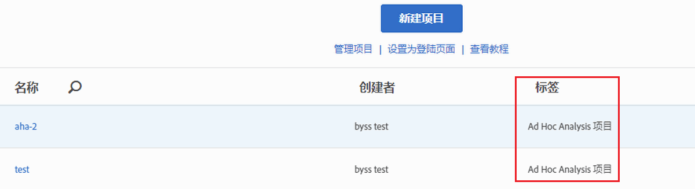

# 在Analysis Workspace中查看转换的项目

在 Workspace 中查看项目之前，请参阅[常见问题解答](../../../analyze/ad-hoc-analysis/c-aha-project-converter/aha2aw-converter-faq.md#topic_8231595303AD403E9322645A63632D57)和查看 Ad Hoc Analysis 与 Workspace 之间的[术语差异](../../../analyze/ad-hoc-analysis/c-aha-project-converter/aha2aw-converter-faq.md#topic_8231595303AD403E9322645A63632D57)。

1. Navigate to **[!UICONTROL Analytics]** &gt; **[!UICONTROL Workspace]**. 请注意，从 Ad Hoc Analysis 转换的项目会标记为“Ad Hoc Analysis 项目”。

   

1. 单击项目名称以查看项目。
1. 根据需要对项目做出进一步更改。请注意，所做的更改将不会反映到 Ad Hoc Analysis 中。

