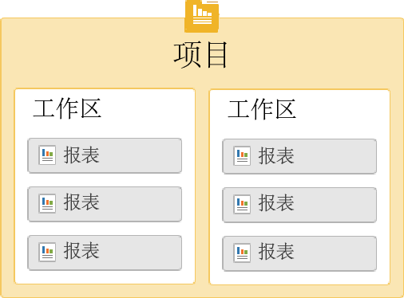
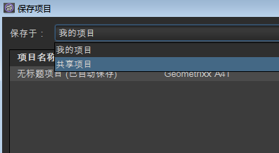

# Get Started with Ad Hoc Analysis{#concept_48936BA28FAE42DB81F1B2CD4726EB17}

>[!Important]
>2018 年 8 月 6 日，Adobe 宣布计划终止 Ad Hoc Analysis 生命周期。确定终止日期后，Adobe 会立即与大家共享此信息。For more information, including which versions of Java will be compatible during this period, visit [https://adobe.ly/discoverworkspace](https://adobe.ly/discoverworkspace).

您可以即时对网站活动执行高级分析。您可以同时查看多个报表并跨多个维度应用区段。可以从微观和宏观的视角分析数据，以查看它们对您的重要业务量度的影响。

通过使用这些功能，您可以了解有关网站流量、访客统计资料、收入和产品运输的信息。然后，您可以过滤、排序和细分数据以了解更准确的信息。结果会立即返回，使您可以快速分析这些因素的综合效果。

<table id="table_C9C0444687FC418580F996E1D2ADB61A"> 
 <thead> 
  <tr> 
   <th colname="col1" class="entry"> 入门任务 </th> 
   <th colname="col2" class="entry"> 说明 </th> 
  </tr> 
 </thead>
 <tbody> 
  <tr> 
   <td colname="col1"> 
1. 登录 Adobe Analytics。 
 </td> 
   <td colname="col2"> 
Go to <a href="https://marketing.adobe.com" scope="external" format="https"> marketing.adobe.com </a>and log in using your Adobe Analytics credentials. 
 </td> 
  </tr> 
  <tr> 
   <td colname="col1"> 
2. 启动 Ad Hoc Analysis。 
 </td> 
   <td colname="col2">单击 Adobe Analytics &gt; 工具 &gt; Ad Hoc Analysis，然后单击启动 Ad Hoc Analysis 按钮。 
 
注意：如果此页面未显示<b>启动 Ad Hoc Analysis</b> 按钮，请确保管理员已将您添加到管理工具的 <i>Ad Hoc Analysis 授权用户</i>群组中。 
 
 </td> 
  </tr> 
  <tr> 
   <td colname="col1"> 
3. 创建项目。 
 </td> 
   <td colname="col2"> 
在 启动页面中，选择一个报表包，然后单击“创建项目”。 
 
See <a href="../../analyze/ad-hoc-analysis/c-getting-started.md#concept_FAE346335B0347A192C6C806C775D72B" type="concept" format="dita" scope="local"> Projects and Workspaces</a>. 
 </td> 
  </tr> 
  <tr> 
   <td colname="col1"> 
4. 打开报表。 
 </td> 
   <td colname="col2"> 
使用标准 Cloud 报表菜单搜索报表。您也可以选择使用模板。 
 
请参阅 <a href="../../analyze/ad-hoc-analysis/c-getting-started.md#concept_370F674C5B4C45368731AA801C5A45F8" type="concept" format="dita" scope="local"> 报表模板</a>. 
 </td> 
  </tr> 
  <tr> 
   <td colname="col1"> 
5. 配置报表。 
 </td> 
   <td colname="col2"> 
执行任务以配置报表，例如： 
 
    <ul id="ul_0D2E8C614F2A4899A376BCEECEA374C6"> 
     <li id="li_FA925D52A8FD4DFAB0C88B797B24E72B"> 创建区段以深入挖掘数据 </li> 
     <li id="li_5E91632551D2473BA8BD0637CDC1A9F6"> 将量度、维度和区段添加到 <a href="../../analyze/ad-hoc-analysis/c-tablebuilder.md#concept_664FC77306E148DBA4EA081814943C5E" type="concept" format="dita" scope="local"> 表生成器</a> </li> 
     <li id="li_019316C9A94B4A8C8A77D07C04E50278">Configuring <a href="../../analyze/ad-hoc-analysis/c-dates.md#concept_E8A2E36E595C45C785ECB724CA37FA47" type="concept" format="dita" scope="local"> date ranges</a> </li> 
     <li id="li_2B33B325D5EE420AB412B73AD1D231C5"> <a href="../../analyze/ad-hoc-analysis/c-schedule.md#concept_12D2DDD66086453BAB6D48D9D22932F2" type="concept" format="dita" scope="local"> 计划</a>报表提交 </li> 
    </ul> 
搜索此帮助系统以查找所需的帮助。 
 </td> 
  </tr> 
 </tbody> 
</table>

## 系统建议 {#concept_6691331B45174290BD9B839806A9B52D}

尽管报表在一些最常用的 Web 浏览器上也能正常运行，但在符合特定建议要求的系统中运行时才能获得最佳的显示效果和功能。

<!-- 

c_sys_reqs.xml

 -->

>[!NOTE]
>
>从 2018 年 7 月起，Ad Hoc Analysis 将仅支持 Java 8 或更高版本。如果在2018年月维护版本之后选择在Java上运行临时分析，Adobe将不再支持您的Ad Hoc Analysis实施。

* 支持 OpenGL 2.0 的显卡
* Cookie：必需
* 操作系统：Windows 和 Mac OS。
* Macromedia Flash Player：版本 6 或更高版本
* 显示器分辨率：800x600（建议为 1024x768）
* 颜色深度：16 位或更高
* JavaScript：已启用
* Java 版本：Java 1.7 或更高版本（请参阅以上注意事项）

   如果未安装正确的 Java 版本，则会为您安装。如果安装了不兼容的 Java 版本，Ad Hoc Analysis 将下载更新并提示您进行安装。

## Java 升级说明 {#section_E4C0C6492FF24636A0FF71A59331111D}

从 2018 年 7 月起，Ad Hoc Analysis 将仅支持 Java 8 或更高版本。如果在2018年月维护版本之后选择在Java上运行临时分析，Adobe将不再支持您的Ad Hoc Analysis实施。

我们的 .jar 文件将使用安全的 256 位加密方法进行签名，低于 1.7.0_76 的 Java 版本不支持此加密方法。通过使用此 256 位证书，我们可以为您提供增强的安全性。

如果您安装的仍是 Java 7，则必须在 2018 年 7 月发布的维护版本之前进行升级。以下是具体操作方法：

* 如果允许您在计算机上安装程序，请执行以下操作：

   1. 转到https://www.java.com。
   1. Click **[!UICONTROL Free Java Download]**.
   1. Click **[!UICONTROL Agree and Start Free Download]**.
   1. 安装特定于您的操作系统的最新 Java 版本。

* 如果&#x200B;**不允许**&#x200B;您在计算机上安装程序，请采用以下方法：

   1. 在您的 IT 部门的协助下安装最新的 Java 版本。

## 启动 Ad Hoc Analysis {#concept_B1CE3C1E6D1A4311B9835BEB69812E55}

<!-- 

c_login.xml

 -->

您可以从 [!DNL Experience Cloud] 或通过 URL 登录。如果您从 Reports &amp; Analytics 登录，那么您将自动登录。仅当您从其他位置（如链接或收藏夹菜单）访问 Discover URL 时，才需要使用 URL 进行登录。

## 从 Experience Cloud 登录 {#task_128ED319F3AE49ED886EA3DFA8D0987F}

描述如何从 [!DNL Experience Cloud] 登录的步骤。

<!-- 

t_login_suite.xml

 -->

1. In a browser, navigate to [!DNL marketing.adobe.com].
1. Type your company name, your username, and your password. Then click **[!UICONTROL Sign In]**.
1. Click **[!UICONTROL Adobe Analytics]** &gt; **[!UICONTROL Tools]** &gt; **[!UICONTROL Ad Hoc Analysis]**.

   如果此页面中未显示&#x200B;**启动 Ad Hoc Analysis** 按钮，请确保管理员已将您添加到管理工具的 *Ad hoc Analysis 授权用户*&#x200B;群组中。
1. Click **[!UICONTROL Launch Ad Hoc Analysis]**.
1. Save the [!DNL discover.jnlp] file locally.

   您可以随时运行该保存的文件来启动 Ad Hoc Analysis。

## 项目和工作区 {#concept_FAE346335B0347A192C6C806C775D72B}

项目定义了导入的数据集，包括报表包和日期范围。项目由任意数量的报表及其所有量度、设置、维度和区段组成。您可以启动新项目，加载保存的项目，或者加载自动保存的项目。

<!-- 

c_projects.xml

 -->

您可以在&#x200B;*工作区*&#x200B;中对报表进行分组。一个项目可以包含多个工作区，而一个工作区可以包含多个报表。这些项目之间的关系最好理解为嵌套关系：

您每次只能打开一个项目。不过，您可以在一个项目中打开多个工作区。在每个工作区中，您可以打开多个报表。

新项目的默认日期范围为[!UICONTROL 过去 90 天]。

## 启动项目 {#task_918A4539134E4E62B00486DCB8D3D403}

描述如何启动项目的步骤。

<!-- 

t_project_start.xml

 -->

1. 登录。
1. Open a saved project or click **[!UICONTROL Create Project]**.
1. 搜索报表或选择模板。

## 打开最近保存的工作区 {#task_DE4A54180BC24E9DAEC98E2171DC6B40}

描述如何打开最近保存的工作区的步骤。

<!-- 

t_recent_workspace.xml

 -->

1. Click **[!UICONTROL File]** &gt; **[!UICONTROL Recent Workspace]**.

   您最多可以打开 5 个最近使用过的工作区。退出会话后，最近保存的工作区将不再可用。

## 共享项目 {#task_5911780D90164F3A8A677C8BC719750D}

公司内所有的 Ad Hoc Analysis 用户都可以使用共享的项目。

<!-- 

t_share_projects.xml

 -->

1. Go to **[!UICONTROL File]** &gt; **[!UICONTROL Save As]**.
1. Select **[!UICONTROL Shared Projects]** from the **[!UICONTROL Save in:]**drop-down.

   

1. Click **[!UICONTROL Save]** to save the project.

   Shared projects can be opened via **[!UICONTROL File]** &gt; **[!UICONTROL Open]** &gt; **[!UICONTROL Shared Projects]**.

   >[!NOTE]
   >
   >您可以通过选择一个或多个项目，在同一对话框中删除自己共享项目以共享项目。

## Rename a Workspace {#task_0DB177DD6DB54B7F9FE60A0B3FC7CFC3}

描述如何重命名工作区的步骤。

<!-- 

t_rename_workspace.xml

 -->

1. 右键单击工作区名称。
1. Choose **[!UICONTROL Rename Workspace]**.
1. Type a name, then click **[!UICONTROL OK]**.

## 打开本地项目 {#task_1B3EF63A80C74776B24B99D80EAC74AC}

描述如何打开项目本地副本的步骤。

<!-- 

t_open_local_project.xml

 -->

1. Click **[!UICONTROL File]** &gt; **[!UICONTROL Open Local Copy]**.
1. Navigate to the local [!DNL .dproj] file, then click **[!UICONTROL Open]**.

## 报表模板 {#concept_370F674C5B4C45368731AA801C5A45F8}

模板是要执行的分析类型的起点。模板可以是空白画布，例如排名报表或流失报表。此外，模板也可以是最初包含默认量度和维度的报表。

<!-- 

c_templates.xml

 -->

You can access templates when creating a project ( **[!UICONTROL File]** &gt; **[!UICONTROL New Project]**), or by adding a workspace or report.

| 模板 | 描述 |
|--- |--- |
| 排名 | 提供可构造表的空白画布。例如，“页面”报表根据流量对您的网站上的页面进行排名，并且明细表会显示页面查看和收入等量度的百分比和数值。 |
| 趋势 | 用于查看报告期间选定时间粒度（小时、日、周、月、季或年）内的转化和事件趋势。 |
| 总计 | 显示基本数据的执行级别报表。该报表包含有关总收入、页面查看和订购的数据。 |
| 流失 | 用于构造显示检查点间转化和流失比率的漏斗。例如，您可以跟踪购买期间访客的流失点数。 |
| 流量 | 显示用户访问页面、网站区域和服务器的最常用路径。 |
| 转换漏斗 | 显示特定量度事件之间的转换百分比。您可以使用此报表了解日常销售的点进次数和售出件数。 |
| 网站分析 | 三维网站路径分析工具，它显示访客如何在特定页面和事件之间移动。 |
| 虚拟焦点组 | 虚拟焦点组报表从您的访问中随机抽取一个访问，然后显示有关该访问的详细数据。您可以使用该报表从访客群体中创建焦点组。 |

## 打开报表 {#task_0AC455CDA198497AA546622FB05F300D}

您可以在创建项目时打开报表或模板，或从现有项目打开报表或模板。可以使用模板重新配置报表。

<!-- 

t_reports_opening.xml

 -->

有几种方法可打开报表：

* 在“新建报表”页面上，搜索报表或选择模板。
* 单击菜单中的“报表”**，然后选择报表或报表模板。**
* 从维度启动报表：右键单击维度名称，然后选择&#x200B;**[!UICONTROL 运行报表]** &gt; **`report name`**.
