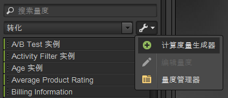
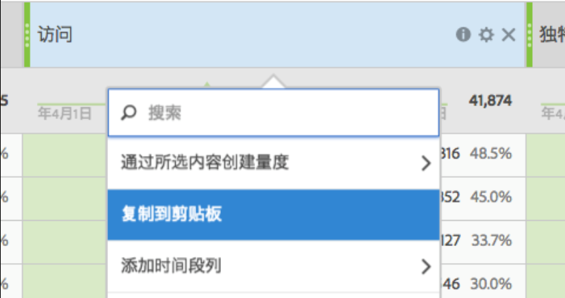

# 量度

量度是有关访客活动的量化信息，如查看次数、点进次数、重新加载次数、平均逗留时间、日期、件数、订购数、收入等。量度和关联的数据显示在报表的列中。

## 量度 {#concept_46A67930CFDB4A078225C5B189688AF3}

量度是有关访客活动的量化信息，如查看次数、点进次数、重新加载次数、平均逗留时间、日期、件数、订购数、收入等。量度和关联的数据显示在报表的列中。

标准量度包括：

* **流量**：显示有关访客数量的数据。
* **转化**：显示网站上成功事件的数据。成功事件包括购买、下载或您希望用户在网站上执行的任何其他操作。
* **计算**：通过组合其他量度所创建的自定义量度。例如，您可以创建一种量度，通过从收入中扣除关键词成本和货品成本得到净收入。然后，您可以将此金额除以订购总次数，得出每次订购的平均净收入。

请参阅 Analytics 参考中的&#x200B;*量度定义*，以了解如何在 [!DNL Experience Cloud] 中使用量度的相关信息。

可以使用“组织量度”工具创建用于量度的新文件夹。然后，可以按所需的任意方式对量度进行分组。通过使用组织器，可以使用拖放方式将现有量度复制到自定义文件夹。

虽然可以创建文件夹、命名文件夹并按任意所需方式将量度组织到文件夹，但是除了“收藏夹”和“计算量度”文件夹以外，不能更改任何其他默认文件夹。

## 组织量度 {#task_17C844A9387042EAA9983E1E554846B1}

描述如何组织量度和创建量度文件夹的步骤。

<!-- 

t_organize_metrics.xml

 -->

1. In the [!UICONTROL Metrics] tool pane, click **[!UICONTROL More Actions]**. (  

   ）
1. Click **[!UICONTROL Organize Metrics]**.
1. Click **[!UICONTROL New]** to create a folder.
1. 选择其他文件夹中的量度，然后将选定量度拖到新的文件夹中。
1. Click **[!UICONTROL OK]**.

   >[!NOTE]
   >
   >删除文件夹时，文件夹中的所有量度都会从当前选定的项目中删除。

## 将量度添加到报表中 {#task_747DD1718B3F4776B83A115D0BE8754C}

描述如何将量度添加到报表中的步骤。

<!-- 

t_add_metrics_dsc.xml

 -->

1. 在“量度”工具窗格中，查找量度。

   您可以在搜索字段中或通过浏览量度文件夹来查找量度。

1. 将量度拖到报表表或[!UICONTROL 表生成器]中。

   如果要避免在报表中重复添加量度，则可能需要事先在“设置”中指定默认量度。

   请参阅[排名选项卡-定义](../../analyze/ad-hoc-analysis/c-global-settings.md#reference_FB9BADD7E3DA42C1BB2A02A6E9D5C1CF)。

## 计算量度生成器 {#concept_F8E213CE786A43FB93847C5BA883A29C}

Ad Hoc Analysis 中的计算量度生成器当前与 Analytics 统一计算量度绑定在一起。它的用户界面类似于 Analytics 中的计算量度生成器。

<!-- 

c_calc_metric_builder.xml

 -->

有关如何构建和管理计算量度的更多信息，请参阅[计算量度指南](https://marketing.adobe.com/resources/help/en_US/analytics/calcmetrics/)。

下面介绍如何访问 Ad Hoc Analysis 中的计算量度生成器：

1. In the [!UICONTROL Metrics] pane, click **[!UICONTROL More Options]**, then **[!UICONTROL Calculated Metrics Builder]**.

   

1. 通过计算量度生成器界面，您可以拖放量度、区段和函数，以构建您的自定义量度：

   

