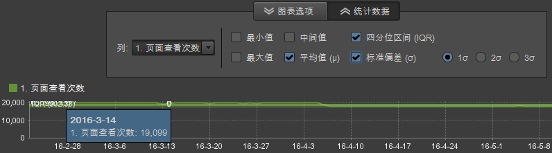

# 报表概述

标准报表显示网站和访客活动、流量模式、反向链接数据、广告促销活动、访客维系、产品数据等数据。您可以运行报表，然后使用工具来配置区段、量度和报表比较。

## 报表概述 {#concept_41459A705F2048EEA4EFA80F6BD9FFAB}

标准报表显示网站和访客活动、流量模式、反向链接数据、广告促销活动、访客维系、产品数据等数据。您可以运行报表，然后使用工具来配置区段、量度和报表比较。

您可以收集自定义数据，以创建您的网站特有的报表。例如，如果您的网站上具有搜索功能，则可以跟踪提交的搜索词，并创建显示此类词和搜索结果的报表。

标准报表集包含每个网站的常见主题。报表包含（但不限于）：

* 网站数据
* 访客数据
* 流量模式
* 反向链接数据
* 广告促销活动
* 访客维系
* 产品信息

如果您使用 Marketing Reports &amp; Analytics，那么报表类型和菜单对您而言应该并不陌生。Ad Hoc Analysis 基于以下类型对报表进行分类：

**摘要报表**

包括[!UICONTROL 总计报表]等报表，其中显示专用于快速了解的数据。此类报表适用于要了解数据概要信息的管理人员。

**转化报表**

转化报表可以全面、准确、详细地分析客户活动。通过使用促销活动管理、销售周期、客户流失和客户转化等量度，您可以精确衡量电子商务交易、销售源、广告效果和客户忠诚度等。

**流量报表**

通过使用流量报表，您可以对访客与网站之间的交互情况进行深入分析。

* 分析访客行为的重要方面。
* 监视和了解流量模式。
* 确定受欢迎的网站内容。
* 采用任何可度量的标准对访客分类。

## 促销活动 {#concept_A407CDF1D4AA49BAB396A1666E67FC87}

显示有关广告活动效果的信息。您可以查看哪些类型的广告活动为您带来的流量最多，以及这些广告活动是由哪些员工负责推动。

<!-- 

c_reports_campaigns.xml

 -->

这些报表通常是自定义报表，因此与每个分析报表不同。See [Campaign Manager](https://marketing.adobe.com/resources/help/en_US/reference/campaign_manager_admin.html) in the [!DNL Admin Console] help for more information.

## 统计计算 {#concept_83FF70DB7895435E985699FE9012D585}

您可以自定义在排名报表中显示的默认统计信息。

<!-- 

c_Statistical_Calculation_ad_hoc.xml

 -->

您还可以基于运行报表时显示的情况，将其他默认的统计计算添加到排名报表中，其中包括按照您的特定报告需求，对您的数据评估得出的平均值、中间值、标准偏差和其他数学计算。

**要打开排名报表的统计计算，请执行以下操作：**

1. Select **[!UICONTROL Tools]** &gt; **[!UICONTROL Ranked]** from the menu.

1. Select **[!UICONTROL Settings]**.
1. Select **[!UICONTROL Default Statistics]**.

**[!UICONTROL 忽略统计计算中的零]**。 选择此选项可以忽略零，并确保添加其他量度时不会更改已计算出的平均值。所有统计信息均受此设置的影响（不过它对“总计”没有影响）。

| 计算 | 描述 |
|--- |--- |
| Max（最大） | 标识指定数据集内所有行之间的最大值。 |
| Min（最小） | 标识指定数据集内所有行之间的最小值。 |
| 总计 | 计算数据集中每一行的所有值。例如，“总计”可合计某访客的所有访问次数，而不是仅将该访客计为一次（无论其访问次数有多少）。它是所搜集数据点的全面总和。 |
| 平均值 | 平均值是数据集中各行值的算术平均数，计算方法是用总和除以计数（总和/计数）。平均值受离群数据影响，它与中间值不太一样，通常用于偏态分布。 |
| 标准偏差 | 标准偏差显示与预期的平均值之间的偏差。标准偏差较小则表示数据点靠近平均值。标准偏差较大则表示数据点分布在较大范围的值中。 |
| 中间值 | 中间值是一个数字值，用于将数据集中行数据的上半部分和下半部分隔开。不同于平均值的是，它通常用于避免离群值。 |
| 四分位点 | 四分位点是数据集中的一组值，它由三个将数据集划分为四个相等群组（每个群组均包含四分之一的数据集）的点进行标识。第一个四分位点为第 25 个百分位数，第三个四分位点为第 75 个百分位数。（第二个四分位点为中间值，第四个四分位点为总计。） |
| 计数 | 返回数据集中的行数。 |

## 平均值和量度总量计算的示例 {#section_7C49196503964FB0A429FA347BC92D09}

中间值函数的计算方式类似于 Microsoft Excel 中数据列的计算。特别需要指出的是，这意味着某比率的&#x200B;**平均值**（如确定平均跳出率）是指该比率的平均值，而非平均值的比率。平均值的比率包括跳出率量度的&#x200B;**总和**。

<table id="table_9EC56B15C6A340DA8917CB0DBCAC2355"> 
 <thead> 
  <tr> 
   <th colname="col1" align="center" class="entry"> 日期 </th> 
   <th colname="col2" align="center" class="entry"> 单次访问 </th> 
   <th colname="col3" align="center" class="entry"> 登录 </th> 
   <th colname="col4" align="center" class="entry"> 跳出率 </th> 
   <th colname="col5" align="center" class="entry"> </th> 
  </tr>
 </thead>
 <tbody> 
  <tr valign="top"> 
   <td colname="col1"> 
2013 年 6 月 
 
2013 年 7 月 
 
2013 年 8 月 
 </td> 
   <td colname="col2" align="center"> 
344 
 
297 
 
41 
 </td> 
   <td colname="col3" align="center"> 
1000 
 
1000 
 
1000 
 </td> 
   <td colname="col4" align="center"> 
34.4% 
 
29.7% 
 
41.0% 
 </td> 
   <td colname="col5"> </td> 
  </tr> 
  <tr valign="top"> 
   <td colname="col1" align="center" valign="middle"><b>平均值</b> </td> 
   <td colname="col2" valign="middle"> (344+297+41)/3 </td> 
   <td colname="col3" valign="middle"> (1000+1000+100)/3 </td> 
   <td colname="col4" valign="middle" align="right"> (34.4 + 29.7 + 41.0) / 3 = <b>35.0</b>% </td> 
   <td colname="col5" valign="middle"><b>比率的平均值</b> </td> 
  </tr> 
  <tr valign="top"> 
   <td colname="col1" align="center" valign="middle"><b>量度总量</b> </td> 
   <td colname="col2" valign="middle"> 682 </td> 
   <td colname="col3" valign="middle"> 2100 </td> 
   <td colname="col4" valign="middle" align="right"> 682 / 2100 = <b>32.0</b>% </td> 
   <td colname="col5" valign="middle"><b>平均值的比率</b> </td> 
  </tr> 
 </tbody> 
</table>

## 统计计算结果覆盖图 {#concept_97E1B32DAC734C7B9F8899717283CEEC}

对于显示一段时间（分钟、小时、天、星期）数据的报表，Ad Hoc Analysis 现在可以提供统计计算结果的直观覆盖图。

<!-- 

c_overlay_calculations.xml

 -->

如果报表中标识了一段时间的数据，那么&#x200B;**[!UICONTROL 统计信息]按钮可以允许您选择在报表时间线间显示为覆盖图的计算结果。**

In addition to standard [Statistical Calculations](../../analyze/ad-hoc-analysis/c-overview-standard-reports.md#concept_83FF70DB7895435E985699FE9012D585), you can select the 1st, 2nd, and 3rd standard deviations in the overlays.

## 组管理器 {#concept_E1433974A61144858E87334C006982B2}

Rather than using a single page in a report, you can group multiple pages and use them as categories for starting, intermediate, or destination location in the [!UICONTROL Fallout] and [!UICONTROL Site Analysis] reports. 您可以从主菜单或报表中编辑组。[!UICONTROL “检查点选择器”]列表中还将显示您在 Marketing Reports &amp; Analytics 中创建的类别。

<!-- 

c_groups.xml

 -->

Click **[!UICONTROL Tools]** &gt; **[!UICONTROL Group Manager]**.
