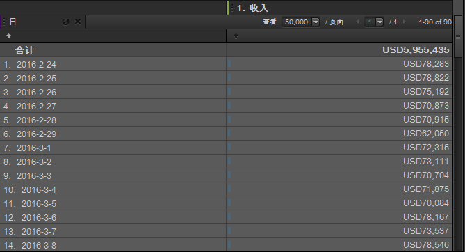

# 时间

时间是用于显示小时、日、周和日期范围趋势的报表维度。例如，产品报表显示选定日期范围内产品所产生的收入。您可以添加日维度以查看报告期间每天的趋势。时间提供“小时”、“日”、“周”、“月”、“季度”和“年”粒度设置。日期范围预设包含今天、昨天和过去一周等设置。

## 时间 {#concept_CB64A0A2150C471FB0B0B42516905887}

时间是用于显示小时、日、周和日期范围趋势的报表维度。例如，产品报表显示选定日期范围内产品所产生的收入。您可以添加日维度以查看报告期间每天的趋势。时间提供“小时”、“日”、“周”、“月”、“季度”和“年”粒度设置。日期范围预设包含今天、昨天和过去一周等设置。

要添加时间维度，请将“时间”工具窗格中的一个或多个日期范围拖到报表或表生成器中。

此示例显示了日维度的收入趋势。

## 时间 - 定义 {#reference_6E718B78E437438E825DB9262086A987}

在“时间”窗格中，您可以选择日期范围和趋势预设，然后将您的选择拖到[!UICONTROL 表生成器]或报表网格中。

<!-- 

r_time_panel.xml

 -->

| 字段 | 定义 |
|--- |--- |
| 日期范围 | 用于选择一个或多个时间段，并将其拖到表生成器或报表网格中。将时间段用作行中的划分或列开头。您可以选择日、周、月份或自定义的日期范围时间段。如果您使用 SiteCatalyst 中的“自定义日历”，您的报表包将继承这些设置。 |
| 趋势 | 用于按照小时、日、周、月等创建趋势报表。将趋势中的项目拖到报表中时，您正在查看一段时间内（由日历中指定的特定时间范围确定）的数据。 |