# Analysis Workspace概述

Analysis Workspace 去除了单一 Analytics 报表存在的所有典型限制。它提供了一个功能强大而灵活的画布，用于构建自定义分析项目。您可以向一个项目拖放任意数量的数据表、可视化信息和组件（维度、量度、区段和时间粒度）。可以即时创建划分和区段、创建用于分析的同类群组、创建警报、比较区段、进行流量和流失分析，并且组织和计划报表以与公司的其他人员共享。

**[!UICONTROL Analytics]** &gt; **[!UICONTROL Workspace]**

## Overview video {#section_B99BF8A326D94ECB91BD69C9888AD10C}

>[!VIDEO](https://www.youtube.com/watch?v=IHOy-QsvVcA)

完整的 Youtube 播放列表可在[此处](https://www.youtube.com/playlist?list=PL2tCx83mn7GuNnQdYGOtlyCu0V5mEZ8sS)获得。

>[!NOTE]
>
>See [What's New in Analysis Workspace](../../analyze/analysis-workspace/new-features-in-analysis-workspace.md#concept_EDB651D6F41E4F7BB4EB5E1EBB95D195) for updates about features.

## Full control over project elements and components {#section_B7E3EDA3EDEE407D833F4FDB69646EEC}

Analysis Workspace 可以提供自由和灵活性。

* 可拖放组件（维度、量度、区段和时间粒度）
* 可在项目中拖放多种可视化信息
* 根据需要，可随时在项目中移动、堆叠可视化信息并调整其大小

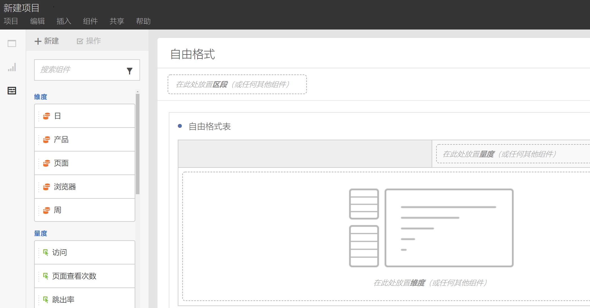

请参阅[创建一个 Analysis Workspace 项目](../../analyze/analysis-workspace/build-workspace-project/t-freeform-project.md#task_C2C698ACC7954062A28E4784911E6CF2)，以了解更多信息。

## Multiple visualizations in a project {#section_B7670740C2D44130B21DAF0873280DA5}

您可以根据需要，在项目中拖放多种可视化信息。

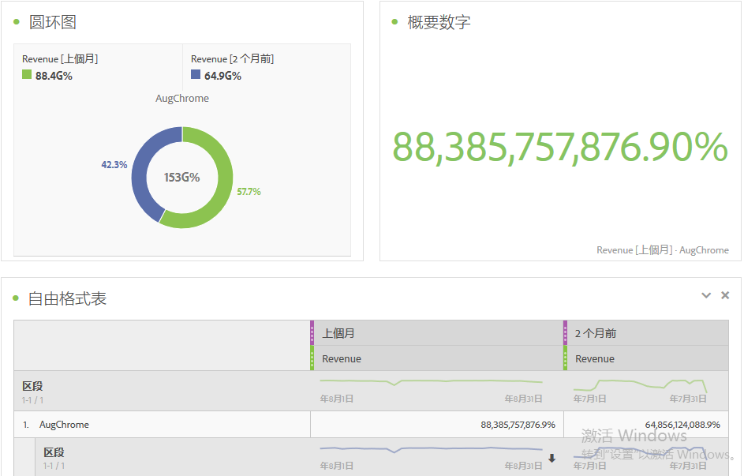

创建一个显示变化（百分比）的项目，并在其中包含与自由格式数据表中单元格对应的多项可视化信息。

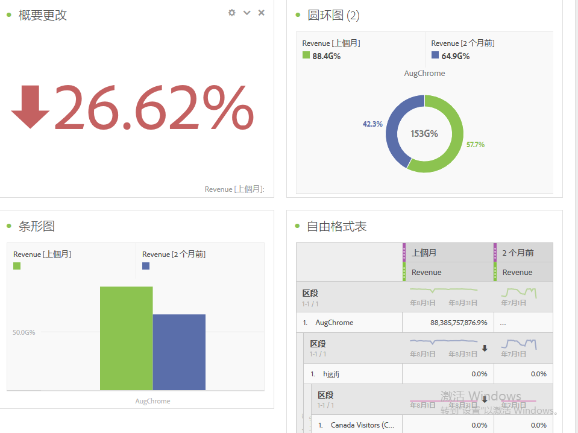

See [Create an Analysis Workspace project](../../analyze/analysis-workspace/build-workspace-project/t-freeform-project.md#task_C2C698ACC7954062A28E4784911E6CF2) for more information.

## Intra-linking to panels and visualizations {#section_253EA04E067F4A29A8B54CE2B7631086}

In conjunction with the [rich text editing](../../analyze/analysis-workspace/visualizations/text.md#concept_2315D97E27364E3194AC1C459B654B2F) capabilities of Analysis Workspace, you can link down to specific panels and visualizations within a project from a text box, such as to create a project's table of contents. 您可以像共享项目链接一样共享这些链接，以将某个人定向到项目中的特定可视化或面板。新增了名为“获取面板链接”和“获取可视化链接”的右键单击选项。要将内部链接添加到您的项目，请执行以下操作：

1. 将文本可视化拖到项目中可能需要某些上下文的可视化或表格旁边。
1. 使用相关内容（例如目录）填充文本框，然后突出显示要链接到面板或可视化的项目，例如“成功量度”。

   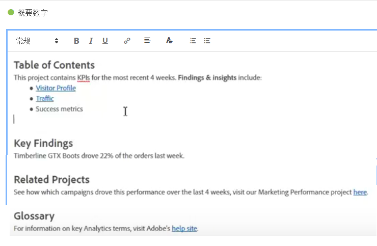

1. 滚动到该面板或可视化，并右键单击面板的标题。
1. Scroll down and select **[!UICONTROL Get Panel Link]** or **[!UICONTROL Get Visualization Link]**:

   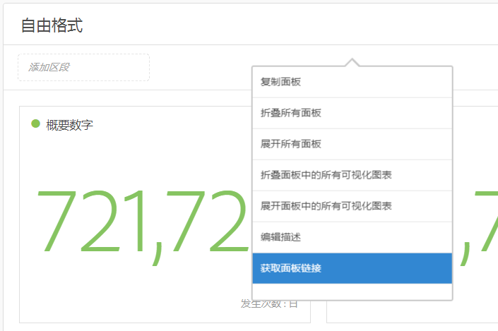

1. 复制该链接，并将其添加到文本可视化中的“成功量度”超链接。单击复选标记以保存文本。

如果您在项目中折叠了面板或可视化，则单击链接将可展开该面板/可视化信息，以便用户可以看到它。

>[!NOTE]
>
>You can also use this feature within the **[!UICONTROL Edit Description]** right-click option.

## Link to other projects {#section_AE886C367C3E4F189B65B1BD9BCDBD8C}

You can link users to other projects that may be of interest to them by going to  **[!UICONTROL Share]** &gt; **[!UICONTROL Get Project Link]** and embedding this link in project descriptions, for example.

## Dynamic visualization of selected cells {#section_182CEC285E4547EBA4608D5F70C9D5D7}

可选择若干单元格，查看这些单元格可视化信息的动态变化情况。可[同步并锁定](../../analyze/analysis-workspace/analysis-workspace-features.md#section_9D66A001586F49CEB0C565581E44957C)选定单元格的可视化信息。

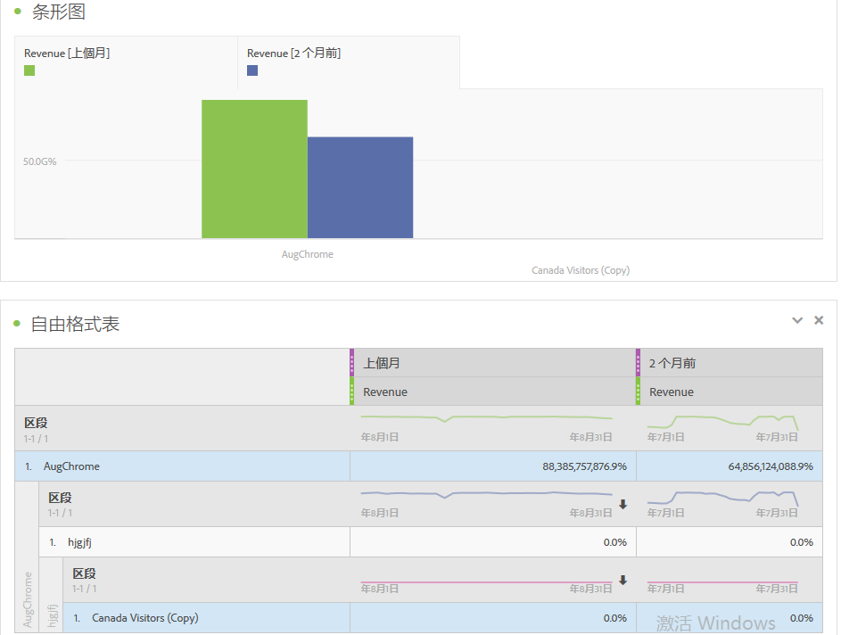

## Lock selected items or positions {#section_9D66A001586F49CEB0C565581E44957C}

通过锁定可视化信息可以控制与其对应的自由格式数据表来源。

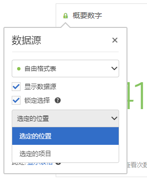

请参阅[管理数据源](../../analyze/analysis-workspace/visualizations/t-sync-visualization.md#task_A73B065DC3834AFCA422E364A1468099)。

## Trend visualizations from selected cells {#section_34930C967C104C2B9092BA8DCF2BF81A}

创建选定单元格的可视化信息。(Right-click &gt; **[!UICONTROL Trend Selection]**.)

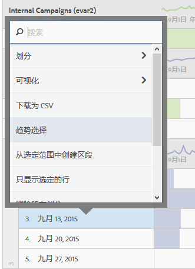

趋势选择现已&#x200B;**关联**&#x200B;到下面的表，因此，如果选择表中的不同行，趋势图将反映出该行的内容。

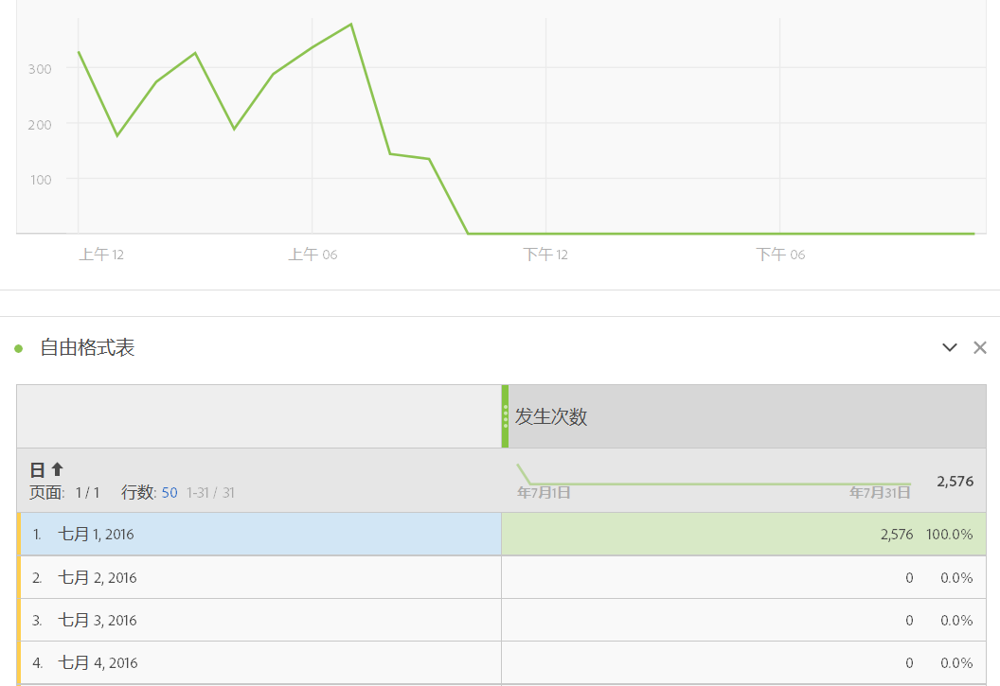

## Dimensions and dimension item breakdowns {#section_1380C1F9E51E4BFB8C5D35E7A53BC70D}

作为零售商，您能够采取比以往更加深入的方式来调研促销活动，了解怎样可以更好地吸引客户。您可以采用任何方式，无限制地划分数据以满足自己的特定需求；使用相关的量度、维度、区段、时间线以及其他分析划分值来构建查询。

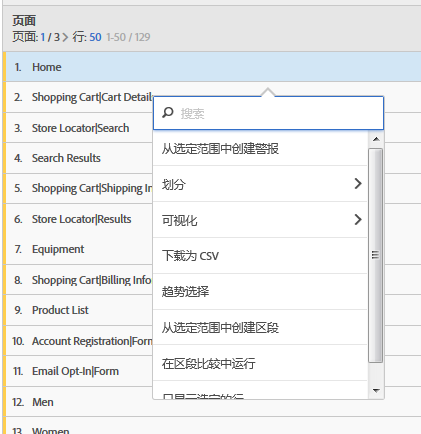

See [Break down dimensions](../../analyze/analysis-workspace/components/dimensions/t-breakdown-fa.md#task_B594DA2476E84DFDA8279E831F0BD9C4).

## Segments from table selections {#section_73BC3688089B426D969B3D5B606DA970}

选择自由格式表中的单元格，然后根据选定的内容创建区段。

多个区段之间可进行比较，而且可以立即创建并应用区段。您可以应用多个区段，根据行为和交互情况来重点关注特定的客户，然后进行比较和对照。

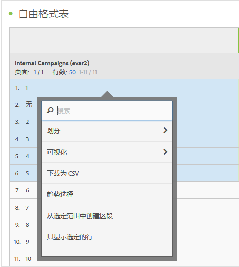

如果按照项目级别将区段放在自由格式面板中，该区段则会应用在整个项目中。

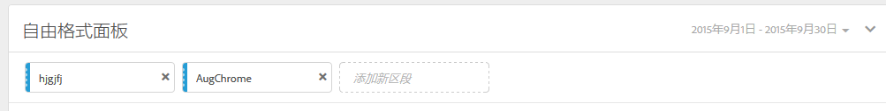

请参阅[区段](../../analyze/analysis-workspace/components/t-freeform-project-segment.md#task_11C6A2C7717B48049E5750B9D20FEC80)。

## Project and component tagging {#section_F54D688132A541F2982326D5E022B90D}

可将标记应用到 Analysis Workspace 的项目和组件中：

* 在“信息”面板中可应用或创建项目级别的标记 (

* 从“组件”面板中右键单击组件，可应用（或创建）标记。
* 在搜索栏中使用“#”可查找标记。

## Component actions {#section_CBF4D0A5F63E4B0883077B8D852B800B}

从位于组件左边栏顶部的“操作”菜单执行组件级别的操作。选择某个组件并单击&#x200B;**[!UICONTROL 操作]可查看相关操作。**

| 组件操作 | 描述 |
|--- |--- |
| 标记 | 通过对组件应用标记来组织或管理组件。然后它会显示在相应的组件管理器中，如 Analytics &gt; 组件 &gt; 区段，或 Analytics &gt; 组件 &gt; 项目 |
| 收藏 | 将组件添加到您的收藏夹列表中。然后它会显示在相应的组件管理器中，如 Analytics &gt; 组件 &gt; 区段，或 Analytics &gt; 组件 &gt; 项目  . |
| 批准 | 批准组件以使其成为规范。然后它会显示在相应的组件管理器中，如 Analytics &gt; 组件 &gt; 区段，或 Analytics &gt; 组件 &gt; 项目 |
| 共享 | 仅适用于区段。 |
| 删除 | 仅适用于区段。 |

请参阅[可视化](../../analyze/analysis-workspace/visualizations/freeform-analysis-visualizations.md#concept_09242627629147A88A68F1506954C276)，以了解更多信息。

## Additional feature descriptions {#section_5F06AE43C0194CFDBCA7EE0EA3C30B05}

**拖动和堆叠项**

组件

* 维度
* 区段
* 量度
* 日期范围
* 时间粒度（小时、天、周等等）。

**多个自由格式表和多项可视化信息**

从技术角度来讲，可以向面板添加的自由格式表和可视化信息的数量并无限制。此外，您可以针对每个自由格式表或自由格式表的选定行，运行新的可视化（或将其导出为 CSV 格式）。

**分类、排序和复制列**

* 排序日期范围预设（不包括自定义日期范围）。
* 按住 Ctrl（或 Command），单击并拖动可复制该列，拖动复制的列会将其粘贴至表中的新位置。

See [Hotkeys Available in Analysis Workspace](../../analyze/analysis-workspace/build-workspace-project/fa-shortcut-keys.md#concept_9A6356084DBC4D468E265E7A65B3E051) for more information.

**选择并操作**

您可以像在 Excel 中选择行和列那样来进行选择。然后，您可以在选定的内容上执行操作。例如：

* 通过选定的内容创建可视化信息
* 复制到剪贴板（Ctrl 或 Command + C）
* 划分多个选定的行。选择若干行，然后将某个维度拖放到选定的行上。或者，右键单击选定的行，然后使用“划分”菜单。

**自动保存和未保存的更改**

当您尝试关闭浏览器（或使用“返回”按钮）并且尚未保存项目时，系统会提示您保存对项目所做的更改。如果系统崩溃，那么在您加载项目时，会收到一个将该项目还原至以前状态的警报。

现有（非新）项目只有在浏览器崩溃时，或在其他一些没有机会保存的情况下才会自动保存。

**所有访问**

Analysis Workspace 特有的默认区段。*`All Visits`*&#x200B;显示您添加到数据表中的组件的所有访问次数。

**计算量度**

使用的计算方法与使用标准量度相同。

请参阅[计算量度](https://marketing.adobe.com/resources/help/en_US/analytics/calcmetrics/)。
