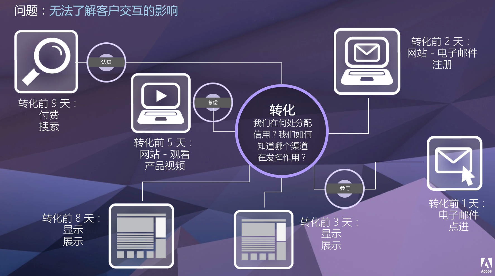

# 归因 IQ

归因IQ是Adobe Analytics中的一组功能，可进一步了解营销工作如何促进转化。

给定的客户旅程不是线性的，而且往往难以预测。 每位客户按各自的进度进行；通常，它们会双重返回、失速、重启或参与其他非线性行为。 这些有机的操作使得很难了解营销工作对整个客户旅程的影响。 它还会妨碍将多个数据渠道绑定在一起的工作。

Adobe Analytics Attribution IQ使现代智能团队能够了解整个客户旅程中有意义的参与程度，从而确定引导客户实现目标的拐点。 了解客户旅程的这一方面可以有效地优化营销活动。

Adobe Analytics 通过让您能够执行以下操作来增强归因：

* 定义付费媒体之外的归因：可将任何维度、量度、渠道或事件应用于模型（例如内部搜索），而不仅仅是营销活动。
* 使用无限制的归因模型比较：动态比较任意所需数量的模型。
* 避免实施更改：使用报表时间处理和上下文感知会话，可在运行时构建并应用客户历程上下文。
* 构建与您的归因方案最匹配的会话。
* 按区段划分归因：轻松对所有重要区段中的营销渠道效果进行比较（例如新客户与老客户、产品 X 与产品 Y、忠诚度级别或 CLV）。
* 检查渠道交叉和多触分析：使用维恩图和直方图以及趋势归因结果。
* 直观地分析关键营销序列：利用多节点流和流失可视化探索可视转化的路径。
* 构建计算量度：使用任意数量的归因分配方法。

## 功能

归因IQ包括以下功能：

* [归因面板：](c-panels/attribution/attribution.md)
