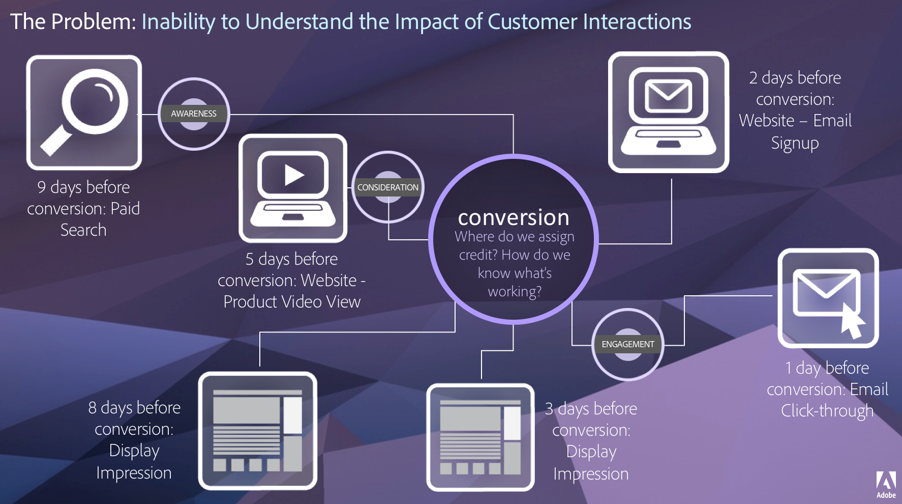

# 归因IQ概述

>[!IMPORTANT]
>
>归因IQ可供Adobe Analytics Ultimate、Prime、Select和Foundation SKU上的所有客户使用。

## 归因 IQ 的商业价值 {#section_E82B97114E1641A8AE911F57AEB3240A}

“客户历程”并不是线性的，而且仅可部分预测。它更为自然、灵活，且往往不可预测。每位客户都按照自身的步调执行操作，经常会返回、停止、重新启动等。这就使得我们很难了解营销工作在整个客户历程中所产生的影响。它还妨碍了将多个数据渠道联系在一起以解答商业问题的工作，并导致不全面的客户信息洞察。

借助 Adobe Analytics 归因 IQ，现代化信息情报团队可了解如何在整个客户历程中开展有意义的互动，如何智能识别可将客户引导至目标结果的拐点，以及如何有效地优化营销活动。

Adobe Analytics 通过让您能够执行以下操作来增强归因：

* 定义付费媒体之外的归因：可将任何维度、量度、渠道或事件应用于模型（例如内部搜索），而不仅仅是营销活动。
* 使用无限制的归因模型比较：动态比较任意所需数量的模型。
* 避免实施更改：使用报表时间处理和上下文感知会话，可在运行时构建并应用客户历程上下文。
* 构建与您的归因方案最匹配的会话。
* 按区段划分归因：轻松对所有重要区段中的营销渠道效果进行比较（例如新客户与老客户、产品 X 与产品 Y、忠诚度级别或 CLV）。
* 检查渠道交叉和多接触点分析：使用维恩图和直方图，以及趋势归因结果。
* 直观地分析关键营销序列：通过多节点流量和流失可视化图表，以可视方式探索导致转化的路径。
* 构建计算量度：使用任意数量的归因分配方法。

## 归因 IQ 有什么作用？ {#section_63B421E9E75B4CCEBA96726CAA37D73E}

通过 Analysis Workspace 中的归因 IQ，您可以将多个新类型的归因模型添加到自由格式表、可视化图表和计算量度。所有归因模型都有两个组成部分：

* 一个是&#x200B;**归因模型**（即首次接触、最后接触、线性等）。此模型描述某个群组中点击的转化分布。
* 一个是&#x200B;**归因回顾窗口**（即访问或访客）。回顾窗口描述针对每个模型考虑的点击分组。

以下客户历程示例展示了单个访客的营销接触点，包括三次访问、三次转化和四个营销渠道（搜索、显示、社交和电子邮件）：

## 基于实例的归因 {#section_A81DBC3B19014CE3894131F1CF72736F}

Analysis Workspace 中的归因会利用任何维度的“实例”，这意味着归因模型会应用于传递到 Analytics 中的值（在处理规则、VISTA 和营销渠道处理规则之后）。事实上，这意味着在归因建模方面，prop 或 eVar（或其他任何维度）之间没有任何区别。可以使用下面的任何回顾窗口或模型将 prop 设置为永久，并且在应用归因回顾窗口或模型时，不会使用 eVar 的分配和过期设置（在“管理员”设置中指定）。

## 归因回顾窗口 {#section_A2782BB64171431EB370CDCD4AD8030D}

归因回顾窗口是归因模型将应用到的点击分组。Analysis Workspace 中有两个归因回顾窗口设置：访问和访客。

**访问回顾窗口**

默认情况下，访问回顾窗口是以 30 分钟不活动状态分隔的任何活动序列。但是，如果您希望更改该默认值，则通过[报表时间处理](https://marketing.adobe.com/resources/help/en_US/reference/vrs-report-time-processing.html)也支持[上下文感知会话](https://marketing.adobe.com/resources/help/en_US/reference/vrs-mobile-visit-processing.html)。如果通过使用自定义会话在虚拟报表包 (VRS) 中使用访问归因回顾窗口，则归因回顾窗口会将自定义访问定义用作其计算的基础。在上述示例中，每次访问都将被视为一个独立的归因回顾。

**访客回顾窗口**

访客回顾窗口将考虑工作区面板的报告窗口中的访客点击总数，以及包含报告窗口的完整月份。例如，如果报表日期范围为 9 月 15 日到 9 月 30 日，则访客回顾日期范围将为 9 月 1 日到 9 月 30 日。有关访客回顾窗口的更多信息，请参阅[显示在报告窗口之外的数据](https://helpx.adobe.com/analytics/kb/data-appearing-outside-reporting-window.html)。

**归因回顾窗口示例**

为了说明归因回顾窗口的影响，我们将对上面的示例应用一个线性模型（对所有接触点都给予相同的点数）：

在使用&#x200B;**访问归因回顾窗口**&#x200B;时，每次访问都会独立分配转化：

* 第一次访问中的/$10将平均拆分，在搜索、显示、社交和电子邮件中，每项均可接收/$2.50。
* 在第二次访问中，搜索和电子邮件每个都将收到/$转换的一半，因此电子邮件和搜索每个都收到另一个/$2.50。
* 最后，在最后一次访问时，电子邮件会收到/$转换的所有信用。

在&#x200B;**访客回顾窗口**&#x200B;中，会同时考虑所有转化，但由于存在多次转化，因此其计算会稍微复杂一些。

* 在搜索、显示、社交和电子邮件中，第一次/第10美元的转化将均等拆分。
* 然后，第二次/五美元转化将划分到访问中的渠道以及上一次访问中的先前渠道中：搜索=(2/6)*/$5=/$1.67，Display=(1/6)*/$5=/$0.83，Social=(1/6)*/$5=/$0.83，Email=(2/6)*/$5=/$1.67。
* 最后，将在访客的所有渠道中拆分上次转化：搜索=(2/7)*/$2=/$0.57，Display=(1/7)*/$2=/$0.29，Social=(1/7)*/$2=/$0.29，电子邮件=(3/7)*/$2=/$0.86。

以下是表格形式的结果摘要：

| 渠道 | 收入(线性/访问) | 收入(线性/访客) |
|---|---|---|
| 搜索 | /$5.00 | /$4.74 |
| 显示 | /$2.50 | /$3.62 |
| 社交 | /$2.50 | /$3.62 |
| 电子邮件 | /$7.00 | /$5.02 |
| 合计 | /$17.00 | /$17.00 |

归因回顾窗口中的这种差异与下面描述的所有归因模型类似。

## 归因模型 {#section_4B9E7F83AE0B451A992397E55C3F5871}

Analysis Workspace 支持 10 种不同的归因模型：首次接触、最后接触、同一接触、线性、U 型、J 曲线、反 J 曲线、时间衰减、参与度和自定义。每种模型以及随附示例的详细信息如下所示：

<table id="table_A3EB34CD52314F0393FF0D12E5F9779D"> 
 <thead> 
  <tr> 
   <th colname="col1" class="entry"> UI 图标 </th> 
   <th colname="col2" class="entry"> 归因模型 </th> 
   <th colname="col3" class="entry"> 定义 </th> 
   <th colname="col4" class="entry"> 使用时间 </th> 
  </tr>
 </thead>
 <tbody> 
  <tr> 
   <td colname="col1"> 
 
 </td> 
   <td colname="col2"> 
最后接触 
 </td> 
   <td colname="col3"> 
最后接触模型会为紧靠转化之前出现的接触点分配 100% 点数。从上面的示例来看，在访问或访客回顾中，电子邮件渠道将获得所有 17 美元的点数，因为电子邮件刚好在所有三次转化之前出现。 
 </td> 
   <td colname="col4"> 
这是最基本和常见的归因模型，经常用于具有较短考虑周期的转化。 
 
最后接触模型通常由管理搜索营销或分析内部搜索关键字的团队使用。 
 </td> 
  </tr> 
  <tr> 
   <td colname="col1"> 
 
 </td> 
   <td colname="col2"> 
首次接触 
 </td> 
   <td colname="col3"> 
首次接触模型会为归因回顾窗口中首先出现的接触点分配 100% 点数。 
 
在上面使用访问回顾的示例中，10 美元 + 5 美元 = 15 美元将会分配给搜索渠道，而 2 美元则会分配给电子邮件渠道。在上面使用访客回顾的示例中，所有 17 美元都将分配给搜索渠道，因为它首先出现在报告窗口的所有点击中。 
 </td> 
   <td colname="col4"> 
这是另一种常见的归因模型，可用于对旨在提升品牌认知度或促进客户获取的营销渠道进行分析。 
 
首次接触经常由显示或社交渠道营销团队使用，但其对于评估现场产品推荐的有效性也很有帮助。 
 </td> 
  </tr> 
  <tr> 
   <td colname="col1"> 
 
 </td> 
   <td colname="col2"> 
同一接触 
 </td> 
   <td colname="col3"> 
同一接触模型会为出现转化的同一点击分配 100% 点数。 
 
在上述示例中，每次转化都发生在上一个营销接触点的后续点击中，因此所有 17 美元都将分配到报表中的“无”行项目。 
 </td> 
   <td colname="col4"> 
在对转化时立即呈现的内容或用户体验进行评估时，这个模型将会很有帮助。产品或设计团队通常会使用此模型来对发生转化的页面有效性进行评估。 
 </td> 
  </tr> 
  <tr> 
   <td colname="col1"> 
 
 </td> 
   <td colname="col2"> 
线性 
 </td> 
   <td colname="col3"> 
线性模型是一个多接触点模型，它为促成转化的每个点击分配相同的点数。 
 
在同一访问或访客回顾中出现多次订购的情况下，转化之前发生的所有渠道均会分配相同的点数。 
 </td> 
   <td colname="col4"> 
对于需要更频繁/一致的客户参与且具有较长考虑周期或用户体验的转化，此模型将非常有用。 
 
线性归因模型通常由负责对移动设备应用程序通知有效性进行衡量的团队使用，或用于基于订阅的产品。 
 </td> 
  </tr> 
  <tr> 
   <td colname="col1"> 
 
 </td> 
   <td colname="col2"> 
U 型 
 </td> 
   <td colname="col3"> 
U 型模型为首次交互分配 40% 点数，为最后一次交互分配 40% 点数，在这两次交互之间的所有交互则分享其余的 20% 点数。 
 
在只有一个接触点的归因回顾中，100% 点数会分配给单个接触点，在具有两个接触点的情况下，每个接触点会各分配 50% 点数。 
 </td> 
   <td colname="col4"> 
对于那些需要对转化中首次或最后发生的交互（引入或结束）进行评估，但同时希望识别辅助交互的人来说，这个模型将会很有帮助。 
 
U 型归因通常由采取更均衡方法但希望为找到或结束转化的渠道分配更多点数的团队使用。 
 </td> 
  </tr> 
  <tr> 
   <td colname="col1"> 
 
 </td> 
   <td colname="col2"> 
J 曲线 
 </td> 
   <td colname="col3"> 
J 曲线模型为最后一次交互分配 60% 点数，为首次交互分配 20% 点数，在这两次交互之间的所有交互则分享其余的 20% 点数。 
 
在只有一个接触点的归因回顾中，100% 点数会分配给单个接触点，在具有两个接触点的情况下，75% 点数会分配给最近接触点，25% 点数会分配给首个接触点。 
 </td> 
   <td colname="col4"> 
与 U 型类似，对于那些需要对转化中首次或最后发生的交互（引入或结束）进行评估，但同时希望强调结束转化的交互的人来说，这个模型将会很有帮助。 
 
J 曲线归因通常由采取更均衡方法但希望为结束转化的渠道分配更多点数的团队使用。 
 </td> 
  </tr> 
  <tr> 
   <td colname="col1"> 
 
 </td> 
   <td colname="col2"> 
反 J 曲线 
 </td> 
   <td colname="col3"> 
反 J 曲线模型为首次交互分配 60% 点数，为最后一次交互分配 20% 点数，在这两次交互之间的所有交互则分享其余的 20% 点数。 
 
在只有一个接触点的归因回顾中，100% 点数会分配给单个接触点，在具有两个接触点的情况下，75% 点数会分配给首个接触点，25% 点数会分配给最近接触点。 
 </td> 
   <td colname="col4"> 
与 U 型类似，对于那些需要对转化中首次或最后发生的交互（引入或结束）进行评估，但同时希望强调启动转化的交互的人来说，这个模型将会很有帮助。 
 
反 J 曲线归因通常由采取更均衡方法但希望为启动转化的渠道分配更多点数的团队使用。 
 </td> 
  </tr> 
  <tr> 
   <td colname="col1"> 
 
 </td> 
   <td colname="col2"> 
自定义 
 </td> 
   <td colname="col3"> 
自定义模型是基于位置的模型，通过此模型，您可以指定要为最初（首次接触）、最终（最后接触）和中间（中间接触）交互所分配的权重。 
 
即便所输入的数字相加之和并不等于 100，指定的值也会被标准化为 100%。在只有一个接触点的归因回顾中，100% 点数会分配给单个接触点，在具有两个接触点的情况下，“中间接触”参数会被忽略，首次和最近交互权重由“首次接触”和“最后接触”模型参数权重进行计算，这两个权重将会被标准化为 100%。 
 </td> 
   <td colname="col4"> 
如果您的组织对 Adobe Analytics 所提供的默认设置不满意，则自定义模型允许您指定对您的组织最有意义的权重。 
 </td> 
  </tr> 
  <tr> 
   <td colname="col1"> 
 
 </td> 
   <td colname="col2"> 
时间衰减 
 </td> 
   <td colname="col3"> 
时间衰减模型遵循具有自定义半衰期参数的指数衰减（默认为 7 天）。 
 
每个渠道的权重取决于接触点和最终转化之间经过的时间量，并且通过使用公式 2^(-t/半衰期) 确定，其中 t 为接触点与转化之间的时间量。对于只有一个接触点的回顾，100% 点数会分配给单个接触点，对于具有两个接触点的回顾，点数与转化时间成正比。 
 </td> 
   <td colname="col4"> 
对于在预定天数内进行促销，并且希望强调最近出现的渠道的团队而言，这是一个很有帮助的模型。 
 
时间衰减归因通常由运行视频广告的团队或在预定日期（例如会议或体育赛事）围绕重大事件安排营销活动的团队使用。 
 </td> 
  </tr> 
  <tr> 
   <td colname="col1"> 
 
 </td> 
   <td colname="col2"> 
参与度 
 </td> 
   <td colname="col3"> 
参与度模型会为归因回顾窗口内的所有唯一接触点或渠道分配 100% 点数。使用参与度模型时，与其他归因模型相比，您报表中的转化总数将会被夸大。请注意，参与度模型会在分配点数之前对单个归因回顾窗口中多次出现的渠道进行重复数据删除。 
 
在上述示例中，对于访客回顾窗口，搜索、显示、社交和电子邮件将分别获得 17 美元。在同一示例中，对于访问回顾窗口，搜索将获得 15 美元，显示将获得 10 美元，社交将获得 10 美元，电子邮件将获得 17 美元。 
 </td> 
   <td colname="col4"> 
此模型非常适合进行分析和探索，以了解最终用户或客户接触任何特定渠道、页面或交互的频率。 
 
媒体团队通常会使用此模型来计算内容周转率，而零售组织通常会使用此模型来了解其应用程序或网站的哪些部分处于转化的关键路径上。 
 </td> 
  </tr> 
 </tbody> 
</table>

## 营销渠道与营销渠道处理规则 {#section_FCBF08A9D7C94B67B7AD76E8633E7916}

“首次接触渠道”和“最后接触渠道”，以及“首次接触渠道详细信息”和“最后接触渠道详细信息”，可与新的归因模型一起使用。但是，为了避免将来为您的团队造成混淆，我们建议改用两个新的维度：**营销渠道**&#x200B;和&#x200B;**营销渠道详细信息**。它们的作用完全相同，只是名称中不再使用容易混淆的“首次接触”和“最后接触”来区分。如果没有应用归因模型，则“营销渠道”和“营销渠道详细信息”将分别提供与“最后接触渠道”和“最后接触渠道详细信息”相同的结果。

在将归因模型应用于“首次接触渠道”或“最后接触渠道”时，您所选择的归因模型将会覆盖任何归因设置。因此，尽管维度的名称可能为“首次接触渠道”，但如果您选择了线性模型（例如），则结果将反映线性归因，而不是“首次接触”归因。

此外，由于营销渠道变量依赖于传统访问（由在数据收集过程中应用的营销渠道处理规则进行定义），因此它们不符合在上下文感知会话中使用的条件。

## 关于分类划分的归因 {#section_F9DE21758C4643879BE05EEAE9A34E5A}

可将归因模型应用于任何值及其分类。在分类的值按其键划分的情况下，Analytics 仅包含与该特定分类值相关联的键。例如，将某个线性归因模型应用于给定 eVar，该 eVar 的值“apple”、“banana”和“carrot”被分类到值“Fruits”和“Vegetables”，其中值“Vegetables”按基础 eVar 划分，只有“carrot”会显示在划分中。同样地，即便归因点数在所有三个基础 eVar 值中进行分配，按基础 eVar 划分的“Fruits”也将只在划分结果中显示“apple”和“banana”。

此行为也适用于按“营销渠道详细信息”维度划分“营销渠道”维度的报表。

## 用于划分的归因 {#section_B2E87C768B6B4DBFA8EB7DB5E2DF881E}

Analysis Workspace 允许您按任何其他维度划分任何值，并在划分中指定相同或不同的归因设置。例如，渠道维度可能已应用了线性归因，但通过按促销活动划分渠道，您可以在促销活动级别指定不同的归因模型。

对于在渠道级别（在渠道中平均分配）拥有一个归因模型，但仍有单个团队希望在其各自促销活动中使用单独的归因模型，而且还需要其促销活动的总计以便与在渠道级别分配的内容相匹配的团队来说，这一点非常有用。

## 归因中的“无”行项 {#section_BC71DA030E45487AA3C3F6ED247A3C4A}

“无”行项是一个范畴极为广泛的行项目，代表了在没有维度值的情况下发生的所有转化。传统上，“无”行项仅存在于 eVar 报表或具有持久性的其他维度中。而在应用归因模型后，“无”行项可能会在之前未出现过的位置出现。当 prop 引入了之前并不存在的某个“无”行项，那么在将归因模型应用到此类 prop 时，这种情况最有可能发生。

## 多值变量的归因

Analytics 中的某些维度可以在单次点击中包含多个值，例如 listVar、产品变量、列表属性或推销 eVar。Analysis Workspace 允许您在点击级别将归因 IQ 应用于任何此类变量。例如，可将 U 型 (40/20/40) 归因用于单次访问：

| 点击编号 | 多值变量 | 转化事件 | 点击的点数百分比（U 型） |
|--- |--- |---|---|
| 1 | A、B、C | - | 40% |
| 2 | D | - | 20% |
| 3 | E、F | 1 | 40% |

对于此例，在点击 1 中同时设置了 A、B 和 C，在点击 2 中单独设置了 D，在点击 3 中设置了 E 和 F。

归因 IQ 将点击的所有百分比点数分配给点击中存在的任何值。在上例中，A、B 和 C 都将获得 40% 或 .4 的转化，D 将获得 20% 或 .2 的转化，而 E 和 F 将各获得 40% 或 .4 的转化。在上述点击中使用 U 型归因将生成以下报表：

| 多值变量 | 转换(U形/访问) |
|--- |---|
| A | .4 |
| B | .4 |
| C | .4 |
| D | .2 |
| E | .4 |
| F | .4 |
| 合计 | 1 |

>[!NOTE]
>由于归因模型的点击级别分配，您的报表中每一行项目的总和都不等于属于包含它所在点击的总百分比的每个值的总和。