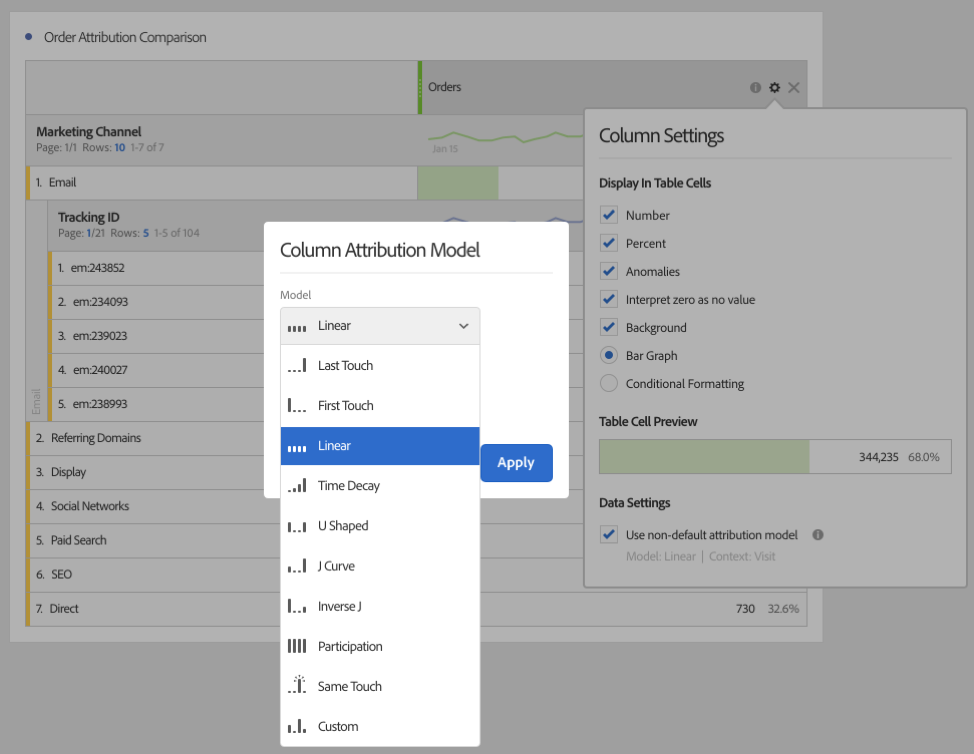
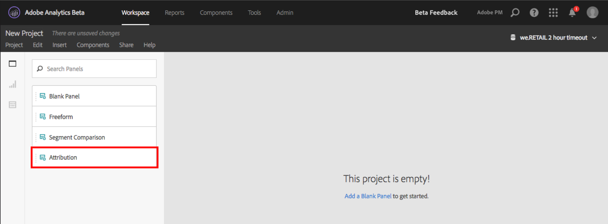

# 在 Analysis Workspace 中使用归因 IQ

通过 Analysis Workspace 中的归因 IQ，您可以：将任何受支持的归因模型相互比较；通过使用高级流失和流量可视化图表，显示导致转化的关键营销序列；轻松发现任何营销渠道或促销活动的趋势以查看一段时间内的效果；以及查找渠道/促销活动效果中的统计异常，并在效果出现上下波动时收到警报。

## Use attribution in freeform tables {#section_F2F72AE840EB4EA781302A559726E6F4}

Analysis Workspace 自由格式表支持几乎可用于所有量度的归因模型。可以在“列设置”的“自由格式表”列量度中设置归因模型：

1. 单击“自由格式表”列中的“设置”（齿轮）图标。

   

1. Under **[!UICONTROL Data Settings]**, check **[!UICONTROL Use non-default attribution model]**. 有关不同归因模型的更多信息，请参阅[归因 IQ 概述](../../../analyze/analysis-workspace/attribution-iq/attribution.md#section_4B9E7F83AE0B451A992397E55C3F5871)。

   

## Apply attribution models to breakdowns {#section_ED1E7532CF084B5AB0942BD80B4770C9}

自由格式表中的任何划分也可以应用任何归因模型，此归因模型可以与父列相同，也可以不同。例如，您可能想要对“营销渠道”维度上的线性订单进行分析，但同时也想将 U 型订单应用于渠道中的特定跟踪代码。要编辑已应用于划分的归因模型，只需将鼠标悬停在划分模型上，然后单击“编辑”：

## Compare one attribution model to another {#section_1D74C09549CC4EC8A952A7392C76D375}

If you’d like to quickly and easily compare one attribution model to another, right click a metric and select **[!UICONTROL Add comparative attribution model]**:

此操作可让您快速、轻松地将一个归因模型与另一个归因模型进行比较，而无需将归因模型拖动到某个量度中且不必对其进行两次配置。

## Attribution panel and visualizations {#section_6B02F28182F14ECC9FC5020F224726E6}

归因面板是一种用于构建各种归因模型的比较分析的简便方法。要访问归因面板，请执行以下操作：

1. 单击最左侧的面板图标。
1. 将归因面板拖动到您的 Analysis Workspace 项目中。

   

1. 添加要归因的成功量度，并且还添加任何要归因的渠道维度（例如营销渠道或内部促销）。

   

1. 选择要比较的[归因模型](../../../analyze/analysis-workspace/attribution-iq/attribution.md)和[回顾窗口](../../../analyze/analysis-workspace/attribution-iq/attribution.md)。

   归因面板将返回一组丰富的数据和可视化图表，以帮助您更好地了解营销渠道（或其他维度）如何协同工作：

   

   下面描述了每个可视化图表：

| 可视化图表 | 描述 |
|--- |--- |
| 总量度 | 报告窗口内发生的转化总数。这些是在您所选维度中归因的转化。 |
| 量度归因比较条形图 | 借助此条形图，您可以直观地比较所选维度中每个维度项目的归因转化。每种条形颜色代表一种选定的不同归因模型。 |
| 量度归因自由格式表 | 显示与条形图相同的数据-在此表中选择不同的列或行将过滤条形图以及面板中的几个其他可视化。此表与Workspace中的任何其他自由形式表相同-允许您添加度量、细分、细分等。 |
| 维度重叠图 | 这是一个维恩图，显示了前三个维度项目（例如渠道）以及它们共同参与转化的频率。例如，气泡重叠的大小表示当访客处于两个维度项目（例如渠道）时发生转化的频率。如果在自由格式表中选择其他行，则会更新可视化图表以反映所选内容。 |
| 每个历程的营销接触点 | 这是一个直方图，指示访客在报表日期范围内的营销（或任何维度）接触点数量。这有助于了解多接触点归因对数据集的影响程度。如果几乎所有的访客都只有一个接触点，则在结果上，不同的归因模型之间不会有很大的差异。 |
| 营销渠道效果详细信息 | 允许您使用散点图直观地对最多三个归因模型进行比较。 |
| 营销渠道流量 | 让您可以了解哪些是最常交互的渠道，以及这些渠道在访客历程中的顺序。 |
