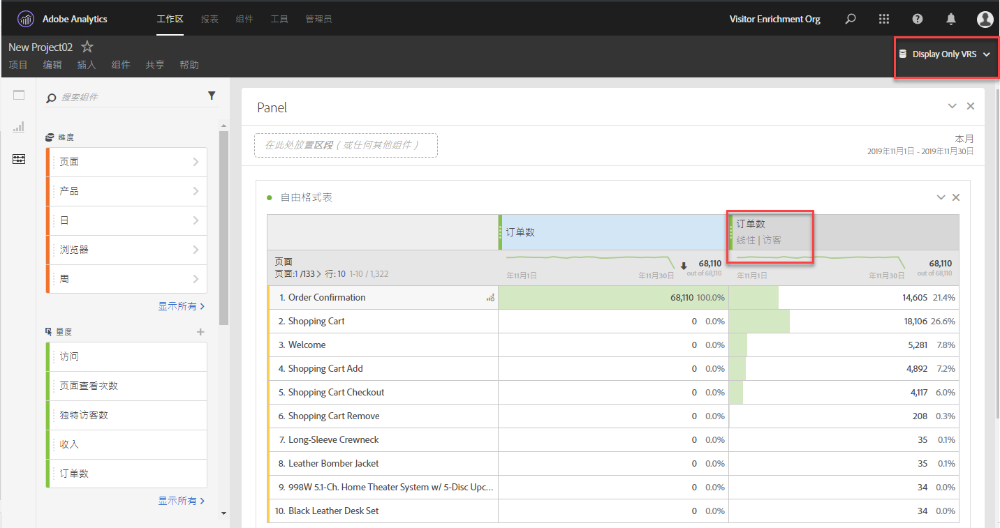

# 归因常见问题解答

+++##使用归因时，“无”行项目是什么？

“无”行项目是一个全包项，它表示在回顾窗口内发生的不含任何接触点的所有转化。要减少归因于“无”行项目的转化的次数，请尝试使用回顾期较长的“自定义回顾窗口”。

+++

+++##在使用归因模型时，为什么有时会看到超出报告窗口以外的日期？

某些基于访问的量度（如[登入次数](/help/components/metrics/entries.md)或[跳出率](/help/components/metrics/bounce-rate.md)），可以将数据归因到报告窗口开始日期范围之前的某个时段。这种情况是由使用回顾窗口的归因模型造成的，回顾窗口决定了归因应该回顾多远才能为量度提供点数。最常见的情况是访问时间跨过午夜。例如：

1. 用户于 9 月 7 日晚上 11:55 访问您的主页。
1. 他们访问了一些页面，其中最后一页的访问时间为 9 月 8 日凌晨 12:05。
1. 一周后，您运行了一份每日趋势报告，该报告的日期范围是 9 月 8 日至 9 月 14 日。

基于点击的量度（如[页面查看次数](/help/components/metrics/page-views.md)）将产生预期输出；从 9 月 8 日至 9 月 14 日，数据每天都在呈现趋势。然而，基于访问的量度还将显示上述 9 月 7 日那天的访问。访问的归因条目发生在 9 月 7 日，默认情况下，回顾窗口是 9 月 1 日至 9 月 31 日。

在此示例中，9 月 7 日那天的跳出率始终显示为 0%。此量度被定义为 `Bounces divided by Entries`，由基于点击的量度除以基于访问的量度而得。跳出次数由单一图像请求组成，因此它们不能跨越多天。9 月 7 日的任何跳出次数都发生在报告窗口之外，这将导致当天的跳出率一定为 0%。在此报告中，其他基于点击的量度也会在 9 月 7 日显示为 0，这是由于这些点击也不在此报告窗口内。

再看一个类似的例子。以下示例与上面示例之间唯一的区别就是日期：

1. 用户于 8 月 31 日晚上 11:55 访问您的主页。
1. 他们访问了一些页面，其中最后一页的访问时间为 9 月 1 日凌晨 12:05。
1. 一周后，您获得了一份每日趋势报告，该报告的日期范围是 9 月 1 日至 9 月 7 日。

在本例中，“登入次数”和“跳出率”不显示从 8 月 31 日起的数据。由于回顾窗口和报告窗口均从 9 月 1 日开始，因此数据不能从 8 月 31 日起归因。

+++

+++##何时应使用访问、访客或自定义归因回顾？

归因回顾的选择取决于您的用例。如果转化通常比单次访问花费的时间长，则建议使用访客或自定义回顾。如果转化周期较长，则自定义回顾窗口最适合，因为它是允许提取报告窗口之前的数据的唯一类型。

+++

+++##使用归因时，如何进行prop和eVar比较？

归因在报表运行时会重新计算，因此在归因建模时，prop 或 eVar（或任何其他维度）之间没有区别。使用任意回顾窗口或归因模型时 Prop 会持久保留，但是 eVar 分配/到期设置会被忽略。

+++

+++##归因模型在其他Analytics功能(例如数据馈送或Data Warehouse)中是否可以使用？

不会。归因模型会使用报表时间处理，这项功能仅在 Analysis Workspace 中可用。有关更多信息，请参阅[报表时间处理](/help/components/vrs/vrs-report-time-processing.md)。

+++

+++##是否只有在使用启用了报表时间处理的虚拟报表包时，我才可以使用归因模型？

归因模型可在虚拟报表包以外的报表中使用。当归因模型在后端使用报表时间处理时，它们可用于标准报表包和虚拟报表包。

+++

+++##不支持哪些维度和量度？

归因面板支持所有维度。不支持的量度包括：

* 所有计算量度
* 独特访客
* 访问
* 发生次数
* 页面查看次数
* A4T 量度
* 逗留时间量度
* 跳出次数
* 跳出率
* 登录
* 退出
* 页面未找到
* 搜索
* 单页面访问量
* 单次存取

+++

+++##归因是否适用于分类？

是的，完全支持分类。

+++

+++##归因是否适用于数据源？

是的，支持大多数数据源。摘要级别数据源不能进行归因，因为这些数据源未与Analytics访客标识符关联。

交易ID数据源的处理方式与任何其他点击的处理方式相同。 交易ID数据源不使用传统报表中通常使用的特殊处理。 换言之，在使用报表时间处理时，交易ID点击将传播来自点击的eVar值，这些点击发生在交易ID点击的时间戳附近。 这些值将不会从接近原始事务时间的点击中传播。

如果可能，归因依赖于数据源中事件内发送的MID列值，而不是持久值。 归因模型会动态应用于数据源中的MID列值。 例如，当您使用“最后接触”归因时，模型将从量度的每个实例开始，并在点击中顺序向后移动，直到模型达到MID列中观察到的最后一个值。

如果不可用，归因将使用数据源中“前一个记录”中的MID值进行评估。 鉴于AA不支持乱序数据，此以前的记录可能不会按时间戳顺序排序。

由于记录未按顺序排序，应用持久性的预期值可能会影响提供的交易ID时间戳和原始交易之间存在的时间。

+++

+++##归因是否适用于Advertising Analytics集成？

元数据维度（如匹配类型和关键词）可与归因结合使用。但是，量度（包括展示次数、成本、点击量、平均位置和平均质量分数）使用摘要级别的数据源，因此不兼容。

+++

+++##如何将归因与营销渠道结合使用？

当营销渠道首次推出时，只提供首个接触维度和最后接触维度。在有了当前版本的归因后，不再需要显式的首次接触/最后接触维度。Adobe提供通用 [!UICONTROL 营销渠道] 和 [!UICONTROL 营销渠道详细信息] 维度，以便将它们用于所需的归因模型。 这些通用维的行为与相同 [!UICONTROL 最近联系渠道] 维度，但采用不同的标记以防止在将营销渠道用于不同的归因模型时造成混淆。

由于营销渠道维度取决于传统的访问定义（由其处理规则定义），因此使用虚拟报表包无法更改其访问定义。

+++

+++##归因如何与多值变量（如列表变量）一起使用？

Analytics 中的某些维度可能包含单个点击时的多个值。常见示例包括列表变量和产品变量。

当将归因应用于多值点击时，同一点击中的所有值都将获得相同的点数。由于许多值都可以获得此点数，因此报表总计情况可能与您汇总每个单独行项目时有所不同。报表总计情况会去除重复项，而每个维度项目将获得适当的点数。

+++

+++##归因如何与区段一起使用？

归因始终在分段之前运行，并且进行分段之后才能应用报表过滤器。此概念原则也适用于使用区段的虚拟报表包。

例如，如果创建一个应用了“显示点击量”区段的虚拟报表包，则您可能会在使用某些归因模型的表中看到其他渠道。

>[!NOTE]
>
>如果区段禁止包含您的量度的点击，则这些量度实例不会归因到任何维度。 但是，类似的报表过滤器只会隐藏某些维度项目，而不会影响根据归因模型处理的量度。 因此，区段返回的值可能会比具有类似定义的过滤器返回的值少。

+++
