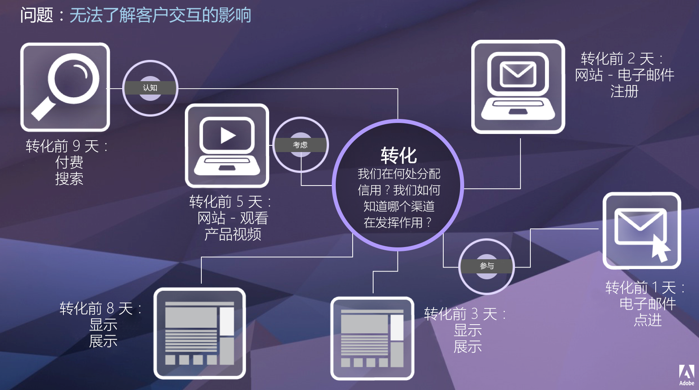

# 归因概述

通过归因，分析师能够自定义维度项目获取成功事件点数的方式。 例如：

1. 网站访客单击指向您的某个产品页面的付费搜索链接。 他们将产品添加到购物车，但不购买。
2. 第二天，他们查看自己朋友的社交媒体帖子，单击链接，然后完成购买。

在某些报告中，您可能希望将订单归因到“付费”搜索。 在其他报告中，您可能希望将订单归因到社交。 通过归因，您能够控制报告的这一方面。 它适用于 Adobe Analytics Ultimate、Prime、Select 和 Foundation 上的所有组织。 如果您不确定您与 Adobe 签订的合同类型，请联系贵组织的 Adobe 客户团队。

## 归因的价值

给定的客户历程不是线性的，而且往往难以预测。 每位客户按各自的进度进行；通常，它们会再次返回、延迟、重新启动或参与其他非线性行为。 这些免费操作使得我们很难了解营销工作在整个客户历程中所产生的影响。 它还会妨碍将多个数据渠道绑定在一起的工作。

<!--

-->

Adobe Analytics 通过让您能够执行以下操作来增强归因：

* 定义付费媒体之外的归因：可将任何维度、量度、渠道或事件应用于模型（例如内部搜索），而不仅仅是营销活动。
* 使用无限制的归因模型比较：动态比较任意所需数量的模型。
* 避免实施更改：使用报告时间处理和上下文感知会话，可在运行时构建并应用客户历程上下文。
* 生成与您的归因方案最匹配的会话。
* 按区段细分归因：轻松对所有重要区段中的营销渠道效果进行比较（例如新客户与老客户、产品 X 与产品 Y、忠诚度级别或 CLV）。
* 检查渠道交叉和多接触点分析：使用维恩图和直方图，以及趋势归因结果。
* 直观地分析关键营销序列：通过多节点流量和流失可视化图表，以可视方式探索导致转化的路径。
* 生成计算量度：使用任意数量的归因分配方法。

## 功能

归因包括以下功能：

* [归因面板](../c-panels/attribution.md)：获取任何维度和量度，并快速将其与不同的归因模型进行比较。
* [将归因应用于度量](../visualizations/freeform-table/column-row-settings/column-settings.md)：对项目中的任何量度使用非默认归因。
* [将归因应用于细分](../components/dimensions/t-breakdown-fa.md)：对细分使用非默认归因。
* [比较归因模型](../components/apply-create-metrics.md)：快速了解任何量度的不同归因模型的异同。

## 视频

>[!BEGINSHADEBOX]

请参阅 [自由格式表中的归因](https://experienceleague.adobe.com/en/docs/analytics-learn/tutorials/analysis-workspace/attribution-iq/using-attribution-iq-in-freeform-tables){target="_blank"}，获取演示视频。

>[!ENDSHADEBOX]

>[!BEGINSHADEBOX]

请参阅  [计算量度中的归因](https://experienceleague.adobe.com/en/docs/analytics-learn/tutorials/analysis-workspace/attribution-iq/attribution-iq-in-calculated-metrics){target="_blank"}，获取演示视频。

>[!ENDSHADEBOX]

>[!BEGINSHADEBOX]

请参阅  [使用归因面板](https://experienceleague.adobe.com/en/docs/analytics-learn/tutorials/analysis-workspace/attribution-iq/using-the-attribution-iq-panel){target="_blank"}，获取演示视频。

>[!ENDSHADEBOX]

>[!BEGINSHADEBOX]

请参阅  [添加归因模型的并排比较](https://experienceleague.adobe.com/en/docs/analytics-learn/tutorials/analysis-workspace/attribution-iq/adding-side-by-side-comparisons-of-attribution-iq-models){target="_blank"}，获取演示视频。

>[!ENDSHADEBOX]

## 不支持归因的 Adobe Analytics 工具

任何不支持 Analytics 2.0 API 的工具，例如[旧版 Report Builder](/help/analyze/legacy-report-builder/home.md)，都不支持归因。
