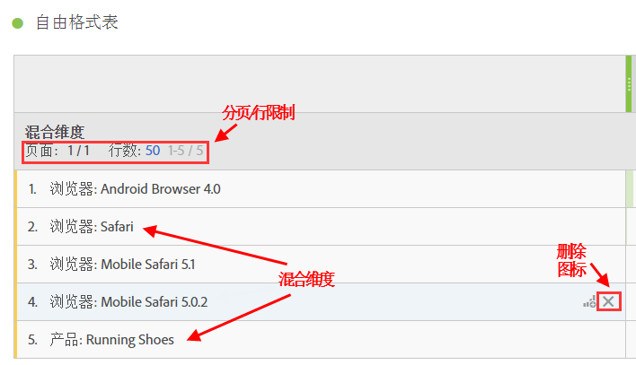
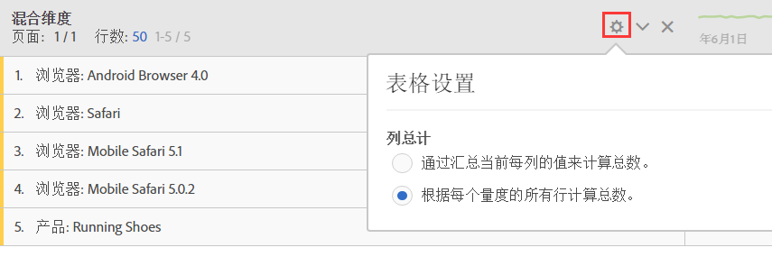

# 静态与动态行

Analysis Workspace 表格会在您将维度拖入到表格中时生成“动态”行，这意味着给定量度中与该维度对应的所有项目都将提取到表格中。

例如，当您将浏览器维度拖动到表格时，其所有维度项目（例如，Android 浏览器、Mobile Safari、Firefox 等）都将动态提取到表格中。

与此相反，无论您何时手动选择特定量度、区段、数据范围或单个维度项目并将其拖动到表格中，结果都会生成硬编码或“静态”行或列表。您现在可以通过以下方式与静态行进行交互：

* 单击静态行中的“预览”图标可预览区段、量度和日期范围。
* 单击“x”图标以从表格中删除该行。
* 限制显示的行数和启用分页显示。
* 添加“混合维度项目”。例如，从浏览器维度添加一个项目，然后从产品维度添加另一个项目。

   说明如下：

   

此外，(仅限)处于静态行模式时，现在可以更改如何计算列总数。只需单击齿轮图标并在以下 2 个选项之间进行切换：

| 选项 | 描述 |
|---|---|
| 通过汇总当前每列的值来计算总数。 | 此选项仅计算表格中的当前行。（客户端计算） |
| 根据每个量度的所有行计算总数。 | 此选项包括此维度的所有维度项目，甚至包括未列在表格中的维度项目。（服务器端计算） |

