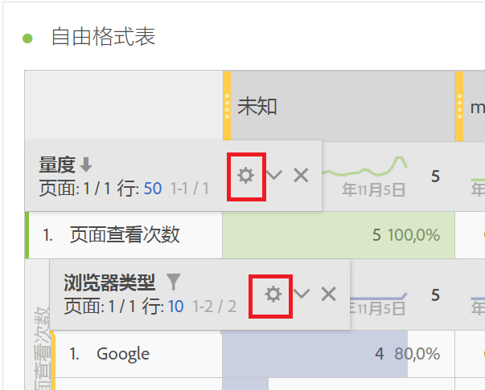
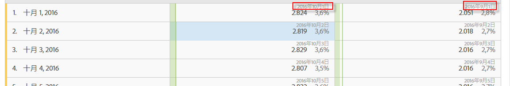

# 行设置

行设置因您拖入到表格中的组件而异。

您还可以[在表格中使用右键单击操作](/help/analyze/analysis-workspace/visualizations/freeform-table.md)来管理选定行。

要访问表格行设置，请单击每个行内的维度、区段、量度、时间段或划分旁边的“设置”图标：

<table id="table_7ACE6413DB1F40349ED2860020F92E55"> 
 <thead> 
  <tr> 
   <th colname="col1" class="entry"> 行设置 </th> 
   <th colname="col2" class="entry"> 描述 </th> 
  </tr>
 </thead>
 <tbody> 
  <tr> 
   <td colname="col1"> 
<a href="/help/analyze/analysis-workspace/components/calendar-date-ranges/time-comparison.md"  > 日期比较</a> 
 </td> 
   <td colname="col2"> 
<b>将每列的日期调整为全部从同一行开始。</b> 
 
如果选择调整日期，例如在 2016 年 10 月和 9 月间的月同比比较中，左列将从 10 月 1 日开始，右列将从 9 月 1 日开始： 
 
 
 
默认情况下处于禁用状态。 
 </td> 
  </tr> 
  <tr> 
   <td colname="col1"> 
百分数 
 </td> 
   <td colname="col2"> 
<b>按行计算百分比</b> 
 
强制自由格式表按行计算单元格百分比，而不是沿列计算。这对显示百分比趋势特别有用。在使用可视化图标时，默认情况下会开启该设置。 
 </td> 
  </tr> 
  <tr> 
   <td colname="col1"> 
列总计 
 </td> 
   <td colname="col2"> 
这些设置只显示<a href="/help/analyze/analysis-workspace/build-workspace-project/column-row-settings/manual-vs-dynamic-rows.md"  >手动（静态）行</a>（在选择了有限项目集时），而不显示动态行（在显示所有项目的维度中拖放时）。 
注意：对于<i></i>“量度”手动行，该设置处于禁用状态，因为对表格中当前行以外的任何量度进行汇总都是毫无意义的。 
 
 
<b>通过汇总当前每列的值来计算总数（默认情况下处于启用状态）：</b> 
 
此选项仅计算表格中的当前行。（客户端计算） 
 
<b>根据每个量度的所有行计算总数（默认情况下处于禁用状态）：</b> 
 
此选项包括此维度的所有维度项目，甚至包括未列在表格中的维度项目。（服务器端计算） 
 </td> 
  </tr> 
  <tr> 
   <td colname="col1"> 
划分 
 </td> 
   <td colname="col2"> 
<b>按位置划分:</b> 
 
您可以基于自由格式表中的固定位置执行划分。例如，您可以指定始终对表的头七行进行划分。 
 
（以前，划分中的值列表会被“锁定”。这会导致这样一种情况，例如，如果您按页面划分日期，则会得到您选定日期范围内的前 50 页的列表。如果您保存了该报表然后在一个月后运行它，则头 50 页很可能已发生更改。然而，Analysis Workspace 将使用来自原始划分的结果并返回相同页面，但将当前月份作为日期范围。） 
 
要执行基于固定位置的划分，请执行以下操作： 
 
    <ol id="ol_A396A11566AA4F52BC3ABBC373CEF477"> 
     <li id="li_BDAB1E9A48D44944A4F7C31F1182B923">划分表格中的一些行。 </li> 
     <li id="li_C5610437D3714CCEB9F3C771864B4336">单击希望处于固定位置的表格行旁边的“设置”（齿轮）图标。 </li> 
     <li id="li_675E429DC3B94201978166F9408D30B1">选中按位置划分旁边的复选框。 </li> 
     <li id="li_E8A417D0D6D1438CAE825843BA0A7060">更改排序顺序或日期范围，并注意划分现在已绑定到行位置，而不是硬编码的行。 </li> 
    </ol> 
默认情况下处于禁用状态。 
 </td> 
  </tr> 
 </tbody> 
</table>

| 行设置 | 描述 |
|--- |--- |
| 日期比较 | 将每列的日期调整为全部从同一行开始。当您选择对齐日期时（例如，在2016年10月和9月的按月比较中），左列将从10月1日开始，右列将从9月1日开始。 默认情况下处于禁用状态。 |
| 百分数 | 按行计算百分比强制自由格式表计算行中的单元格百分比，而不是向下计算列。 这对显示百分比趋势特别有用。 默认情况下，在使用可视化图标时启用。 |
| 列总计 | 这些设置只显示 [static) rows](https://docs.adobe.com/content/help/en/analytics/analyze/analysis-workspace/build-workspace-project/column-row-settings/manual-vs-dynamic-rows.html) (when you have selected a finite set of items), not with dynamic rows (i.e., when you drop in a dimension that shows all items).<ul><li>**[!UICONTROL 将当前行的总和显示为总计]**- 此设置将显示表中行的客户端总和，这意味着总计将&#x200B;**不会**&#x200B;消除重复的量度，如访问次数或访客。</li><li>**[!UICONTROL 显示总计]**- 此设置将显示服务器端总和，这意味着总计将消除重复的量度，如访问次数或访客。</li></ul> |
| 划分 | **[!UICONTROL 按职位划分]**: 您可以根据自由格式表中的固定位置执行细分。 例如，您可以指定始终对表的头七行进行划分。 （以前，划分中的值列表会被“锁定”。这会导致这样一种情况，例如，如果您按页面划分日期，则会得到您选定日期范围内的前 50 页的列表。如果您保存了该报表然后在一个月后运行它，则头 50 页很可能已发生更改。然而，Analysis Workspace 将使用来自原始划分的结果并返回相同页面，但将当前月份作为日期范围。） 要根据固定位置执行细分，请执行以下操作：1. 划分表格中的一些行。2.单击要处于固定位置的表行旁边的“设置”（齿轮）图标。 3.选中按位置划分旁边的复选框。 4.更改排序顺序或日期范围，并注意，现在划分与行位置相关联，而不是硬编码行。 默认情况下处于禁用状态。 |
