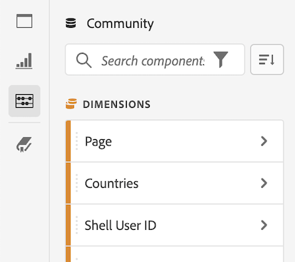

# 在 Analysis Workspace 中创建项目

Analysis Workspace 中的[项目](/help/analyze/analysis-workspace/build-workspace-project/freeform-overview.md)允许您查看可与组织内部或外部的利益相关者共享的关键业务分析内容。

有关如何开始使用 Analysis Workspace 的一般信息，请参阅 [Analysis Workspace 概述](/help/analyze/analysis-workspace/home.md)。

以下部分介绍的是如何创建项目并开始添加任何 Analysis Workspace 项目的关键构建区块：面板、可视化效果和组件。

## 从空白项目或报表创建项目

1. 在 Adobe Analytics 中，选择 [!UICONTROL **Workspace**]。

1. 选择是创建空白项目还是从报表创建项目：

   +++创建空白项目

   1. 在 [!UICONTROL **Workspace**] 选项卡上，选择页面左侧的&#x200B;[!UICONTROL **项目**]&#x200B;选项卡，然后选择&#x200B;[!UICONTROL **创建项目**]。

   1. 选择是创建空白项目还是空白移动记分卡

      * 如果您计划通过浏览器共享您的分析，请创建&#x200B;**空白项目**
      * 如果您计划通过 Adobe Analytics 功能板移动设备应用程序共享您的分析，请创建&#x200B;[**空白移动记分卡**](/help/analyze/mobile-app/curator.md)。

   1. 选择&#x200B;[!UICONTROL **创建**]。

+++

   +++从报表创建项目

   1. 在 [!UICONTROL **Workspace**] 选项卡上，选择页面左侧的&#x200B;[!UICONTROL **报表**]&#x200B;选项卡。

   1. 搜索或导航到要使用的报表，然后在它出现时将其选定。

      默认情况下，提供一组标准报表。此外，您的组织可能已创建自定义报表以供您选择。

   1. 选择&#x200B;[!UICONTROL **项目**] > [!UICONTROL **保存**]&#x200B;以将报表另存为新项目。

      有关报表的更多信息，请参阅 [Adobe Analytics 登陆页面](/help/analyze/landing.md)中的“导航‘报表’选项卡”。

+++

1. 接下来，您需要在项目中添加面板、可视化效果和组件。首先，将面板添加到 Analysis Workspace 中的项目内，如[将面板添加到项目中](#add-panels-to-the-project)所述。然后，您可以将可视化效果添加到任何面板中。最后，您可以将组件添加到任何面板或可视化效果中。

## 将面板添加到项目中 {#panels}

[面板](https://experienceleague.adobe.com/docs/analytics/analyze/analysis-workspace/panels/panels.html?lang=zh-Hans)是 Analysis Workspace 中任何项目的基础。面板可用于组织项目的内容（可视化效果和组件）。

Analysis Workspace 中提供的许多面板都可以基于一些用户输入来生成整套分析。

要添加面板，请执行以下操作：

1. 选择左边栏中的&#x200B;[!UICONTROL **面板**]&#x200B;图标。

   

1. 搜索要添加的面板。当它出现在左边栏中时，将它拖到您的项目中。

1. 在面板中添加可视化效果，如[在项目中添加可视化效果](#add-visualizations-to-the-project)中所述。

   或者，您可以将组件直接添加到面板中，如[将组件添加到项目中](#add-components-to-the-project)所述。

## 在项目中添加可视化效果

[可视化图表](https://experienceleague.adobe.com/docs/analytics/analyze/analysis-workspace/visualizations/freeform-analysis-visualizations.html?lang=zh-Hans)（例如自由格式表，条形图或折线图）可用于直观地呈现数据。

>[!TIP]
>
>自由格式表是最常见的可视化类型，也是交互式数据分析的基础。有关如何在 Analysis Workspace 中使用自由格式表的更多详细信息，请参阅[自由格式表](/help/analyze/analysis-workspace/visualizations/freeform-table/freeform-table.md)。

要添加可视化效果，请执行以下操作：

1. 选择左边栏中的&#x200B;**[!UICONTROL 可视化]**&#x200B;图标。

   

1. 搜索要添加的可视化效果。当它出现在左边栏中时，将它拖动到项目中的面板内。

1. 将组件添加到可视化效果中，如[将组件添加到项目](#add-components-to-the-project)中所述。

## 将组件添加到项目中

[组件](/help/analyze/analysis-workspace/components/analysis-workspace-components.md)构成任何项目的实际数据。您可以将组件添加到可视化效果或面板中。

>[!TIP]
>
>有关每个组件的信息，请选择左边栏中组件名称旁边的“信息”图标，或参阅 [Analytics 组件指南](/help/components/home.md)。

以下是有关如何将组件添加到Analysis Workspace中的项目的基本信息。 有关添加各种类型的组件（维度、量度、区段和日期范围）的更多详细信息，请参阅 [在Analysis Workspace中使用组件](/help/analyze/analysis-workspace/components/use-components-in-workspace.md).

要在Analysis Workspace中将组件添加到项目，请执行以下操作：

1. 选择左边栏中的&#x200B;**[!UICONTROL 组件]**&#x200B;图标。

   

1. 滚动到或搜索要添加组件，然后将其拖动到项目中的面板或可视化图表。

   例如，您可以将区段拖到面板标题中的区段放置区域。

   

   有关将组件添加到项目的更多信息，请参阅 [在Analysis Workspace中使用组件](/help/analyze/analysis-workspace/components/use-components-in-workspace.md).

1. （可选）按照[保存和共享项目](#save-and-share-the-project)中的说明共享项目。

## 保存和共享项目

在 Analysis Workspace 中创建分析时，您的工作将[自动保存](/help/analyze/analysis-workspace/build-workspace-project/save-projects.md)。

在构建完项目并收集可操作洞察后，项目即可供其他人使用。您可以与组织内的用户和组甚至组织外的人员共享项目。有关共享项目的信息，请参阅[共享项目](/help/analyze/analysis-workspace/curate-share/share-projects.md)。
