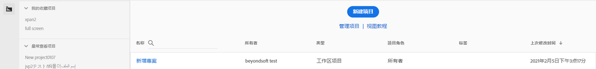
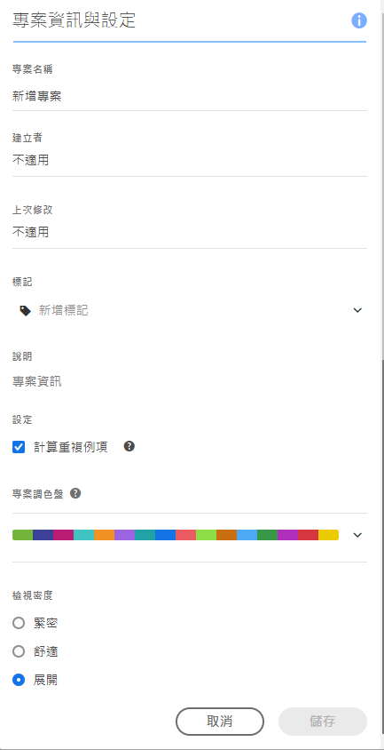
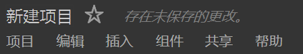
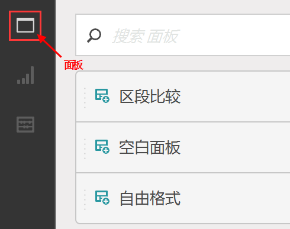
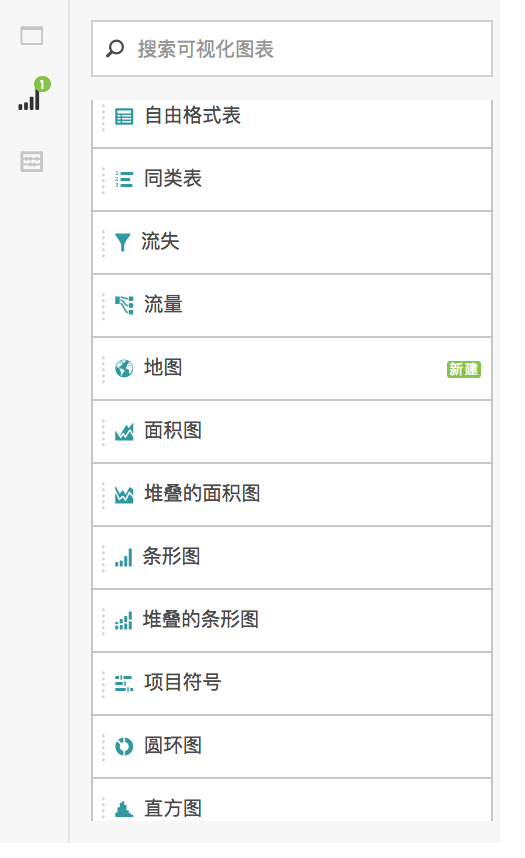
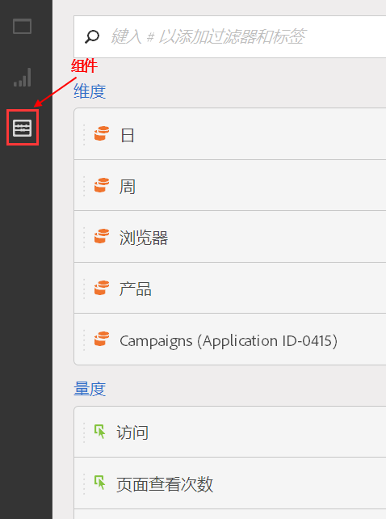

# 创建项目-概述

**[!UICONTROL Analytics]** &gt; **[!UICONTROL Workspace]**

您可以基于可视化、报表组件和数据表的任意组合，创建功能强大的 Analytics 项目。它将 Ad Hoc Analysis 的许多表格生成器功能引入到 Analytics 中。

在 Analysis Workspace 中，您可以通过以前所没有的方式来比较和分析数据。例如，配置排名报表，并对数据查询进行快速迭代更改，然后在报告级别访问和处理值。

查询直接与报表引擎关联 -- 创建您的分析时，您可以在内部进行更改，无需引入其他报表。结果可以立即返回，无需刷新浏览器。

## 工作区项目列表页面 {#section_39AA007D7C384F4E869F842F1C7B11F8}

When you first go to **[!UICONTROL Analytics]** &gt; **[!UICONTROL Workspace]**, the page lists all the projects you own or have been granted access to. You can set this page to be your Adobe Analytics landing page by clicking **[!UICONTROL Set as Landing Page]**. （如果您未看到此选项，如下面的屏幕快照所示，则它已是您的登录页面。）

工作区项目列表页面包含了以下信息：

| 元素 | 描述 |
|---|---|
| 项目[模板](../../../analyze/analysis-workspace/build-workspace-project/starter-projects.md#concept_49B9A327C5004DB0A4BE6291435625C5) | 您可以按原样使用这些预填充项目模板，或调整它们以符合您的需要（例如，添加或替换量度或可视化），然后取一个新名称将它们保存。 |
| [新建项目](../../../analyze/analysis-workspace/build-workspace-project/t-freeform-project.md#task_C2C698ACC7954062A28E4784911E6CF2) | 单击此链接可重新启动一个新项目。 |
| 管理项目 | Clicking this link takes you to the Projects Component Manager ( **[!UICONTROL Analytics]** &gt; **[!UICONTROL Components]** &gt; **[!UICONTROL Projects]**), which lists all your projects and lets you tag, share, delete, rename, approve, copy, and export projects to CSV. |
| 查看教程 | 转到 [Analysis Workspace YouTube 视频](https://www.youtube.com/playlist?list=PL2tCx83mn7GuNnQdYGOtlyCu0V5mEZ8sS)。 |
| 名称 | 工作区项目名称。 |
| 创建者 | 创建此项目的人员（您或与您共享项目的人员）。 |
| 标记 | Tags that were applied to the project, either in the Projects Component Manager or under **[!UICONTROL Workspace]** &gt; **[!UICONTROL Project]** &gt; **[!UICONTROL Project Info &amp; Settings]**. |
| 上次修改时间 | 项目上次修改的日期和时间。 |

## 项目信息和设置 {#section_63773D0B9E4543E88068ECECB9EEB4C6}

**[!UICONTROL “工作区]** ”&gt; **[!UICONTROL “项目]** ”&gt; **[!UICONTROL “项目信息和设置”]**

**[!UICONTROL 项目信息和设置]**&#x200B;提供有关当前活动项目的项目级信息。

| 设置 | 描述 |
|---|---|
| 项目名称 | 给项目起的名称。您可以双击该名称以编辑它。 |
| 创建者 | 项目所有者名称 |
| 上次修改时间 | 项目上次修改日期。 |
| 标记 | 列出应用于项目以方便分类的所有标记。您也可以在保存项目时标记项目。可在工作区登录页面上“[!UICONTROL 标记]”列中查看项目的标记。 |
| 描述 | 描述有助于明确项目的目的。您可以双击描述以编辑它。 |
| 计算项目中的重复实例 | 指定是否将重复实例计入报表中。如果您针对相同的变量具有多个序列值，则可以将它们计为该变量的一个实例，也可以计为多个实例。 |
| 可视化图表配色方案 | 您可以通过选择不同的调色板或指定个性化调色板来更改工作区中使用的配色方案。这项功能会影响工作区中的许多内容，包括大多数可视化图表。 |
| 视图密度 | 您可以减小左边栏、自由格式表和同类群组表的垂直边距，从而在屏幕上查看更多数据。 |

## 项目菜单 {#section_850CDFCB86A64EB0A0AD5B9E0FCB7013}

顶部项目菜单如下所示：

子菜单包含以下选项。

>[!NOTE]
>
>Options marked by an asterisk (*) display only with **saved** projects.

| 项目 | 编辑 | 插入 | 组件 | 共享 | 帮助 |
|---|---|---|---|---|---|
| 新建 | 撤消 | 新建面板 | 新建区段 | 共享项目 | 视频 |
| 打开 | 清除 | 新建自由格式面板 | 新建量度 | 获取项目链接* | 热键 |
| 保存 | 全部清除 | 新建区段比较面板 | 新建日期范围 | 立即发送文件* | 帮助论坛 |
| 另存为* |  | 新建自由格式表 | 新建警报 | 按计划发送文件* |  |
| 设置为登录页面* |  | 新行 | 刷新组件 | 组织项目数据 |  |
| 刷新项目 |  | 新建条形图 |  |  |  |
| 下载 CSV |  |  |  |  |  |
| 下载 PDF* |  |  |  |  |  |
| 项目信息和设置 |  |  |  |  |  |

## 左边栏 {#section_271295C26EC840ABB2A8E7EC0498B60E}

The left rail has 3 icons, allowing you access to Panels, [Visualizations](../../../analyze/analysis-workspace/visualizations/freeform-analysis-visualizations.md#concept_09242627629147A88A68F1506954C276), and [Components](../../../analyze/analysis-workspace/components/analysis-workspace-components.md#concept_BEBE3A75E072495D9E2F895567BBD462)(Dimensions, Metrics, Segments, Data Ranges) with one click:

  

在可从左边栏访问的面板列表中添加了&#x200B;**[!UICONTROL 空白面板]。**&#x200B;要创建&#x200B;**新的同类群组面板**，请拖入一个空白面板，然后再拖入一个同类群组表可视化。
