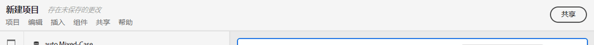
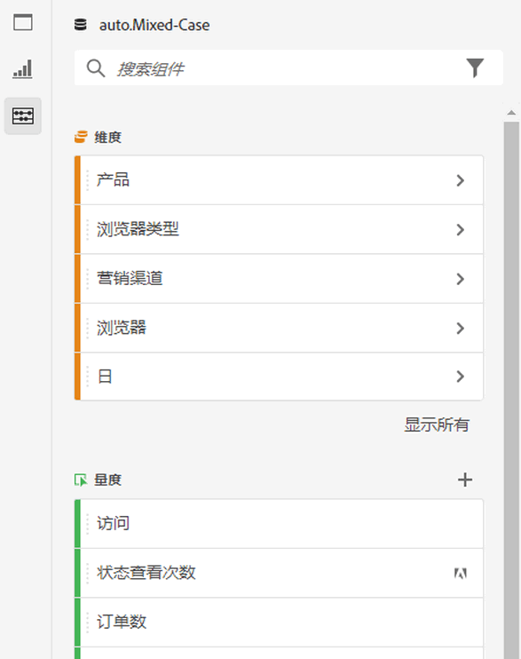
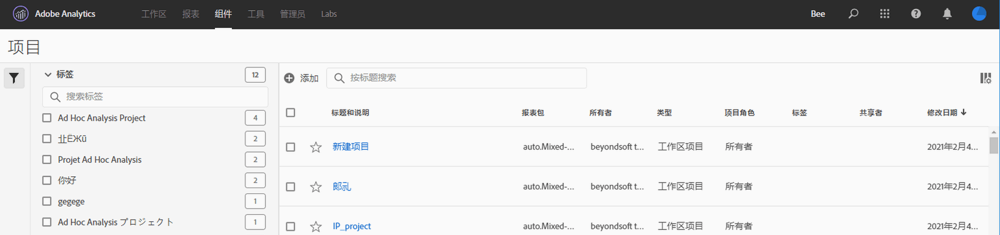

# 项目概述

Workspace项目允许您结合数据组件、表格和可视化，创建分析并与组织中的任何人共享。 在启动第一个项目之前，请了解如何访问、导航和管理您的项目。

## 项目列表 {#project-list}

当您首次转到&#x200B;**[!UICONTROL Analytics]** > **[!UICONTROL Workspace]**&#x200B;时，页面会列表您拥有或已共享给您的所有项目。 这也是Adobe Analytics的登陆页，除非您之前设置了自定义登陆页。

工作区项目列表页面包含了以下信息：

| 元素 | 描述 |
|---|---|
| [新建项目](/help/analyze/analysis-workspace/home.md) | 单击此链接可从头开始或从为您创建的[template](https://experienceleague.adobe.com/docs/analytics/analyze/analysis-workspace/build-workspace-project/starter-projects.html?lang=en#analysis-workspace)中开始新项目。 |
| 管理项目 | 单击此链接将会转到项目组件管理器（**[!UICONTROL Analytics]** > **[!UICONTROL 组件]** > **[!UICONTROL 项目]**），其中列出了您的所有项目，并允许您标记、共享、删除、重命名、批准、复制项目以及将项目导出到 CSV。 |
| 设置为登录页面 | 将此页面转换为您的工作区登陆页。 |
| [查看教程](https://docs.adobe.com/content/help/en/analytics-learn/tutorials/analysis-workspace/analysis-workspace-basics/analysis-workspace-introduction.html) | 带您观看Analysis Workspace视频教程。 |
| 名称 | 工作区项目名称。 |
| 所有者 | 创建此项目的人员（您或与您共享项目的人员）。 |
| 类型 | 指示这是工作区项目还是[Mobile Scorecard](https://docs.adobe.com/content/help/zh-Hans/analytics/analyze/mobapp/home.html)。 |
| [项目角色](https://experienceleague.adobe.com/docs/analytics/analyze/analysis-workspace/curate-share/share-projects.html) | 指示您对项目的角色 — 所有者、编辑、重复、视图。 |
| 标记 | 应用于项目的标记。 |
| 上次修改时间 | 项目上次修改的日期和时间。 |
| 我最喜欢的项目 | 要将项目标记为收藏，请打开项目，然后单击项目名称旁的星形。 它将在您下次打开Workspace时显示在此列表中。 |
| 经常查看的项目 | 列表您经常打开的所有项目，以便轻松访问。 |

## 菜单栏{#menu-bar}

在项目中，该菜单提供了用于管理项目、添加组件、查找帮助等的选项。 每个菜单选项也可通过键盘[快捷键](https://experienceleague.adobe.com/docs/analytics/analyze/analysis-workspace/build-workspace-project/fa-shortcut-keys.html)访问。

| 菜单项 | 描述 |
|---|---|
| 项目 | 包括用于项目管理的常见操作，包括“新建”、“打开”、“保存”、“另存为”和“另存为”模板](https://experienceleague.adobe.com/docs/analytics/analyze/analysis-workspace/build-workspace-project/starter-projects.html)。 [您还可以通过单击“刷新项目”来刷新整个项目以检索最新数据和定义。 [下载CSV和PDF](https://experienceleague.adobe.com/docs/analytics/analyze/analysis-workspace/curate-share/download-send.html) 选项使您能从Workspace导出数据。[“项目信息和设](https://experienceleague.adobe.com/docs/analytics/analyze/analysis-workspace/build-workspace-project/freeform-overview.html?#info-settings) 置”为管理项目提供了许多选项。 |
| 编辑 | 撤消或重做您的上一个操作。 “全部清除”会将您的项目重置为空的起始点。 |
| 此项前 | 从此菜单中插入新面板或可视化。 您还可以从左边栏插入新面板和可视化。 |
| [组件](https://experienceleague.adobe.com/docs/analytics/analyze/analysis-workspace/components/analysis-workspace-components.html) | 从您的项目创建新的区段、计算量度、日期范围或警报组件。 您还可以从左边栏创建新组件。 如果您的组件定义最近已更改，则“刷新组件”将检索最新的定义。 |
| [共享](https://experienceleague.adobe.com/docs/analytics/analyze/analysis-workspace/curate-share/send-schedule-files.html) | 将PDF/CSV项目管理、共享和计划到您组织中的收件人。 |
| 帮助 | 访问帮助文档、视频和Experience League社区。 管理工作区提示以及[调试器](https://www.adobe.io/apis/experiencecloud/analytics/docs.html#!AdobeDocs/analytics-2.0-apis/master/reporting-tricks.md)的可见性。 查找有关Workspace和影响项目[性能](https://experienceleague.adobe.com/docs/analytics/analyze/analysis-workspace/workspace-faq/optimizing-performance.html)的因素的详细信息。 |
| “共享”按钮或“所有者” | 如果您位于项目的“自行”或“编辑”中，则右上角的“共享”按钮可让您单击一次以管理项目收件人。 如果您是项目的重复或视图角色，您将看到项目所有者的名称。 |

### 项目信息和设置 {#info-settings}

**[!UICONTROL 工作区]** > **[!UICONTROL 项目]** > **[!UICONTROL 项目信息和设置]** 提供有关当前活动项目的项目级信息。

设置包括：

| 设置 | 描述 |
|---|---|
| 项目名称 | 给项目起的名称。您可以双击该名称以编辑它。 |
| 创建者 | 项目所有者名称 |
| 上次修改时间 | 项目上次修改日期。 |
| 标记 | 列出应用于项目以方便分类的所有标记。 |
| 描述 | 描述有助于明确项目的目的。您可以双击描述以编辑它。 |
| 计算项目中的重复实例 | 指定是否将重复实例计入报表中。注意：此设置不适用于流或流失可视化。 |
| [项目颜色调色板](https://experienceleague.adobe.com/docs/analytics/analyze/analysis-workspace/build-workspace-project/color-palettes.html) | 您可以通过从已针对色盲优化的现成调色板中进行选择，或通过指定自定义调色板来更改Workspace中使用的分类调色板。 这项功能会影响工作区中的许多内容，包括大多数可视化图表。 |
| [视图密度](https://experienceleague.adobe.com/docs/analytics/analyze/analysis-workspace/build-workspace-project/view-density.html) | 您可以减小左边栏、自由格式表和同类群组表的垂直边距，从而在屏幕上查看更多数据。 |

## 左边栏{#left-rail}

在项目中，从左边栏访问[面板](https://experienceleague.adobe.com/docs/analytics/analyze/analysis-workspace/panels/panels.html)、表、[可视化](https://experienceleague.adobe.com/docs/analytics/analyze/analysis-workspace/visualizations/freeform-analysis-visualizations.html)和[组件](https://experienceleague.adobe.com/docs/analytics/analyze/analysis-workspace/components/analysis-workspace-components.html)。 这些都是组成项目的构件。

您还可以从[空白面板](https://experienceleague.adobe.com/docs/analytics/analyze/analysis-workspace/panels/blank-panel.html)访问可视化和面板。

左边栏中的组件(Dimension、量度、区段、日期范围)与活动面板报表包相关。 活动面板周围将有一个蓝色边框，活动报表包将列在组件边栏的顶部。

## 项目画布{#canvas}

在项目画布中，您可以将面板、表格、可视化和组件组合在一起，以构建分析。 一个项目可以包含多个面板，每个面板可以包含多个表和可视化。

当您希望根据时段、报表包或分析用例组织项目时，面板非常有用。 活动面板周围将有一个蓝色边框，并确定左边栏中可用的组件。

根据您为项目选择的起始点，您将在画布中有一个[自由格式表](https://experienceleague.adobe.com/docs/analytics/analyze/analysis-workspace/visualizations/freeform-table/freeform-table.html)或一个[空白面板](https://experienceleague.adobe.com/docs/analytics/analyze/analysis-workspace/panels/blank-panel.html)以开始。 开始分析的最快捷方式是选择一个或多个组件，并将它们拖放到项目画布中。 系统会自动为您呈现数据表。 [进](https://experienceleague.adobe.com/docs/analytics/analyze/analysis-workspace/visualizations/freeform-table/freeform-table.html) 一步了解用于构建表的不同选项，或利用我们的培训教 [程](https://experienceleague.adobe.com/docs/analytics/analyze/analysis-workspace/home.html?#training-tutorial) ，了解有关构建第一个项目的更多指导。

## 项目经理 {#manager}

Analysis Workspace项目可在&#x200B;**Analytics >组件>项目**&#x200B;下进行管理。 项目经理会显示特定用户已创建的项目。 项目所有权可以在“管理员”>“Analytics用户和资产”>“转移资产”下转移给新用户。

在项目管理器中，您可以添加、标记、共享、重复/复制等。 在搜索栏中或使用左边栏中的筛选器选项搜索项目。 您可以按标记、所有者、项目类型等进行筛选。

以下是项目管理器中的常见操作，可以同时对一个或多个项目执行以下操作：

| 操作 | 描述 |
|---|---|
| 添加 | 从头开始或从[template](https://experienceleague.adobe.com/docs/analytics/analyze/analysis-workspace/build-workspace-project/starter-projects.html)开始创建新项目。 |
| 标记或批准 | 选择“标记”或“批准”以组织您的项目并使其更易于搜索。 |
| [共享](https://experienceleague.adobe.com/docs/analytics/analyze/analysis-workspace/curate-share/share-projects.html) | 使某个项目可供贵组织中的其他 Analysis Workspace 用户使用。 |
| 删除 | 删除您的项目。 |
| 重命名 | 编辑项目的名称。 |
| 复制 | 创建项目的重复副本。 这将创建新项目和项目ID。 不会复制与原始项目关联的任何共享或计划。 |
| 导出到 CSV | 将项目下载为包含纯文本数据的CSV文件。 |
