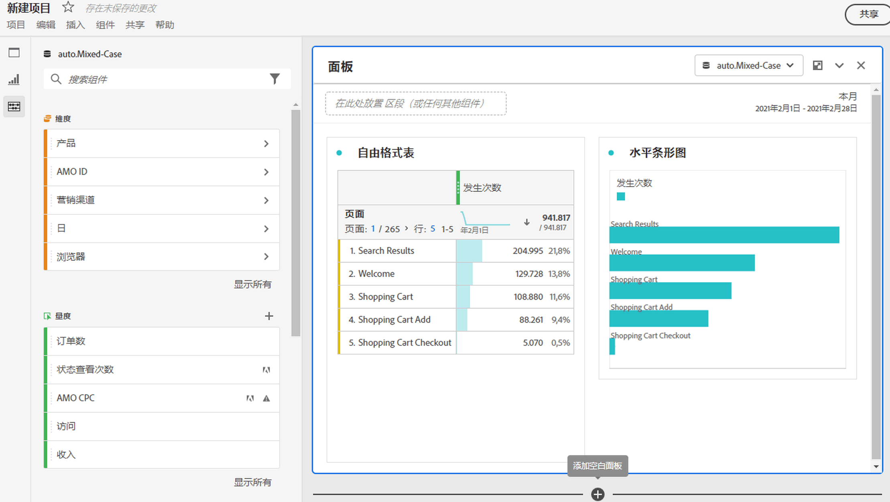

# 项目概述

通过 Workspace 项目，可结合数据组件、表格和可视化以得出您的分析结果，并与您组织中的任何人共享。在开始您的第一个项目之前，请了解如何访问、浏览和管理您的项目。

以下是一段关于如何构建 Workspace 项目的视频：

>[!BEGINSHADEBOX]

观看演示视频，请参阅 [构建Workspace项目](https://video.tv.adobe.com/v/3415636?quality=12&learn=on&captions=chi_hans){target="_blank"}。

>[!ENDSHADEBOX]

## 项目列表 {#project-list}

当您首次转到&#x200B;**[!UICONTROL “Analytics”]**>**[!UICONTROL “Workspace”]**&#x200B;时，该页面列出您拥有或与您共享的所有项目。此页面也是Adobe Analytics的登陆页面，除非您以前设置过自定义登陆页面。

“项目”页面包含以下信息：

| 元素 | 描述 |
|---|---|
| [编辑首选项](/help/analyze/analysis-workspace/user-preferences.md) | 为您创建的所有新项目或面板管理Analysis Workspace的设置及其相关的组件。 |
| [创建文件夹](/help/analyze/analysis-workspace/build-workspace-project/workspace-folders/create-folders.md) | 向项目和文件夹列表中添加新文件夹或子文件夹。 |
| [创建项目](/help/analyze/analysis-workspace/build-workspace-project/create-projects.md) | 从头开始或从报表开始新项目。 |
| 展开 | 此选择显示用于创建空白项目或移动记分卡、[查看培训教程](https://experienceleague.adobe.com/zh-hans/docs/analytics-learn/tutorials/analysis-workspace/analysis-workspace-basics/analysis-workspace-introduction)或[查看发行说明](/help/release-notes/latest.md)的选项。 |
|  | 显示或隐藏筛选器。 您可以按标记、报表包、所有者、类型（项目、文件夹、移动记分卡）和其他过滤器进行过滤。 |
|  | 使用搜索字段搜索文件夹、Workspace项目或移动记分卡。 |
| 显示文件夹和项目 | 选择是否显示项目的文件夹结构。 有关更多信息，请参阅[关于 Analytics 中的文件夹](/help/analyze/analysis-workspace/build-workspace-project/workspace-folders/about-folders.md)。 |
|  | 此图标允许您自定义在项目列表中为每个项目显示的列。 |

项目列表可显示以下列：

| 列 | 描述 |
|---|---|
| [!UICONTROL 名称] | Workspace项目的名称。 选择可显示一个弹出窗口，其中包含有关项目或文件夹的更多详细信息。 选择以显示可用操作。 有关详细信息，请参阅[管理项目](#manage-projects)。 |
| [!UICONTROL Type] | 指示此条目是Workspace项目、文件夹还是[移动记分卡](https://experienceleague.adobe.com/zh-hans/docs/analytics/analyze/mobapp/home)。 |
| [!UICONTROL 标记] | 应用于项目的标记。 |
| [!UICONTROL 已计划] | 指示项目是否计划通过电子邮件发送给收件人。 请参阅[计划项目](/help/analyze/analysis-workspace/curate-share/t-schedule-report.md)。 |
| 共享链接（任何人） | 项目可与任何人共享，即使与无权访问Analysis Workspace的人共享。 此列显示项目是否已以这种方式共享。 有关详细信息，请参阅[共享项目](/help/analyze/analysis-workspace/curate-share/share-projects.md)中的[与任何人共享项目（无需登录）](/help/analyze/analysis-workspace/curate-share/share-projects.md#share-public-link)。 |
| [项目角色](https://experienceleague.adobe.com/zh-hans/docs/analytics/analyze/analysis-workspace/curate-share/share-projects) | 指示您在项目中的角色 — 所有者、编辑、复制、查看。 |
| [!UICONTROL 报告包] | 与项目关联的报表包。 |
| [!UICONTROL 所有者] | 创建此项目的人员（您或与您共享此项目的人员）。 |
| [!UICONTROL 共享对象] | 与项目共享的用户。 |
| [!UICONTROL 上次修改时间] | 项目上次修改的日期和时间。 |
| [!UICONTROL 上次打开时间] | 上次打开项目的日期和时间。 |
| [!UICONTROL 上次使用] | 上次使用项目的日期和时间。 |
| [!UICONTROL 项目 ID] | 项目的ID。 |
|  | 项目的最长日期范围。 |
| [!UICONTROL 查询次数] | 项目中包含的查询总数。 |
| [!UICONTROL 位置] | 项目所在的文件夹。 |

### 管理项目

要管理项目，请从项目列表中选择一个或多个项目。

从蓝色操作栏中，您可以选择以下操作：

| 操作 | 描述 |
|---|---|
| 删除 | 选中后，会显示一个确认对话框，提示您确认删除Workspace项目或移动记分卡。 选择&#x200B;**[!UICONTROL 确定]**&#x200B;确认。 |
| 共享 | 此操作允许您共享您的项目。 请参阅[共享项目](../curate-share/share-projects.md)。 |
| 重命名 | 打开&#x200B;**[!UICONTROL 重命名： *名称&#x200B;*]**&#x200B;对话框以重命名您的项目。 选择&#x200B;**[!UICONTROL 保存&#x200B;]**&#x200B;以保存项目的新名称。 |
| 副本 | 立即将所选项目复制到名为&#x200B;*原始名称*&#x200B;的新项目（复制）。 |
| 针 | 立即将项目固定到列表顶部。 添加指示器。 |
| 标记 | 打开&#x200B;**[!UICONTROL 标记项目]**&#x200B;对话框。 您可以选择现有标记或添加新标记。 选择&#x200B;**[!UICONTROL 保存]**&#x200B;以保存项目的标记。 |
| 批准或取消批准 | 批准或取消批准项目。 |
| 导出CSV | 立即下载包含以逗号分隔的项目值列表的文件。 |
| 移至 | 此操作允许您将项目移动到文件夹。 在&#x200B;**[!UICONTROL 选择文件夹]**&#x200B;对话框中，从&#x200B;**[!UICONTROL 文件夹]**&#x200B;列表中选择一个文件夹，然后选择&#x200B;**[!UICONTROL 移动]**。 |

## 菜单栏 {#menu-bar}

在项目中，菜单提供管理项目、添加组件、查找帮助等选项。您还可以通过键盘[快捷键](https://experienceleague.adobe.com/zh-hans//docs/analytics/analyze/analysis-workspace/build-workspace-project/fa-shortcut-keys)访问每个菜单选项。

| 菜单项 | 描述 |
|---|---|
| 项目 | 此菜单包含项目管理的常用操作，包括新建、打开、保存、另存为和[另存为公司报表](/help/analyze/analysis-workspace/build-workspace-project/starter-projects.md)。 还可通过单击“刷新项目”而刷新整个项目以检索最新的数据和定义。通过[“下载 CSV 和 PDF”](https://experienceleague.adobe.com/zh-hans/docs/analytics/analyze/analysis-workspace/curate-share/download-send)选项，可从 Workspace 导出数据。[“项目信息和设置”](https://experienceleague.adobe.com/zh-hans/docs/analytics/analyze/analysis-workspace/build-workspace-project/freeform-overview)提供多种用于管理项目的选项。 |
| 编辑 | 撤消或重做您的上一项操作。全部清除将项目重置为空起点。 |
| 插入 | 从此菜单插入新面板或可视化图表。还可从左侧边栏插入新面板和可视化图表。 |
| [组件](https://experienceleague.adobe.com/zh-hans/docs/analytics/analyze/analysis-workspace/components/analysis-workspace-components) | 从您的项目创建新区段、计算指标、日期范围或警报组件。还可从左侧边栏创建新组件。如果最近更改了组件定义，则“刷新组件”将检索最新定义。 |
| [Share](https://experienceleague.adobe.com/zh-hans/docs/analytics/analyze/analysis-workspace/curate-share/send-schedule-files) | 策划、安排 PDF/CSV 项目以及将其共享给您组织中的接收方。 |
| 帮助 | 访问帮助文档、视频和 Analytics [Experience League 社区](https://experienceleaguecommunities.adobe.com/t5/adobe-analytics/ct-p/adobe-analytics-community)。管理 Workspace 提示和[调试器](https://developer.adobe.com/analytics-apis/docs/2.0/)的可见性。查找关于 Workspace 及影响项目[性能](https://experienceleague.adobe.com/zh-hans/docs/analytics/analyze/analysis-workspace/workspace-faq/optimizing-performance)的各种因素的详细信息。 |
| “共享”按钮或“所有者” | 如果您处于项目的“拥有”或“编辑”角色，则通过右上方的“共享”按钮可一键管理项目接收方。如果您处于项目的“复制”或“查看”角色，则可以看到项目所有者的姓名。 |

### 项目信息和设置 {#info-settings}

**[!UICONTROL Workspace]** > **[!UICONTROL 项目]** > **[!UICONTROL 项目信息和设置]**&#x200B;提供有关当前活动项目的项目级信息。

这些设置包括：

| 设置 | 描述 |
|---|---|
| 项目名称 | 给项目起的名称。您可以双击该名称以编辑它。 |
| 所有者 | 项目所有者名称。 |
| 上次修改时间 | 项目上次修改日期。 |
| 标记 | 列出应用于项目以方便分类的所有标记。 |
| 描述 | 描述有助于明确项目的目的。您可以双击描述以编辑它。 |
| 计数重复实例 | 指定是否将重复实例计入报表中。例如，此设置（激活时）会将同一页面的多次连续页面浏览视为多次页面浏览。关闭此设置后，它们会计为单次页面查看（此设置仅影响某些量度，例如单页面访问量）。 **注意**：此设置不适用于“流”或“流失”可视化。 |
| [显示注释](/help/analyze/analysis-workspace/components/annotations/overview.md) | 指定是否在项目中显示注释。 |
| [项目调色板](https://experienceleague.adobe.com/zh-hans//docs/analytics/analyze/analysis-workspace/build-workspace-project/color-palettes) | 通过从已为色盲优化过的现成调色板中进行选择或通过指定您的自定义调色板，可更改在 Workspace 中使用的类别调色板。此功能影响 Workspace 中的许多内容，包括大多数可视化。 |
| [视图密度](https://experienceleague.adobe.com/zh-hans/docs/analytics/analyze/analysis-workspace/build-workspace-project/view-density) | 通过减小左侧边栏、自由格式表和同类群组表的垂直边距，让您可在屏幕上看到更多数据。 |

## 左侧边栏 {#left-rail}

在项目中，左边栏中提供了各种图标，每种图标都表示用于构建项目的重要工具：

| 图标 | 功能 |
|---|---|
|  | [面板](/help/analyze/analysis-workspace/c-panels/panels.md) |
|  | [可视化内容](/help/analyze/analysis-workspace/visualizations/freeform-analysis-visualizations.md) |
|  | [组件](/help/analyze/analysis-workspace/components/analysis-workspace-components.md) |
|  | [数据字典](/help/analyze/analysis-workspace/components/data-dictionary/data-dictionary-overview.md)  |
|  | [目录](/help/analyze/analysis-workspace/build-workspace-project/project-table-of-contents.md) |

左边栏中的组件（维度、量度、区段、日期范围）与活动面板数据视图相关。 蓝色边框标识活动面板，而活动报表包则列在组件边栏的顶部。

## 右键单击菜单

以下是一段关于在 Analysis Workspace 中使用右键单击菜单的视频：

>[!BEGINSHADEBOX]

观看演示视频的 [使用上下文菜单](https://video.tv.adobe.com/v/327459?quality=12&learn=on&captions=chi_hans){target="_blank"}。

>[!ENDSHADEBOX]

## 项目画布 {#canvas}

项目画布是将面板、表格、可视化和组件集中在一起以构建您的分析的地方。一个项目可包含许多面板，而每个面板均可包含许多表格和可视化。

当您要根据时段、报表包或分析用例组织您的项目时，面板非常有用。活动面板在自身四周具有彩色边框，可确定在左边栏中有哪些组件可用。

根据您为项目选择的起点，您在画布中首先使用[自由格式表](https://experienceleague.adobe.com/zh-hans/docs/analytics/analyze/analysis-workspace/visualizations/freeform-table/freeform-table)或[空白面板](https://experienceleague.adobe.com/zh-hans/docs/analytics/analyze/analysis-workspace/panels/blank-panel)。 最快开始分析的方法是选择一个或多个组件，然后将其拖放到项目画布中。数据表会自动为您呈现。 [了解更多](https://experienceleague.adobe.com/zh-hans/docs/analytics/analyze/analysis-workspace/visualizations/freeform-table/freeform-table)有关构建表的不同选项，或利用可用的[培训教程](https://experienceleague.adobe.com/zh-hans/docs/analytics/analyze/analysis-workspace/home)获取有关构建您的第一个项目的更多指导。

