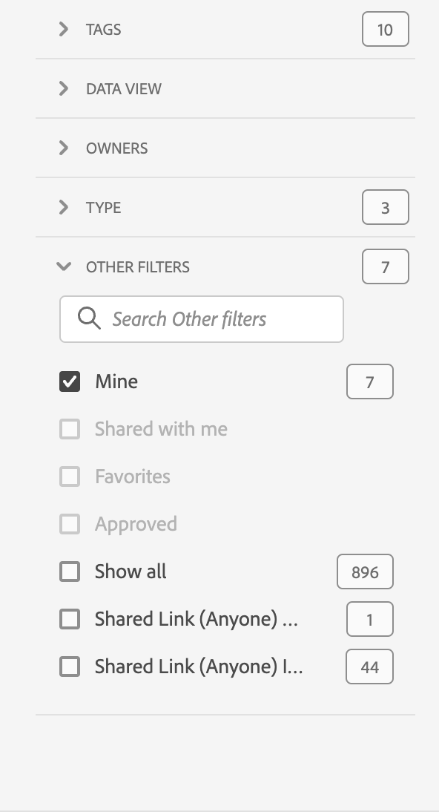

# 项目概述

通过工作区项目，可将窗格、可视化图表和组件组合起来，以得出您的分析结果，并与您组织中的任何人共享。在开始您的第一个项目之前，请了解如何访问、浏览和管理您的项目。

要访问Adobe Analytics中的项目，请选择&#x200B;**[!UICONTROL Workspace]**。  **[!UICONTROL 项目]**&#x200B;管理器列出了您拥有的所有项目或与您共享的项目。具有项目列表的项目管理器也是Adobe Analytics的默认登录页面，除非您已在首选项中进行其他配置。

## 标题区

在标题区域➊中，您可以创建项目、创建文件夹、编辑首选项以及显示或隐藏带有其他图块的面板。

* 要显示或隐藏左侧面板，以便您在&#x200B;**[!UICONTROL 项目]**&#x200B;和&#x200B;**[!UICONTROL 学习]**&#x200B;之间进行选择，请选择。
* 标题会显示“项目”，并可选择性地带有您所选文件夹的路径。例如[!UICONTROL 项目] > **[!UICONTROL 公司文件夹]**。您可以选择单个子文件夹部分，以直接跳转到特定文件夹。
* 要显示[**[!UICONTROL 空白项目]**](create-projects.md)、[**[!UICONTROL 空白移动记分卡]**](/help/analyze/mobile-app/create-scorecard.md)、**[!UICONTROL 打开文档]**&#x200B;和&#x200B;**[!UICONTROL 打开发行说明]**&#x200B;的磁贴，请选择 **[!UICONTROL 显示更多]**。 要隐藏带有图块的区域，请选择  **[!UICONTROL 显示更少]**。
* 根据您使用[显示选择器](#show-selector)选择要显示的内容，您可以编辑偏好设置，并对&#x200B;**[!UICONTROL 项目]**&#x200B;中当前可见的文件夹执行操作：

  | 操作 | 描述 |
  |---|---|
  | **[!UICONTROL 创建项目]** | 选择以[创建新项目](create-projects.md)。 |
  | **[!UICONTROL 创建文件夹]** | 选择以[创建新文件夹](workspace-folders/create-folders.md)。 |
  |  **[!UICONTROL 编辑偏好设置]** | 为所有项目[编辑偏好设置](/help/analyze/analysis-workspace/user-preferences.md)。当痕迹导航导致空间有限时，此操作会作为子菜单的一部分。 |
  | **[!UICONTROL 添加项目]** | 选择以在当前文件夹中[添加项目](workspace-folders/add-projects.md)。当痕迹导航导致空间有限时，此操作会作为子菜单的一部分。 |
  | **[!UICONTROL 重命名文件夹]** | [重命名](workspace-folders/manage-folders.md#rename-folders)当前文件夹。 |
  | **[!UICONTROL 移动文件夹]** | [移动](workspace-folders/manage-folders.md#move-folders)当前文件夹。 |
  | **[!UICONTROL 删除文件夹]** | [删除](workspace-folders/manage-folders.md#delete-folders)当前文件夹。 |

## 项目列表

项目列表➋显示您拥有并与您共享的所有项目。 该列表具有以下各列：

| 列 | 描述 |
| --- | --- | 
|  | 当选择一个或多个项目时，项目界面底部会出现一个蓝色的操作栏。有关更多详细信息，请参阅[操作](#actions)。 |
|  | 选择以加入收藏  或取消收藏  一个项目。 |
| **[!UICONTROL 标题和描述]** | 要编辑项目，请选择标题链接，这会打开[工作区项目](/help/analyze/analysis-workspace/home.md)。与您共享的项目会以  标示。选择  以显示一个弹出菜单，其中包含有关该项目的更多详细信息。选择以打开带有操作选项的上下文菜单。有关更多详细信息，请参阅[操作](#actions)。 |
| **[!UICONTROL Type]** | 工作区项目， 文件夹，或者[移动记分卡](/help/analyze/mobile-app/home.md)。 |
| **[!UICONTROL 标记]** | 应用于项目的标记。 |
| **[!UICONTROL 已计划]** | 是否计划通过电子邮件将项目发送给收件人。相关选项包括  **[!UICONTROL 开启]**&#x200B;或者  **[!UICONTROL 关闭]**。请参阅[向其他人发送项目数据](/help/analyze/analysis-workspace/curate-share/t-schedule-report.md)。 |
| **[!UICONTROL 共享链接（任何人）]** | 是否与任何人共享项目，包括无权访问 Analysis Workspace 的人员。相关选项包括  **[!UICONTROL 有效]**&#x200B;或者  **[!UICONTROL 无效]**。有关详细信息，请参阅[共享项目](/help/analyze/analysis-workspace/curate-share/share-projects.md)中的[与任何人共享项目（无需登录）](/help/analyze/analysis-workspace/curate-share/share-projects.md#share-a-project-with-anyone-no-login-required)。 |
| **[!UICONTROL 项目角色]** | 您在项目中的角色。相关选项包括：编辑、复制、查看。有关更多信息，请参阅[项目角色](/help/analyze/analysis-workspace/curate-share/curate.md)。 |
| **[!UICONTROL 报告包]** | 与项目关联的报表包。 |
| **[!UICONTROL 所有者]** | 创建此项目的人员（您或与您共享此项目的人员）。 |
| **[!UICONTROL 共享对象]** | 已与其共享该项目的用户。 |
| **[!UICONTROL 上次修改时间]** | 项目上次修改的日期和时间。 |
| **[!UICONTROL 上次打开时间]** | 项目上次打开的日期和时间。 |
| **[!UICONTROL 组件 ID]** | 组件的ID。 |
| **[!UICONTROL 最长日期范围]** | 项目中任何面板或可视化图表的最长日期范围。 |
| **[!UICONTROL 查询次数]** | 项目中包含的查询总数。 |
| **[!UICONTROL 位置]** | 项目所在的文件夹。 |

将鼠标悬停在任意列标题上即可显示 ，并从上下文菜单中选择：

* **[!UICONTROL 升序排序]**
* **[!UICONTROL 降序排序]**
* **[!UICONTROL 调整列大小]**。一条蓝线会显示，以帮助您调整列的大小。

### 操作

您可以使用上下文菜单或蓝色操作栏对一个或多个项目执行操作。

| 图标 | 操作 | 描述 |
|:---:| ---|---|
|  | **[!UICONTROL *x *已选择]** | 取消选择您选择的项目和文件夹，并移除蓝色操作栏。 |
|  | **[!UICONTROL 删除]** | 删除一个或多个项目或文件夹。系统将提示您确认。 |
|  | **[!UICONTROL 共享]** | 共享项目。请参阅[共享项目](/help/analyze/analysis-workspace/curate-share/share-projects.md)，以了解更多信息。 |
|  | **[!UICONTROL 重命名]** | 重命名项目。打开&#x200B;**[!UICONTROL 重命名：*项目名称对话框&#x200B;*]**。输入新名称并选择&#x200B;**[!UICONTROL 保存&#x200B;]**。 |
|  | **[!UICONTROL 复制]** | 复制一个或多个项目。相关会获得相同的名称和后缀 `(Copy)`。 |
|  | **[!UICONTROL 固定]**&#x200B;或者&#x200B;**[!UICONTROL 取消固定]** | 固定或取消固定一个或多个项目或文件夹。固定的项目和文件夹会在列表顶部显示，并忽略您指定的排序顺序。 |
|  | **[!UICONTROL 上移]** | 将固定的项目或文件夹在项目列表中上移。 |
|  | **[!UICONTROL 下移]** | 将固定的项目或文件夹在项目列表中下移。 |
|  | **[!UICONTROL 标记]** | 标记一个或多个项目或文件夹。**[!UICONTROL 标记组件]**&#x200B;对话框会显示，以选择一个或多个标记。选择&#x200B;**[!UICONTROL 保存]**&#x200B;来保存所选项目或文件夹的标记。 |
|  | **[!UICONTROL 批准]**&#x200B;或者&#x200B;**[!UICONTROL 拒绝]** | 批准或拒绝项目。只有管理员可以批准项目。 |
|  | **[!UICONTROL 导出 CSV]** | 将选定的项目导出到名为 `Project List.csv` 的 CSV 文件中。 |
|  | **[!UICONTROL 添加项目]** | 将一个或多个项目添加到选定文件夹。在&#x200B;**[!UICONTROL 添加项目]**&#x200B;中，您可以选择一个或多个项目。选择&#x200B;**[!UICONTROL 添加]**，将这些项目添加到文件夹中。请参阅[在文件夹中添加项目](workspace-folders/add-projects.md#from-inside-a-folder)，以了解更多信息。 |
|  | **[!UICONTROL 移动到]** | 将一个或多个选定的项目移动到文件夹。在&#x200B;**[!UICONTROL 选择文件夹]**&#x200B;中，选择要将选定项目移动到的文件夹，然后选择&#x200B;**[!UICONTROL 移动]**。请参阅[在文件夹中添加项目](workspace-folders/add-projects.md#from-the-project-list)，以了解更多信息。 |

## 显示选择器

您可以使用&#x200B;**[!UICONTROL Show]**&#x200B;选择器➌切换项目界面的外观。 **[!UICONTROL 显示]**&#x200B;选择器定义了[标题区域](#title-area)中可用的选项，以及[项目列表](#project-list)中显示的列。

* 要更改[标题区域](#title-area)可用的选项，请选择&#x200B;**[!UICONTROL 显示]**&#x200B;**[!UICONTROL 所有项目]**&#x200B;或&#x200B;**[!UICONTROL 显示]**&#x200B;**[!UICONTROL 文件夹和项目]**。

* 要定义在[项目列表](#project-list)中显示哪些列，请选择 ，然后从&#x200B;**[!UICONTROL 自定义表格]**&#x200B;对话框中选择或取消选择列。选择&#x200B;**[!UICONTROL 应用]**&#x200B;以应用自定义设置。有关列的更多详细信息，请参阅[项目列表](#project-list)。

## 过滤器面板

您可以使用筛选器面板➍筛选[项目列表](#project-list)中的项目和文件夹。 要显示或隐藏过滤器面板，请使用。

过滤器面板由以下部分组成。

### 标记

| 标记 | 描述 |
|---|---|
| {width="300"} | 您可以使用&#x200B;**[!UICONTROL 标记]**&#x200B;部分按标记进行过滤。 <ul><li>您可以使用  *搜索标记*&#x200B;来搜索您想要用于过滤的标记。</li><li>您可以选择多个标记。可用的标记取决于在过滤器面板中对其他部分的选择。</li><li>这些数字表明：<ul><li>**2︎⃣**：当前过滤器生成的项目可用的标记数量。</li><li>7︎⃣：与特定标记相关的项目数量。</li></ul></li></ul> |

### 报表包

| 报表包 | 描述 |
|---|---|
| {width="300"} | 通过&#x200B;**[!UICONTROL 报表包]**&#x200B;部分，可筛选报表包。 <ul><li>您使用 *搜索报表包*&#x200B;来搜索要用于过滤的报表包。</li><li>您可以选择多个报表包。 可用的报表包取决于在过滤器面板的其他部分中所做的选择。</li><li>这些数字表明：<ul><li>**3︎⃣**：由当前筛选器生成的项目可用的报表包数。</li><li>⃣4︎：与特定报表包关联的项目数。</li></ul></li></ul> |

### 所有者

| 所有者 | 描述 |
|---|---|
| {width="300"} | **[!UICONTROL 所有者]**&#x200B;部分允许您过滤所有者。 <ul><li>您可以使用  *搜索所有者*&#x200B;来搜索您想要用于过滤的所有者。</li><li>您可以选择多个所有者。可用的所有者取决于在过滤器面板中对其他部分的选择。</li><li>这些数字表明：<ul><li>**3︎⃣**：当前过滤器生成的项目可用的所有者数量。</li><li>4︎⃣：与特定所有者相关的项目数量。</li></ul></li></ul> |

### 类型

| 类型 | 描述 |
|---|---|
| {width="300"} | **[!UICONTROL 类型]**&#x200B;部分允许您根据项目或文件夹的类型进行筛选。<ul><li>您可以选择以下一个或多个选项：<ul><li> **[!UICONTROL 文件夹]**</li><li>**[!UICONTROL 工作区项目]**</li><li>**[!UICONTROL 移动记分卡]**</li></ul> <li>您可以选择多个其他过滤器。可用的其他过滤器取决于在过滤器面板中对其他部分的选择。</li><li>这些数字表明：<ul><li>**5︎⃣**：当前过滤器生成的项目可用的其他过滤器数量。</li><li>4︎⃣：与特定其他过滤器相关的项目数量。</li></ul></li></ul> |

### 其他过滤器

| 其他过滤器 | 描述 |
|---|---|
| {width="300"} | 您可以使用&#x200B;**[!UICONTROL 其他过滤器]**&#x200B;部分按其他预定义过滤器进行过滤。<ul><li>您可以选择以下一个或多个选项：<ul><li> **[!UICONTROL 显示所有]**</li><li>**[!UICONTROL 与我共享]**</li><li>**[!UICONTROL 我的]**</li><li>**[!UICONTROL 已批准]**</li><li>**[!UICONTROL 收藏夹]**</li></ul> 您可以选择的内容取决于您的角色和权限。</li><li>您可以选择多个其他过滤器。可用的其他过滤器取决于在过滤器面板中对其他部分的选择。</li><li>这些数字表明：<ul><li>**5︎⃣**：当前过滤器生成的项目可用的其他过滤器数量。</li><li>4︎⃣：与特定其他过滤器相关的项目数量。</li></ul></li></ul> |

## 搜索

您可以使用“搜索”区域➎通过字段搜索项目和文件夹。 开始输入后，[项目列表](#project-list)将会自动过滤您的搜索输入。

搜索区域还会显示从过滤器面板中应用的过滤器。

* 要移除过滤器，请选择过滤器中的 。
* 要移除所有过滤器，请选择“全部清除”。

如果空间有限，无法显示单个过滤器，您会看到&#x200B;**[!UICONTROL 按 *x* 分段的过滤器]**。

* 要移除过滤器：

   1. 使用 **[!UICONTROL *x *过滤器]** 顶部打开一个上下文菜单，其中列有过滤器的类型和单个过滤器。
   1. 使用  来移除过滤器。

<!--

# Projects overview

Workspace projects allow you to combine data components, tables and visualizations to craft your analysis and share with anyone in your organization. Before starting your first project, learn about how to access, navigate and manage your projects. 

Here is a video on how to build a Workspace project:

>[!BEGINSHADEBOX]

See  [Build a Workspace project](https://video.tv.adobe.com/v/3415636?quality=12&learn=on&captions=chi_hans){target="_blank"} for a demo video.

>[!ENDSHADEBOX]

## Project list {#project-list}

When you first go to **[!UICONTROL Analytics]** > **[!UICONTROL Workspace]**, the page lists all the projects you own or have been shared to you. This page is also the landing page for Adobe Analytics, unless you have previously set a custom landing page. 

The Projects page contains the following information: 

|  Element  | Description  |
|---|---|
| [Edit preferences](/help/analyze/analysis-workspace/user-preferences.md) | Manage settings for Analysis Workspace and its related components for all new projects or panels that you create.  |
| [Create folder](/help/analyze/analysis-workspace/build-workspace-project/workspace-folders/create-folders.md)  | Add a new folder or subfolder to the list of projects and folders. |
| [Create project](/help/analyze/analysis-workspace/build-workspace-project/create-projects.md)  | Start a new project from scratch or from a report.  |
|  Show more  | This selection reveals options for creating a blank project or mobile scorecard, [viewing training tutorials](https://experienceleague.adobe.com/zh-hans/docs/analytics-learn/tutorials/analysis-workspace/analysis-workspace-basics/analysis-workspace-introduction), or [viewing release notes](/help/release-notes/latest.md).  |
|  | To show or hide filters. You can filter on tags, report suite, owners, type (project, folder, mobile scorecard), and other filters. | 
|  | Use the search field to search for folders, Workspace projects or mobile scorecards. |
| Show Folders & Projects| Choose whether to show the folder structure of projects. For more information, see [About Folders in Analytics](/help/analyze/analysis-workspace/build-workspace-project/workspace-folders/about-folders.md). |
|   | This icon allows you to customize the columns you see for each project in the projects list.  |

The list of projects can display the following columns:

|  Column  | Description  |
|---|---|
| [!UICONTROL Name]  | Name of the Workspace project. Select  to show a popup with more details on a project or folder. Select  to show actions available. See [Manage projects](#manage-projects) for more details.  | 
| [!UICONTROL Type] | Indicates whether this entry is a Workspace project, a folder, or a [Mobile scorecard](https://experienceleague.adobe.com/zh-hans/docs/analytics/analyze/mobapp/home). |
| [!UICONTROL Tags]  |Tags that were applied to the project.  |
| [!UICONTROL Scheduled] | Indicates whether projects are scheduled to be emailed to recipients. See [Schedule projects](/help/analyze/analysis-workspace/curate-share/t-schedule-report.md). |
| Shared link (anyone) | Projects can be shared with anyone, even with people who don't have access to Analysis Workspace. This column shows whether projects have been shared in this way. See [Share a project with anyone (no login required)](/help/analyze/analysis-workspace/curate-share/share-projects.md#share-public-link) in [Share projects](/help/analyze/analysis-workspace/curate-share/share-projects.md) for more information. |
| [Project Role](https://experienceleague.adobe.com/zh-hans/docs/analytics/analyze/analysis-workspace/curate-share/share-projects) | Indicates your role for the project - owners, edit, duplicate, view. |
| [!UICONTROL Report suite] | The report suite that the project is associated with. |
| [!UICONTROL Owner]  | The person who created this project (either you or someone who shared the project with you.)  |
| [!UICONTROL Shared with]  | Users that the project has been shared with.  |
| [!UICONTROL Last Modified]  | Date and time when the project was last modified.  |
| [!UICONTROL Last Opened]  | Date and time when the project was last opened.  |
| [!UICONTROL Last Used] | Date and time when the project was last used. | 
| [!UICONTROL Project ID]  | The ID of the project.  |
| [!UICONTROL Longest Date Range]  | The longest date range of the project.  |
| [!UICONTROL Number of Queries]  | The total number of queries contained in the project.  |
| [!UICONTROL Location]  | The folder where the project resides.  |

### Manage projects

To manage projects, select one or more projects from the project list. 

From the blue action bar, you can select the following actions:

| Action | Description | 
|---|---|
|  Delete | When selected, a confirmation dialog prompts you to confirm the deletion of a Workspace project or Mobile scorecard. Select **[!UICONTROL OK]** to confirm. |
|  Share | This action allows you to share your project. See [Share projects](../curate-share/share-projects.md).|
|  Rename | Opens up a **[!UICONTROL Rename: *name*]** dialog to rename your project. Select **[!UICONTROL Save]** to save the new name for the project. |
|  Copy | Immediately copies the selected project to a new project with name *original name* (Copy).  |
|  Pin | Immediately pins the project to the top of the list. Adds the  indicator. |
|  Tag | Opens up the **[!UICONTROL Tag Project]** dialog. You can select an existing tag or add new tags. Select **[!UICONTROL Save]** to save the tags for the project. |
|  Approve or Unapprove |  Approves or unapproves the project.  |
|  Export CSV | Immediately downloads a file containing a comma-separated value list of the projects. |
|  Move to | This action allows you to move the project to a folder. In the **[!UICONTROL Select Folder]** dialog, select a folder from the **[!UICONTROL Folder]** list, and select **[!UICONTROL Move]**. | 

## Menu bar {#menu-bar}

Within a project, the menu provides options for managing your project, adding components, finding help, and more. You can also access each menu option by keyboard [shortcuts](https://experienceleague.adobe.com/zh-hans/docs/analytics/analyze/analysis-workspace/build-workspace-project/fa-shortcut-keys).

|  Menu item  | Description  |
|---|---|
|  Project  | This menu includes common actions for project management, including New, Open, Save, Save as, and [Save as company report](/help/analyze/analysis-workspace/build-workspace-project/starter-projects.md). You can also refresh the entire project to retrieve the most recent data and definitions by clicking Refresh Project. [Download CSV and PDF](https://experienceleague.adobe.com/zh-hans/docs/analytics/analyze/analysis-workspace/curate-share/download-send) options enable you to export data from Workspace. [Project Info & Settings](https://experienceleague.adobe.com/zh-hans/docs/analytics/analyze/analysis-workspace/build-workspace-project/freeform-overview) offers many options for managing your project.  |
|  Edit  | Undo or redo your last action. Clear All resets your project to a blank starting point. |
|  Insert  | Insert new panels or visualizations from this menu. You can also insert new panels and visualizations from the left rail.  |
|  [Components](https://experienceleague.adobe.com/zh-hans/docs/analytics/analyze/analysis-workspace/components/analysis-workspace-components)  | Create new segment, calculated metric, date range, or alert components from your project. You can also create new components from the left rail. If your component definitions have recently changed, Refresh Components retrieves the latest definitions. |
|  [Share](https://experienceleague.adobe.com/zh-hans/docs/analytics/analyze/analysis-workspace/curate-share/send-schedule-files)  | Curate, share and schedule PDF/CSV projects to recipients in your organization.  |
|  Help  | Access help documentation, videos, and the Analytics [Experience League community](https://experienceleaguecommunities.adobe.com/t5/adobe-analytics/ct-p/adobe-analytics-community). Manage the visibility of Workspace tips as well as the [debugger](https://developer.adobe.com/analytics-apis/docs/2.0/). Find details about Workspace and factors that impact project [performance](https://experienceleague.adobe.com/zh-hans/docs/analytics/analyze/analysis-workspace/workspace-faq/optimizing-performance).  |
|  Share button or Owner  | If you are in an Own or Edit for the project, the Share button in the top-right gives you one-click access to manage your project recipients. If you are in a Duplicate or View role for the project, you see the project owner's name. |

### Project Info & Settings {#info-settings}

>[!CONTEXTUALHELP]
>id="workspace_project_countrepeatinstances"
>title="Count repeat instances"
>abstract="Specifies whether repeat instances are counted in reports.  Note: this setting does not apply to Flow or Fallout visualizations."

>[!CONTEXTUALHELP]
>id="workspace_project_repeatinstances"
>title="Count repeat instances"
>abstract="Specifies whether repeat instances are counted in reports. Note: this setting does not apply to Flow or Fallout visualizations."

>[!CONTEXTUALHELP]
>id="workspace_project_commenting"
>title="Allow commenting"
>abstract="When enabled, a comments area is available in the right rail of the project in Analysis Workspace."

**[!UICONTROL Workspace]** > **[!UICONTROL Project]** > **[!UICONTROL Project Info & settings]** provides project-level information on the currently active project.

Settings include:

|  Setting  | Description  |
|---|---|
|  Project Name  | The name given to the project. You can double-click the name to edit it.  |
|  Owner  | Project owner name  |
|  Last Modified  | Date of last modification to the project.  |
|  Tags  |Lists any tags applied to a project for easier categorization.  |
|  Description  | A description is useful for clarifying the purpose of a project. You can double-click the description to edit it.  |
|  Count repeat instances  | Specifies whether repeat instances are counted in reports. For example, this setting (when activated) treats multiple consecutive pages views to the same page as multiple page views. With it off, they count as a single page view (this setting only affects certain metrics, such as Single Page Visits). **Note**: This setting does not apply to Flow or Fallout visualizations.  |
| [Show annotations](/help/analyze/analysis-workspace/components/annotations/overview.md) | Specify whether to show annotations in the project or not. |
|  [Project color palette](https://experienceleague.adobe.com/zh-hans/docs/analytics/analyze/analysis-workspace/build-workspace-project/color-palettes)  | You can change the categorical color palette used in Workspace, by choosing from out-of-the-box palettes that have been optimized for color blindness, or by specifying your custom palette. This feature affects many things in Workspace, including most visualizations.  |
| [View Density](https://experienceleague.adobe.com/zh-hans/docs/analytics/analyze/analysis-workspace/build-workspace-project/view-density) | Lets you see more data on the screen by reducing the vertical padding of the left rail, freeform tables and cohort tables. |

## Left rail {#left-rail}

Within a project, various icons are available in the left rail, and each represents important tools to build your project:

| Icon | Functionality |
|---|---|
|  | [Panels](/help/analyze/analysis-workspace/c-panels/panels.md) |
|  |[Visualizations](/help/analyze/analysis-workspace/visualizations/freeform-analysis-visualizations.md) |
|  | [Components](/help/analyze/analysis-workspace/components/analysis-workspace-components.md) |
|  | [Data dictionary](/help/analyze/analysis-workspace/components/data-dictionary/data-dictionary-overview.md) |
|  | [Table of contents](/help/analyze/analysis-workspace/build-workspace-project/project-table-of-contents.md) |

Components (dimensions, metrics, segments, date ranges) in the left rail relate to the active panel data view. A blue border identifies the active panel, and the active report suite is listed at the top of the component rail.

## Right-click menu

Here is a video on using the right-click menu in Analysis Workspace:

>[!BEGINSHADEBOX]

See  [Using the context menu](https://video.tv.adobe.com/v/327459?quality=12&learn=on&captions=chi_hans){target="_blank"} for a demo video.

>[!ENDSHADEBOX]

## Project canvas {#canvas}

The project canvas is where you bring together panels, tables, visualizations, and components to build your analysis. A project can contain many panels, and each panel can contain many tables and visualizations.

Panels are helpful when you want to organize your projects according to time periods, report suites, or analysis use case. The active panel has a colored border around it, and determines what components are available in the left rail.

Depending on the starting point you chose for your projects, you either have a [freeform table](https://experienceleague.adobe.com/zh-hans/docs/analytics/analyze/analysis-workspace/visualizations/freeform-table/freeform-table) or a [blank panel](https://experienceleague.adobe.com/zh-hans/docs/analytics/analyze/analysis-workspace/panels/blank-panel) in the canvas to begin with. The quickest way to start analyzing is to select one or many components and simply drag & drop them into the project canvas. A table of data is rendered automatically for you. [Learn more](https://experienceleague.adobe.com/zh-hans/docs/analytics/analyze/analysis-workspace/visualizations/freeform-table/freeform-table) about the different options for building a table, or leverage the available [training tutorial](https://experienceleague.adobe.com/zh-hans/docs/analytics/analyze/analysis-workspace/home) for more guidance on building your first project.

-->