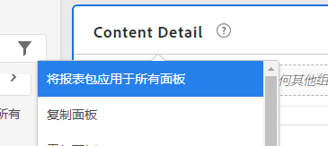
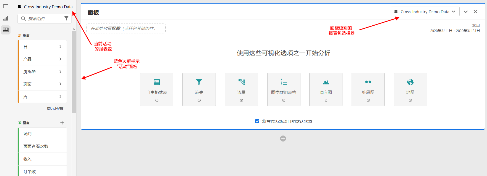
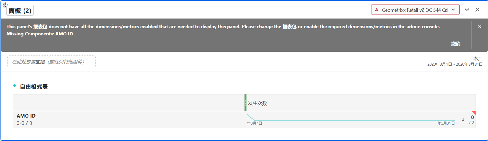

# 多个报告包

您可以在Analysis Workspace中使用多个报表包的数据创建项目。 由于报表包是在面板级别选择的，因此您可以为同一Workspace项目中的每个面板选择不同的报表包。

此功能在以下情况下很有用：

* 比较两个不同区域的数据，以及存储在两个不同的报表包中的数据。 您可以构建一些表格和可视化图表，以并排比较数据。

* 构建一个包含量度和可视化图表的功能板，向其他组织报告。 您可以将不同报表包中的数据提取到同一项目中。

>[!BEGINSHADEBOX]

观看演示视频的 [多个报表包](https://experienceleague.adobe.com/en/docs/analytics-learn/tutorials/analysis-workspace/using-panels/multiple-report-suites-in-analysis-workspace){target="_blank"}。

>[!ENDSHADEBOX]

## 将报表包应用于所有面板

通过右键单击任何面板标题并选择&#x200B;**[!UICONTROL 将报表包应用于所有面板]**，可以将报表包一次应用于所有面板。

## 活动面板

您可以通过周围的浅蓝色边框识别活动面板。 只需在面板内选择，即可将该面板转换为活动面板。

>[!TIP]
>
>您可以拖放到与活动面板位于同一报表包中的任何面板。 通过拖放到同一报表包的非活动面板，该面板将变为活动面板。
>

## 使用多个报表包

1. 在工作区中创建具有 2 个或更多面板的新项目。

1. 将组件（量度、维度、区段、日期范围）拖放到面板中。 确保面板具有特定于其报表包的数据和可视化图表。

   >[!NOTE]
   >
   >有时，在加载项目（或切换到报表包）时，如果该项目中的所有组件并非全部包含在报表包中，则会显示一个横幅。 系统将会列出缺少的组件。 按照[这些说明](/help/admin/admin-console/permissions/product-profile.md)，设置所需量度/维度的权限。
   >

   

   您有 3 个选项可处理这种不兼容的问题：
   * 启用所需的维度/量度
   * 更改报表包。
   * 继续保持缺少一些组件的状态。 此操作将导致没有关于这些组件的数据和/或可视化图表显示空白。

1. 将面板更改为其他报表包，并注意组件标签（当前为活动的报表包）和列出的组件如何根据新的报表包进行更新。

1. 使用键盘快捷键（拖动时按 `shift`）将非活动面板转换为活动面板。

1. （可选）您还可以转到其他 Analytics 组件生成器，并确保它们现在显示一个报表包标签，指示

   * 将创建区段的位置： [区段生成器](/help/components/segmentation/segmentation-workflow/seg-build.md)。
   * 将创建计算量度的位置： [计算量度生成器](/help/components/calculated-metrics/workflow/c-build-metrics/cm-build-metrics.md)。
   * 将生成警报的位置： [警报生成器](/help/components/alerts/alert-builder.md)。
