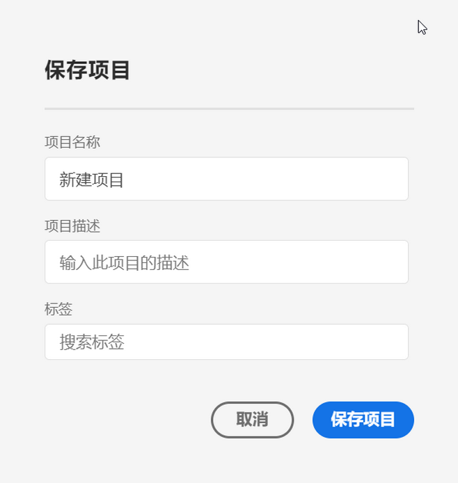
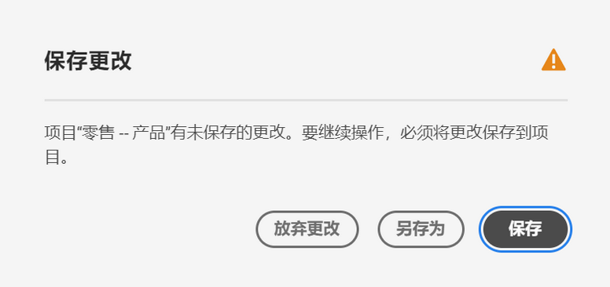
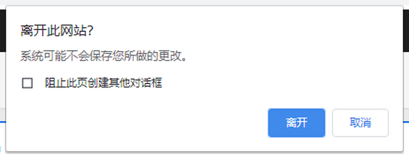
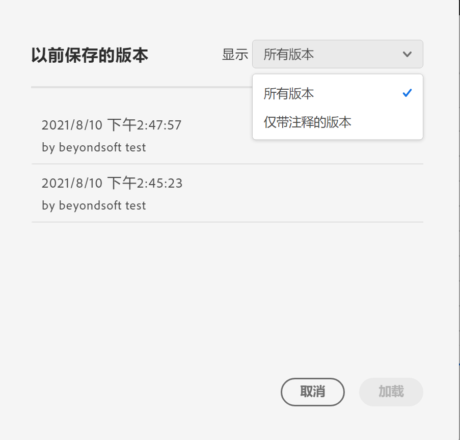

# 保存项目 {#save-projects}

<!-- markdownlint-disable MD034 -->

>[!CONTEXTUALHELP]
>id="workspace_project_addnotes"
>title="添加注释"
>abstract="添加有关正在保存的项目版本的注释。这些注释将会与该版本一起存储，并且可以通过&#x200B;**[!UICONTROL 项目]** > **[!UICONTROL 打开上一个版本]**&#x200B;菜单访问。"

<!-- markdownlint-enable MD034 -->

Analysis Workspace 中的项目每 2 分钟自动保存一次。您还可以自己保存项目、将项目保存为副本或保存带有版本说明的项目。

## 保存

要手动保存项目，请在 Analysis Workspace 中打开您的项目，选择&#x200B;**[!UICONTROL 项目]**，然后从以下选项中进行选择：

* **[!UICONTROL 保存]**

  将更改保存到项目。如果项目已共享，项目的收件人也会看到所做的更改。

  首次保存项目时会显示一个&#x200B;**[!UICONTROL 保存]**&#x200B;对话框。

  

   1. 指定以下内容：

      * **[!UICONTROL 名称]**（必填项）您的项目名称。
      * **[!UICONTROL 描述]**。您的项目描述。
      * **[!UICONTROL 标记]**。在&#x200B;[!UICONTROL *搜索标记*]&#x200B;字段中搜索标记，或使用&#x200B;**[!UICONTROL 输入]**&#x200B;添加新标记。
      * **[!UICONTROL 文件夹]**。从&#x200B;[!UICONTROL *选择文件夹*]&#x200B;下拉菜单中选择文件夹。 如果您未指定文件夹，则该项目会保存在您创建新项目的当前文件夹中。
      * **[!UICONTROL 版本说明]**。在&#x200B;*添加注释*&#x200B;文本区域添加版本说明。

   1. 选择&#x200B;**[!UICONTROL 保存]**&#x200B;以保存项目。

  保存项目实际上会保存一个项目版本，该版本会存储 90 天。

  如果您保存了已共享的项目，**[!UICONTROL 保存对共享项目的更改]**&#x200B;警告对话框会提示您进行确认。

  

   * 选择&#x200B;**[!UICONTROL 保存]**&#x200B;来保存项目。
   * 选择&#x200B;**[!UICONTROL 另存为]**&#x200B;将该项目保存为具有新名称的重复项目。

* **[!UICONTROL 保存并添加注释]**

  

  在保存项目时，添加有关项目中进行了哪些更改的注释。在保存版本说明对话框中：

   1. 在&#x200B;**[!UICONTROL 添加注释]**&#x200B;文本区域输入您的&#x200B;**[!UICONTROL 版本说明]**。
   1. 选择&#x200B;**[!UICONTROL 保存]**。

  注释会与项目版本一起存储，当您[打开项目的先前版本](open-projects.md#open-previous-version)时，这些注释仍然可用。带有注释的版本将自动保存一年。

* **[!UICONTROL 另存为]**

  

  用新名称创建一个项目副本。“另存为”对话框显示。

   1. 指定以下内容：

      * **[!UICONTROL 名称]**（必填项）您的项目名称。
      * **[!UICONTROL 描述]**。您的项目描述。
      * **[!UICONTROL 标记]**。在&#x200B;[!UICONTROL *搜索标记*]&#x200B;字段中搜索标记，或使用&#x200B;**[!UICONTROL 输入]**&#x200B;添加新标记。
      * **[!UICONTROL 文件夹]**。从&#x200B;[!UICONTROL *选择文件夹*]&#x200B;下拉菜单中选择文件夹。 如果您未指定文件夹，则该项目会保存在您创建新项目的当前文件夹中。
      * **[!UICONTROL 版本说明]**。在&#x200B;*添加注释*&#x200B;文本区域添加版本说明。

   1. 选择&#x200B;**[!UICONTROL 保存]**&#x200B;以保存项目。

  您可以将项目保存到不同的文件夹。原始项目不会受到影响。

<!-- Cannot find this option in CJA 
| **[!UICONTROL Save as template]** | Save your project as a [custom template](/help/analyze/analysis-workspace/build-workspace-project/starter-projects.md) that becomes available to your organization under **[!UICONTROL Project > New]** | 
-->

## 自动保存

>[!IMPORTANT]
>
>尽管新项目是自动保存的，但您必须在&#x200B;**第一次**&#x200B;手动保存每个新项目。
>

Analysis Workspace 中的所有项目每 2 分钟会自动保存到本地计算机。该自动保存范围包括尚未手动保存的新创建项目。

### 新项目

在切换到另一个项目、关闭浏览器选项卡等时，Analysis Workspace 会提示您手动保存新项目。

如果出于任何原因您在手动保存之前意外失去对新创建项目的访问权限，您的项目的恢复版本将保存在 Analysis Workspace 登录页面上名为&#x200B;**[!UICONTROL 已恢复项目（过去 7 天）]**&#x200B;的文件夹中。还原已恢复的项目并将其手动保存到所需位置。

要还原已恢复的项目：

1. 转到 Analysis Workspace 登录页面上的&#x200B;**[!UICONTROL 已恢复的项目（过去 7 天）]**&#x200B;文件夹。

<!-- 
     
  -->

1. 打开您的项目并将其保存到所需位置。

### 现有项目

如果出于任何原因您离开的项目包含尚未自动保存的更改，Analysis Workspace 会提示您保存更改或提供警告消息。

一些常见的情况：

#### 打开另一个项目

如果您在处理包含尚未自动保存的更改的项目时打开另一个项目，Analysis Workspace 会提示您保存当前项目。

可以使用以下选项：

* **[!UICONTROL 保存：]**&#x200B;用您最新的更改替换项目最近自动保存的本地副本。
* **[!UICONTROL 放弃更改：]**&#x200B;放弃您最近的更改。该项目保留最近自动保存的本地副本。
* **[!UICONTROL 取消]**：取消打开另一个项目的操作，并保持现有项目处于打开状态。

<!--  -->

#### 离开或关闭选项卡

如果您在查看包含尚未自动保存的更改的项目时离开页面或关闭浏览器选项卡，浏览器会警告您未保存的更改将会丢失。您可以选择离开或取消。浏览器如何向您发出警告取决于您使用的浏览器。

### 浏览器崩溃或会话超时

如果浏览器崩溃或会话超时，则下次访问 Analysis Workspace 时，系统会提示您恢复尚未自动保存的项目更改。

* 选择&#x200B;**[!UICONTROL 是]**&#x200B;将从最近自动保存的副本中恢复项目。

* 选择&#x200B;**[!UICONTROL 否]**&#x200B;将删除自动保存的副本并打开项目的最后一个用户保存的版本。

<!---->

对于从未保存的&#x200B;**新**&#x200B;项目，未保存的更改将无法恢复。

<!-- Shouldn't this belong to another page?  Moved it to a new open projects page

## Open previously saved version

To open a previously saved version of a project:

1. Select **[!UICONTROL Open previous version]** from the **[!UICONTROL Project]** menu.

   

1. Review the list of previous versions available. You can switch between **[!UICONTROL All versions]** and **[!UICONTROL Only versions with notes]**.

   For each version, the list shows a timestamp
   [!UICONTROL Timestamp] and [!UICONTROL Editor] are shown, in addition to [!UICONTROL Notes] if they were added when the [!UICONTROL Editor] saved. Versions without notes are stored for 90 days; versions with notes are stored for 1 year.
1. Select a previous version and click **[!UICONTROL Load]**.
   The previous version then loads with a notification. The previous version does not become the current saved version of your project until you click **[!UICONTROL Save]**. If you navigate away from the loaded version, when you return, you will see the last saved version of the project.

-->

<!--
# Save projects {#save-projects}

>[!CONTEXTUALHELP]
>id="workspace_project_addnotes"
>title="Add notes"
>abstract="Add notes about the project version being saved. These notes will be stored with the version and accessible under the **[!UICONTROL Project]** > **[!UICONTROL Open previous version]** menu."

Projects in Analysis Workspace are automatically saved every 2 minutes. 

You can also manually save projects. Additional options such as adding tags or notes are available when you manually save a project.

## Save projects manually {#Save} 

Various options are available when manually saving a project in Analysis Workspace.

To manually save a project:

1. With your project open in Analysis Workspace, select **[!UICONTROL Project]**, then choose from the following options: 

   | Action | Description | 
   |---|---| 
   | **[!UICONTROL Save]** | Save changes to your project. If the project is shared, recipients of the project will also see the changes. When you first save your project, you are prompted to give the project a name, (optional) description and add (optional) tags. | 
   | **[!UICONTROL Save with notes]** | Before your project saves, add notes about what changed in the project. Notes are stored with the project version and are available to all editors under [!UICONTROL Project] > [!UICONTROL Open previous version]. | 
   | **[!UICONTROL Save as]** | Create a duplicate of your project. The original project will not be affected. | 
   | **[!UICONTROL Save as template]** | Save your project as a [template](/help/analyze/analysis-workspace/templates/create-templates.md) that becomes available to your organization under **[!UICONTROL Project > New]** | 

## Auto-save {#Autosave} 

All projects in Analysis Workspace are automatically saved every 2 minutes to your local machine. This includes newly created projects that are not yet saved manually. 

* **New projects:** Even though new projects are auto-saved, you must save each new project manually the first time. Analysis Workspace prompts you to save new projects manually when switching to another project, closing the browser tab, and so forth. 

  If for any reason you unexpectedly lose access to a newly created project before manually saving it, a recovery version of your project is saved on the Analysis Workspace landing page in a folder called `Recovered Projects (Last 7 Days)`. You must restore the recovered project and manually save it to a desired location. 

  To restore a recovered project:
  
  1. Go to the [!UICONTROL **Recovered Projects**] folder on the Analysis Workspace landing page.

     

  1. Open your project and save it to a desired location. 

* **Existing projects:** If for any reason you leave a project with changes that are not yet auto-saved, Analysis Workspace either prompts you to save your changes or provides a warning message. 

  Following are some common scenarios:

### Open another project 

If you open an additional project while working on a project that contains changes that are not yet auto-saved, Analysis Workspace prompts you to save the current project before leaving.

The following options are available:

* **Save:** Replaces the most recent auto-saved local copy of your project with your latest changes.
* **Save As:** Saves your latest changes as a new project. The original project is saved only with the most recent auto-saved changes.
* **Discard Changes:** Discards your latest changes. The project retains the most recent auto-saved changes.

### Navigate away or close a tab 

If you navigate away from the page or close the browser tab while viewing a project with changes that are not yet auto-saved, the browser warns that your unsaved changes will be lost. You can choose to leave or cancel. 

### Browser crashes or session times out 

If your browser crashes or if your session times out, then the next time you access Analysis Workspace you're prompted to recover any changes to your project that are not yet auto-saved.

Following is the Project Recovery dialog box that displays the first time you access Analysis Workspace after a crash or a timeout.

Select **Yes** to restore the project from the most recent auto-saved copy.

Select **No** to delete the auto-saved copy and open the last user-saved version of the project.

For **new** projects that have never been saved, unsaved changes are not recoverable.

## Open a previous version {#previous-version}

To open a previous version of a project:

1. Go to **[!UICONTROL Project]** > **[!UICONTROL Open previous version]**

   
   
1. Review the list of prior versions available. 
   [!UICONTROL Timestamp] and [!UICONTROL Editor] are shown, in addition to [!UICONTROL Notes] if they were added when the [!UICONTROL Editor] saved. Versions without notes are stored for 90 days; versions with notes are stored for 1 year.
1. Select a previous version and click **[!UICONTROL Load]**.
   The previous version then loads with a notification. The previous version does not become the current saved version of your project until you click **[!UICONTROL Save]**. If you navigate away from the loaded version, when you return, you will see the last saved version of the project. 

-->