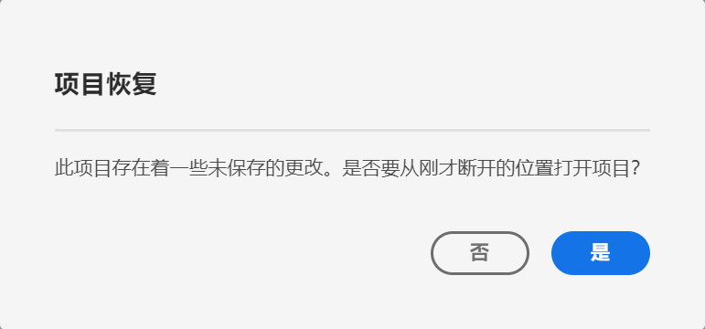

# 保存项目

要保存对项目所做的更改，请转到工作区的&#x200B;**[!UICONTROL 项目]**&#x200B;菜单。此外，在某些情况下，Adobe 会自动保存项目。

## 保存项目选项 {#Save}

在&#x200B;**[!UICONTROL 项目]**&#x200B;菜单下，您可以执行不同的保存操作，具体取决于您希望未来以何种方式访问分析。

| 操作 | 描述 |
|---|---| 
| **[!UICONTROL 保存]** | 将更改保存到项目。如果项目已共享，项目的收件人也会看到所做的更改。首次保存项目时，系统会提示您提供项目的名称、（可选）描述以及（可选）添加标记。 |
| **[!UICONTROL 另存为]** | 创建项目副本。原始项目不受影响。 |
| **[!UICONTROL 另存为模板]** | 将您的项目另存为[自定义模板](https://docs.adobe.com/content/help/zh-Hans/analytics/analyze/analysis-workspace/build-workspace-project/starter-projects.html)，贵组织可在&#x200B;**[!UICONTROL 项目 > 新建]**&#x200B;下使用该模板 |

## 自动保存 {#Autosave}

每两分钟会将现有项目（即，以前至少保存过一次的项目）自动保存到本地计算机。目前，不会自动保存从未保存过的新项目。

有一些情形可能会使您离开项目而未保存所做的更改，从而导致不同的可用操作。

### 打开另一个工作区项目

Adobe 提供了在离开页面之前进行保存的选项。离开现有项目后，将删除自动保存的本地副本。

### 离开或关闭选项卡

浏览器会警告“未保存的更改将会丢失”。您可以选择离开或取消。

### 浏览器崩溃或会话超时

对于&#x200B;**现有**&#x200B;项目，在返回工作区时，用户将会看到&#x200B;**项目恢复**&#x200B;模式。选择“是”将从自动保存的本地副本中恢复项目。选择“否”将删除自动保存的本地副本并打开用户保存的最近项目版本。

对于从未保存的&#x200B;**新**&#x200B;项目，未保存的更改将无法恢复。