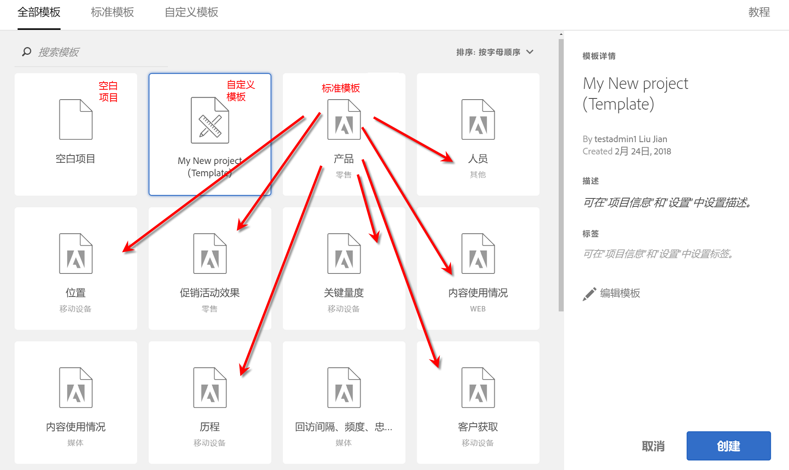

# 模板

## 模板 {#topic_40932F09E18A467983AFBB29908E1CB8}

您可以选择从以下项创建项目：

* 空白项目（默认）。有关说明，请参阅[创建一个 Analysis Workspace 项目](/help/analyze/analysis-workspace/build-workspace-project/t-freeform-project.md)。
* 标准模板。这些模板由 Adobe 创建并且即装即用。
* 自定义模板。这些模板可由具有管理员权限的用户或非管理员（前提是他们获得了“另存为模板”权限）创建。（有关更多信息，请参阅在 Admin Console 中[管理产品权限](https://helpx.adobe.com/cn/enterprise/using/manage-permissions-and-roles.html)文档。）

* [创建自定义模板](/help/analyze/analysis-workspace/build-workspace-project/starter-projects.md)
* [标准模板](/help/analyze/analysis-workspace/build-workspace-project/starter-projects.md)

## 创建自定义模板 {#create-custom-template}

具有管理员权限的用户可以将他们创建的任何项目转换为自定义模板。以下是具体操作方法：

1. 打开该项目。
1. 转到&#x200B;**[!UICONTROL 项目]** &gt; **[!UICONTROL 另存为模板]**。

   

   项目将使用当前项目名称再加上“（模板）”一词进行保存。管理员可以通过编辑模板来更改此名称。

   >[!NOTE]
   >
   >默认情况下，项目模板对贵组织的每个人均可见。您可以通过应用标记来组织这些模板。（转到&#x200B;**[!UICONTROL 项目]** &gt; **[!UICONTROL 项目信息和设置]**&#x200B;以编辑标记和描述。）

### 可对自定义模板执行的操作

<table id="table_D7C7B0CA1EE64E108484C03426800EBC"> 
 <thead> 
  <tr> 
   <th colname="col1" class="entry"> 操作 </th> 
   <th colname="col2" class="entry"> 描述 </th> 
  </tr>
 </thead>
 <tbody> 
  <tr> 
   <td colname="col1"> 
编辑模板 
 </td> 
   <td colname="col2"> 
允许管理员通过更改模板的数据源、修改组件、可视化、日期范围等内容来编辑模板。 
 
要编辑自定义模板，请 
 
    <ul id="ul_2B3A371F83334E14806385753A360903"> 
     <li id="li_EE75E0281B764BA9B56FF1DB1B12D2CC">在 Analysis Workspace 中调出自定义模板列表，选择一个模板，然后单击编辑模板，或 </li> 
     <li id="li_4934DAAA46204990A295E22A97F81EDA">在 Analytics 中，导航到组件 &gt; 项目，然后对模板进行过滤。单击要编辑的模板的名称。 </li> 
    </ul> 
 
 
注意：编辑模板之后，根据具体情况，您有两个选项可用：保存、另存为。以下是它们的不同之处： 
     <ul id="ul_87E2842C8AA442399585B1C6189F5E16"> 
      <li id="li_AB7B189729E14E40A0141ECE2A24C113"><b>保存</b>：更新所有用户的自定义模板。其他人从该自定义模板创建项目时会看到您做出的更改。 </li> 
      <li id="li_C85B0B9873A3404D8B443BBD30B37CEB"><b>另存为</b>：创建包含您所做更改的自定义模板副本。 </li> 
     </ul> 
 
（如果共享 &gt; 共享项目菜单项处于禁用状态，那么您可以据此判断您处于编辑模式当中。） 
 </td> 
  </tr> 
  <tr> 
   <td colname="col1"> 
搜索模板 
 </td> 
   <td colname="col2"> 
在“自定义模板”对话框中，单击搜索模板。 
 </td> 
  </tr> 
  <tr> 
   <td colname="col1"> 
排序模板 
 </td> 
   <td colname="col2"> 
您可以按字母顺序、相关性和创建日期对模板进行排序。 
 
在“自定义模板”对话框中，单击排序:。 
 </td> 
  </tr> 
  <tr> 
   <td colname="col1"> 
将标签应用到模板 
 </td> 
   <td colname="col2"> 
打开模板，然后转到项目 &gt; 项目信息和设置。单击添加标签。 
 </td> 
  </tr> 
  <tr> 
   <td colname="col1"> 
修改模板描述 
 </td> 
   <td colname="col2"> 
打开模板，然后转到项目 &gt; 项目信息和设置。双击该描述并进行编辑。 
 </td> 
  </tr> 
 </tbody> 
</table>

## 标准模板 {#concept_4FE900FEEC894E849CB6C6A0E0ADA524}

首次打开工作区时，模板位于左边栏中。Analysis Workspace 模板涵盖常见用例。它们按所属的垂直领域分组，并填充了不同的维度、区段、量度和可视化，具体取决于您选择的报表包。

您可以按原样使用这些预填充模板，或修改它们以符合您的需要（例如，添加或替换量度或可视化），然后起一个新名称保存它们。

[YouTube 上 Analysis Workspace 中的标准模板](https://www.youtube.com/watch?v=aRgYwPneVXg&amp;list=PL2tCx83mn7GuNnQdYGOtlyCu0V5mEZ8sS&amp;index=6) (2:46)

以下是可用的模板和每个模板帮助回答的问题：

### 广告

>[!IMPORTANT]
>
>广告模板仅在您的报表包针对 Advertising Cloud 启用的情况下才可用。

* **搜索引擎**：此模板可划分广告趋势、广告平台、关键字、帐户、营销活动等。

### 商务

* **Magento：营销与商务**：此模板按营销渠道归因划分您的电子商务转化，并按搜索关键字、登录页面、地理位置等提供分析。有关视频概述，请参阅 &gt; [!VIDEO](https://www.youtube.com/watch?v=AQOViVLEMHw)

### 媒体

* **音频使用情况**：哪个内容的使用次数最多并且吸引用户？
* **回访间隔 - 频度 - 忠诚度**：谁是我的忠实读者？

### 移动设备

>[!IMPORTANT]
>
>移动设备模板仅在您的报表包针对移动设备启用的情况下才可用。

* **消息：**&#x200B;重点关注应用内消息和消息推送的性能。
* **位置：**&#x200B;包括可展示位置数据的“地图”
* **关键量度：**&#x200B;掌握应用程序关键量度。
* **应用程序使用情况：**&#x200B;应用程序拥有多少用户、启动次数和首次启动次数，以及平均会话时长是多少？
* **客户获取：**&#x200B;了解移动设备客户获取链接的表现如何。
* **性能：**&#x200B;应用程序性能如何、用户在哪些情况下遇到问题？
* **维系率：**&#x200B;谁是我的忠实用户，他们会怎么做？
* **历程：**&#x200B;我的应用程序最突出的使用模式是什么？

### 零售

* **促销活动效果：**&#x200B;哪些促销活动获得的收入最多？
* **产品：**&#x200B;哪些产品的表现最佳？

### Web

* **客户获取：**&#x200B;我的网站最主要的流量推动因素是什么？
* **内容使用情况：**&#x200B;用户在我的网站中最常访问哪些区域？
* **维系率：**&#x200B;哪类用户可能成为我的网站的忠实用户？
* **技术：**&#x200B;用户使用哪些技术访问我的网站？

### 人员

> [!NOTE]“人员”模板及其关联的“人员”量度只能在 [Adobe Experience Cloud 设备协作](https://marketing.adobe.com/resources/help/zh_CN/mcdc/mcdc-people.html)中使用。

基于“人员”量度，为删除了重复数据的独特访客量度版本。通过“人员”量度可测量客户使用多个设备与您的品牌进行交互的频率。该模板允许您

* 将美国/加拿大的数据与世界其它地区的数据进行分段。该设备协作当前仅在北美地区可用。
* 横向比较“人员”与“独特访客”量度。
* 请参阅“压缩率”，该计算量度用于计算“人员”量度小于独特访客的百分比。
* 比较客户使用的设备类型总数
* 查看每人使用的平均设备数量。
* 了解如何对“人员”量度进行分段堆叠。
* 探索如何在您的环境中使用 Experience Cloud ID 来增强“人员”量度的效率。

