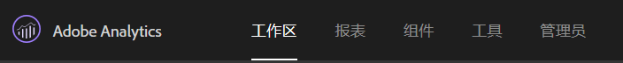
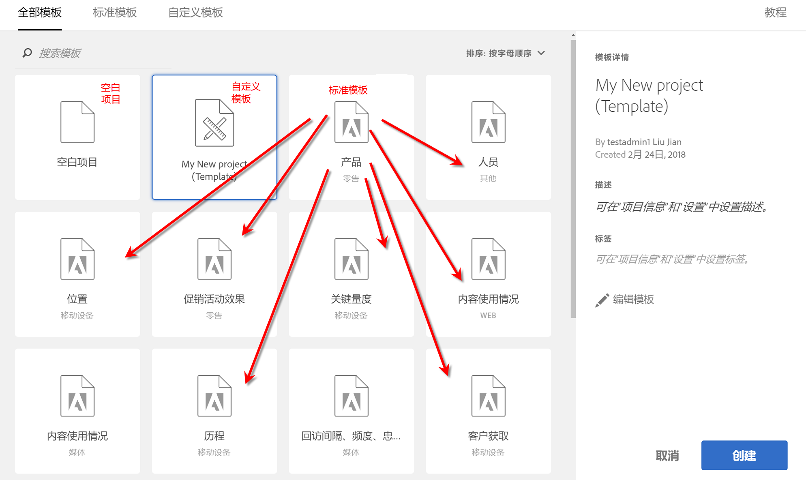
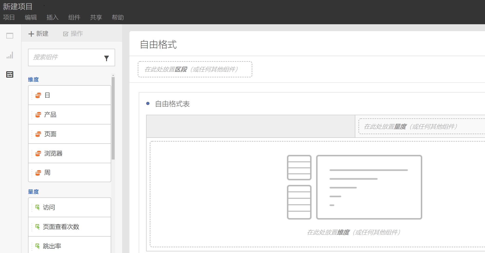
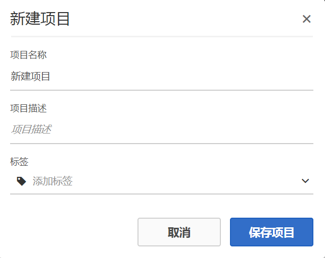
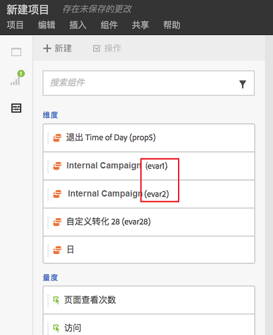
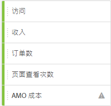
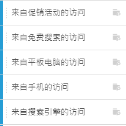
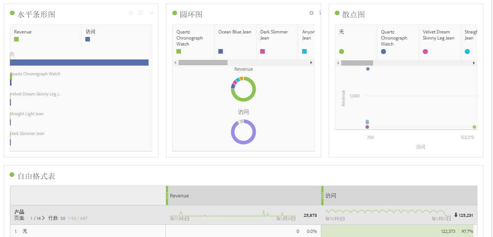

# 创建Workspace项目

创建一个项目并将组件（维度、量度、区段、日期范围）添加到自由格式面板。

在本篇文章中，您可以熟悉 Analysis Workspace 的界面元素，并了解如何创建项目。For specific use cases, see [Use Cases for Analysis Workspace](../../../analyze/analysis-workspace/freeform-analysis-examples-use-cases.md#concept_173D1EB783F24EA89E754628BA30FF4B).

## 创建项目

1. 指定创建和管理项目的用户权限。

   创建或组织 Analysis Workspace 项目之前，管理员必须要将您添加到具有&#x200B;**[!UICONTROL 在 Analysis Workspace 中创建/组织项目]**&#x200B;权限的组，或者添加到&#x200B;**全部报表访问]用户组。[!UICONTROL **( **[!UICONTROL Admin]** &gt; **[!UICONTROL User Management]** &gt; [Groups](https://marketing.adobe.com/resources/help/en_US/reference/?f=groups)).

1. In the [!DNL Experience Cloud], click **[!UICONTROL Analytics]** &gt; **[!UICONTROL Workspace]**.

   

   或者，输入正斜杠 (/) 以打开报表搜索栏，然后键入“分析工作区 *`workspace`*.

   

1. Click **[!UICONTROL Create New Project]**.

   您可以选择从以下项创建项目：

* 空白项目（默认）。有关说明，请参阅下文。
* 标准模板。这些模板由 Adobe 创建并且即装即用。有关说明，请参阅[模板](../../../analyze/analysis-workspace/build-workspace-project/starter-projects.md#concept_49B9A327C5004DB0A4BE6291435625C5)。
* 自定义模板。这些模板由具有管理员权限的用户创建。有关说明，请参阅[模板](../../../analyze/analysis-workspace/build-workspace-project/starter-projects.md#concept_49B9A327C5004DB0A4BE6291435625C5)。

   

1. To create a project from a blank project, click **[!UICONTROL Blank Project]**.

   * Then click **[!UICONTROL Create]**, or
   * Simply click **[!UICONTROL Enter]**.
   屏幕上会显示空白项目，其中包括一个自由格式面板和一个数据表可视化信息。

   

   >[!NOTE]
   >
   >有时，在加载项目(或切换到报表包)时会显示“不兼容的报告包”消息，其中，项目中包括的所有组件(指标/维度)均包括在报表包中。您可以看到不兼容的组件列表，这样便可以了解为什么会收到该消息。

<table id="table_3989E45D9D4241CBB2E58B29DA257B2F"> 
 <thead> 
  <tr> 
   <th colname="col1" class="entry"> 元素 </th> 
   <th colname="col2" class="entry"> 描述 </th> 
  </tr> 
 </thead>
 <tbody> 
  <tr> 
   <td colname="col1"><a href="../../../analyze/analysis-workspace/components/analysis-workspace-components.md#concept_BEBE3A75E072495D9E2F895567BBD462" format="dita" scope="local"> 组件</a> </td> 
   <td colname="col2"> 
可拖入项目中的维度、量度、区段和日期范围。 
 </td> 
  </tr> 
  <tr> 
   <td colname="col1"><a href="../../../analyze/analysis-workspace/visualizations/freeform-analysis-visualizations.md#concept_09242627629147A88A68F1506954C276" format="dita" scope="local"> 可视化信息</a> </td> 
   <td colname="col2"> 
这些项目可拖至界面上的面板或项目区域中。 
 </td> 
  </tr> 
  <tr> 
   <td colname="col1"><a href="../../../analyze/analysis-workspace/visualizations/freeform-table.md#concept_0D2E24FCCBAF4194AA941448860E422F" format="dita" scope="local"> 自由格式面板 </a> </td> 
   <td colname="col2"> 
用于在 Analysis Workspace 中进行交互的画布或工作区。 
 </td> 
  </tr> 
 </tbody> 
</table>

1. 保存项目。Name the project, provide a description (optional, but useful) and tag the project (optional), then click **[!UICONTROL Save Project]**.

   

1. 现在，您可以右键单击并复制可视化或面板，然后将复制的可视化或面板粘贴（“插入”）到同一项目的其他位置或其他项目中。

   您可以利用此项功能来创建一些能够复制到其他项目中的“构建基块”（预定义的可视化/面板），从而更加快速地运用特定于您公司的数据。

   >[!NOTE]
   >
   >复制/另存为后，内部链接现在相对于它们所在的项目(而非复制的原始项目)。

## 添加组件和可视化 {#task_CDAC9B3007BE4A3790AFAD3746D669B1}

1. Build your project by dragging *`components`* and *`visualizations`* to the project.

   **组件**

   “组件”工具栏显示了您最常使用的一些可搜索的维度、量度、区段以及日期范围。

<table id="table_4626163E26DE46CB86391868BBA3AD32"> 
 <thead> 
  <tr> 
   <th colname="col1" class="entry"> 组件 </th> 
   <th colname="col2" class="entry"> 描述 </th> 
  </tr> 
 </thead>
 <tbody> 
  <tr> 
   <td colname="col1"> 维度（橙色） </td> 
   <td colname="col2"> 
应用于项目级别。 
 
 
 
Prop#、eVar# 和 event# 均被附加到维度名称，您可以对这些数字编号进行搜索。示例：“Internal Campaign”在左边栏中显示为“Internal Campaign (event1)”。 
 
 请注意，表中不显示 prop、eVar 和 event 编号（为了使标题保持简短）。 
 
某些现有的维度在被拖到自由格式表中或在左边栏中被人查看时具有默认的排序顺序。例如，如果将“小时”放入表中或在左边栏中查看它时，它将按照从 12AM 至 11PM 的顺序进行排序。您仍然可以选择按照任何量度列进行排序。 
 </td> 
  </tr> 
  <tr> 
   <td colname="col1"> 量度（绿色） </td> 
   <td colname="col2"> 
应用于项目级别。 
 
 
 
  发生次数 是数据表的默认量度。 
 </td> 
  </tr> 
  <tr> 
   <td colname="col1"> 区段（蓝色） </td> 
   <td colname="col2"> 
只能在面板级别进行拖动，不过，您可以在数据表中创建内联区段。 
 
 
 
See <a href="../../../analyze/analysis-workspace/freeform-analysis-examples-use-cases.md#concept_173D1EB783F24EA89E754628BA30FF4B" format="dita" scope="local"> Use Cases for Analysis Workspace</a> for more information. 
 </td> 
  </tr> 
  <tr> 
   <td colname="col1"> 日期范围和粒度（紫色） </td> 
   <td colname="col2"> 
只能在面板级别进行拖动。配置日期范围时，您可以通过“日历”创建一个项目。 
 
 
 </td> 
  </tr> 
 </tbody> 
</table>

**[可视化](../../../analyze/analysis-workspace/visualizations/freeform-analysis-visualizations.md#concept_09242627629147A88A68F1506954C276)**

[!UICONTROL 可视化]面板提供标准的 Analytics 图形、图表、圆环图、数据表、[同类群组](../../../analyze/analysis-workspace/visualizations/cohort-table/cohort-analysis.md#concept_9D240A490265427DA694D18D14EACC0E)表、维恩图等等。您可以将多个可视化信息拖放到项目中。

1. 步骤

## 使用右键单击菜单自定义您的数据 {#concept_8117C300F21843B99F4E1B9AB7B11B6F}

右键单击菜单允许您执行以下操作，具体操作取决于您在表格中右键单击的单元格。

<table id="table_0F84CC5B604D4D41BD0C9668DF525929"> 
 <thead> 
  <tr> 
   <th colname="col1" class="entry"> 操作 </th> 
   <th colname="col2" class="entry"> 描述 </th> 
  </tr>
 </thead>
 <tbody> 
  <tr> 
   <td colname="col1"><a href="../../../analyze/analysis-workspace/components/calendar-date-ranges/time-comparison.md#concept_93BCAD81B7A54ABBBA5CD9E419F6F764" format="dita" scope="local"> 添加时间段列</a> </td> 
   <td colname="col2"> </td> 
  </tr> 
  <tr> 
   <td colname="col1"><a href="../../../analyze/analysis-workspace/components/calendar-date-ranges/time-comparison.md#concept_93BCAD81B7A54ABBBA5CD9E419F6F764" format="dita" scope="local"> 比较时间段</a> </td> 
   <td colname="col2"> </td> 
  </tr> 
  <tr> 
   <td colname="col1"> 
复制到剪贴板 
 </td> 
   <td colname="col2"> </td> 
  </tr> 
  <tr> 
   <td colname="col1"> 
删除选定项 
 </td> 
   <td colname="col2"> </td> 
  </tr> 
  <tr> 
   <td colname="col1"><a href="/help/components/c-alerts/intellligent-alerts.md" format="dita" scope="local"> 从选定范围中创建警报</a> </td> 
   <td colname="col2"> </td> 
  </tr> 
  <tr> 
   <td colname="col1"><a href="../../../analyze/analysis-workspace/components/dimensions/t-breakdown-fa.md#task_B594DA2476E84DFDA8279E831F0BD9C4" format="dita" scope="local"> 划分</a> 
    <ul id="ul_18C83B8514AD4C1C86C071AA8402CB5C"> 
     <li id="li_6CA84ED293EA4940A7495DA9D9121264">维度 </li> 
     <li id="li_EA16EE017B2E4A6998918706938A21BF">量度 </li> 
     <li id="li_0405D339CD01405DB508A7D8D1A976B4">区段 </li> 
     <li id="li_819CE81C552F49BB9C1B83ED3B42C5F7">时间 </li> 
    </ul> </td> 
   <td colname="col2"> </td> 
  </tr> 
  <tr> 
   <td colname="col1"><a href="../../../analyze/analysis-workspace/visualizations/freeform-analysis-visualizations.md#concept_09242627629147A88A68F1506954C276" format="dita" scope="local"> 可视化</a> </td> 
   <td colname="col2"> </td> 
  </tr> 
  <tr> 
   <td colname="col1"><a href="../../../analyze/analysis-workspace/curate-share/download-send.md#concept_BB548979F47F45739679B830428C3025" format="dita" scope="local"> 下载为 CSV 格式</a> </td> 
   <td colname="col2"> </td> 
  </tr> 
  <tr> 
   <td colname="col1"><a href="../../../analyze/analysis-workspace/analysis-workspace-features.md#concept_4D69EE46E3C24EEB97C935A8789364F9" format="dita" scope="local"> 趋势选择</a> </td> 
   <td colname="col2"> </td> 
  </tr> 
  <tr> 
   <td colname="col1"><a href="../../../analyze/analysis-workspace/components/t-freeform-project-segment.md#task_11C6A2C7717B48049E5750B9D20FEC80" format="dita" scope="local"> 从选定范围中创建区段</a> </td> 
   <td colname="col2"> </td> 
  </tr> 
  <tr> 
   <td colname="col1"><a href="../../../analyze/analysis-workspace/c-panels/c-segment-comparison/segment-comparison.md#concept_74FAC1C6D0204F9190A110B0D9005793" format="dita" scope="local"> 在区段比较中运行</a> </td> 
   <td colname="col2"> </td> 
  </tr> 
  <tr> 
   <td colname="col1"> 只显示选定的行 </td> 
   <td colname="col2"> </td> 
  </tr> 
  <tr> 
   <td colname="col1"> 显示所有行 </td> 
   <td colname="col2"> </td> 
  </tr> 
 </tbody> 
</table>

有关复制和选择行的信息，请参阅[在 Analysis Workspace 中可使用键盘、鼠标交互等行为](../../../analyze/analysis-workspace/build-workspace-project/fa-shortcut-keys.md#concept_9A6356084DBC4D468E265E7A65B3E051)。
