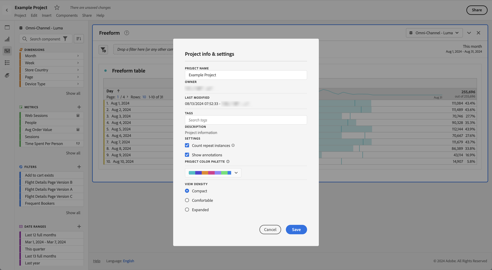

# 视图密度

通过调整视图密度，您可以减小左侧面板、自由格式表和同类群组表的垂直边距，从而在屏幕上查看更多数据。可用的三个选项为：

>[!BEGINTABS]

>[!TAB 紧凑]

这是最浓缩的视图版本。

>[!TAB 舒适]

这是您在工作区中最常用的视图。

>[!TAB 扩展]

这是最扩展视图的版本。

>[!ENDTABS]

要设置视图密度，请执行以下操作：

1. 在工作区中，导航至&#x200B;**[!UICONTROL 项目]** > **[!UICONTROL 项目信息和设置]**。

1. 选择一个&#x200B;**[!UICONTROL 视图密度]**&#x200B;选项，然后选择&#x200B;**[!UICONTROL 保存]**。

<!--
# [!UICONTROL View Density]

Adjusting the [!UICONTROL view density] lets you see more data on the screen by reducing the vertical padding of the left rail, freeform tables and cohort tables. You have 3 options when toggling the view density via radio buttons:

- **[!UICONTROL Compact]**: This is the version with the most condensed view.
- **[!UICONTROL Comfortable]**: This leaves a little more padding than the Compact version.
- **[!UICONTROL Expanded]** (default): This is the view you are used to in Workspace.

To set the view density:

1. In Workspace, navigate to **[!UICONTROL Projects]** > **[!UICONTROL Project Info and Settings]**.

1. Select among the 3 options outlined above and click **[!UICONTROL Save]**.

>[!BEGINSHADEBOX]

See  [View density](https://video.tv.adobe.com/v/40314?quality=12&learn=on&captions=chi_hans){target="_blank"} for a demo video.

>[!ENDSHADEBOX]

-->
