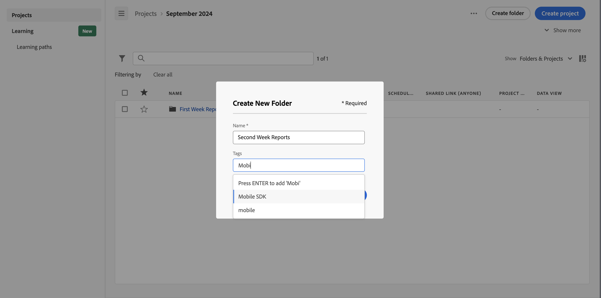

# 创建文件夹

可将新文件夹或子文件夹添加到 Workspace 登陆页上的项目和文件夹列表。

## 创建新文件夹

要创建新文件夹，请执行以下操作

1. 确保您已选择[显示文件夹和项目](/help/analyze/analysis-workspace/build-workspace-project/freeform-overview.md#show-selector)。

1. 确保[标题区](/help/analyze/analysis-workspace/build-workspace-project/freeform-overview.md#title-area)和[项目列表](/help/analyze/analysis-workspace/build-workspace-project/freeform-overview.md#project-list)显示要创建新文件夹的文件夹。

1. 单击&#x200B;**创建文件夹**。

1. 在&#x200B;**[!UICONTROL 创建新文件夹]**&#x200B;对话框中，输入新文件夹的名称。例如：`Second Week Reports`。

1. 从&#x200B;**[!UICONTROL 标记]**&#x200B;下拉列表中选择标记或输入新的标记。

   

1. 单击&#x200B;**创建**。
新文件夹将会添加到当前文件夹。

<!--
# Create folders

You can add a new folder or a subfolder to the list of projects and folders on your Workspace landing page.

## Create a new folder {#create-new-folder}

To create a new folder,

1.  Click **Create new**.

1.  Enter a Name for the new folder.

1.  Select tags from the drop-down menu or add net-new tags.

    

1.  Click **Create**.

    

    The new folder is added in the main list of projects and folders.

    

## Create a subfolder {#create-subfolder}

Subfolders allow you to provide additional levels of project management and organization.

To create a subfolder when you have an existing folder open,

1.  Click **Create a new folder**.

    

1.  Enter a subfolder name and add any necessary tags.

    

1.  Click **Create**.

    The new subfolder is added to the list of projects and subfolders.

    

    >[!NOTE]
    >
    >You can create up to 10-levels of subfolders in a single folder.

    

-->