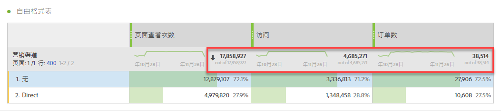
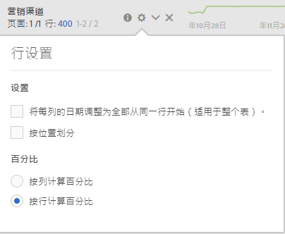

# 工作区总计

在自由格式表中，每个细分级别都显示一个总行，并且可以显示两个总行：

* **[!UICONTROL 总计]** （灰色的“超出”数）-此总数表示已收集的所有点击，有时称为“报表包总数”。 当在面板级别或自由格式表中应用区段时，此总数会调整以反映符合区段标准的所有点击。
* **[!UICONTROL 表总计]** （黑色数字）-此总数通常等于或是总计的 [!UICONTROL 子集]。 它反映自由格式表内应用的任何表过滤器，包括“包 [!UICONTROL 括无] ”选项。

## 显示总设置

在“ **[!UICONTROL 列设置]**”下，有“显示总计”和“显 **[!UICONTROL 示总]** 计”选项 ****。 如果未选中这些设置，则将从表中删除总数。 如果总数不合理（例如，在某些“计算量度”场景中），则可能需要 [这样做](https://docs.adobe.com/content/help/en/analytics/components/calculated-metrics/calcmetrics-reference/cm-totals.html)。

## 静态行总数设置

[静态行合计](https://docs.adobe.com/content/help/en/analytics/analyze/analysis-workspace/build-workspace-project/column-row-settings/manual-vs-dynamic-rows.html) ，其行为方式不同，在“行设置”下 **[!UICONTROL 进行控制]**。

* **[!UICONTROL 将当前行的总和显示为总计]** -这将显示表中行的客户端总和，这意味着总和不会消除 **** （如访问或访客）重复的度量。
* **[!UICONTROL 显示总计]** -这显示服务器端总和，这意味着总计将消除重复的指标，如访问或访客。

## 常见问题解答

| 问题 | 回答 |
|---|---|
| 灰色列百分比基于哪个“总计”? | 这取决于“行设 **[!UICONTROL 置]** ”下的“百分 **[!UICONTROL 比”设置选择]**:<ul><li>按列计算百分比——这是默认设置。 百分比将基于表总数。</li><li>按行计算百分比——百分比将基于总计。</li></ul> |
| “包括未指 **[!UICONTROL 定（无）”设置如何]** ? | 如果未选 **[!UICONTROL 中“包括未指定（无）]**[”设置，则将从表、表总计中删除“无”/“未指定”行，并将执行使用“总计”度量类型的任何计算度量](https://docs.adobe.com/content/help/en/analytics/components/calculated-metrics/calcmetric-workflow/m-metric-type-alloc.html) |
| 当自定义表过滤器应用于自由格式表时，我的所有计算度量和条件格式是否都将过滤器考虑在内？ | 当前不是。 **[!UICONTROL 将计入“包括未指定（无）]** ”，但自定义表过滤器不会影响以下内容：<ul><li>条件格式使用的列最大／最小范围将在所有数据中查看。</li><li>利用“总计”量度 **[!UICONTROL 类型的计算]** 量度。</li><li>使用函数计算自由格式表中各行的度量——如列和、列最大、列最小值、计数、平均值、中值、百分位数、四分位、行计数、标准偏差、方差、累积、累积平均值、回归变量、T-得分、T-测试、Z-得分、Z-测试。</li></ul> |
| 在“计算量度”中，“总计” **[!UICONTROL 量度类型反映]** 什么？ | **[!UICONTROL Grand Total]** （总计）继续引用 **[!UICONTROL Grand Total]**（总计），但不反映应用于表或“表总计”( **[!UICONTROL Table Total)的过滤器]**。 |
| 从自由格式表复制和粘贴数据或通过CSV下载数据时，显示的总数是多少？ | 总行将仅反映“表 **[!UICONTROL 总计]** ”，并遵循“显示总 **[!UICONTROL 计”列设置]** 。 |

