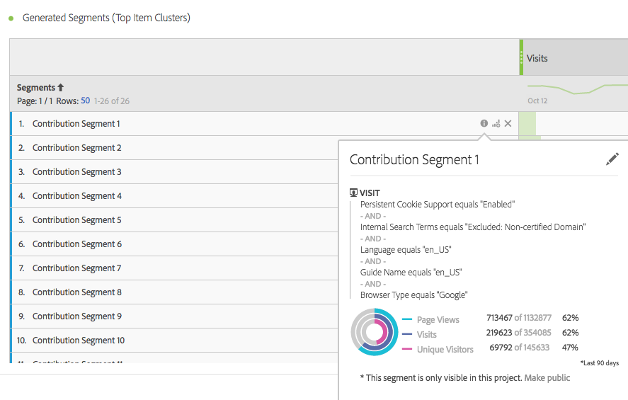

# 运行贡献分析

[贡献分析](/help/analyze/analysis-workspace/c-anomaly-detection/anomaly-detection.md#contribution-analysis)是一个密集型机器学习过程，旨在揭示导致在 Adobe Analytics 中观察到异常的各项因素。意图在于协助用户以远快于其他方式的速度找到焦点领域或时机以供进行其他分析。

## 运行贡献分析 {#run}

在项目中可以通过两种方式来调用贡献分析：

* 在使用每天粒度的自由格式表中，右键单击任何行并选择&#x200B;**[!UICONTROL 运行贡献分析]**。甚至可以对没有显示任何异常的行运行贡献分析。

  >[!NOTE]
  >
  >我们当前仅支持对每天粒度进行贡献分析。

  

* 在折线图中，将光标悬停在折线图中的异常数据点上。单击显示的&#x200B;**[!UICONTROL 分析]**&#x200B;链接。

  

1. （可选）在折线图或表中单击了&#x200B;**[!UICONTROL 运行贡献分析]**&#x200B;后，可通过[排除维度](#exclude)来缩小分析范围（并且因此而提高分析速度）。

1. 在加载贡献分析时，请稍候。此过程可能需要用相当长一段时间，具体取决于报表包的大小和维度的数量。贡献分析可以对每个维度的前 50,000 项执行分析。
1. 然后，Analysis Workspace 将一个新的“贡献分析”面板直接加载到此项目中。

   * 显示当天&#x200B;**访问**&#x200B;次数的可视化。
   * 用于上下文的每月&#x200B;**访问趋势线**。
   * 导致此异常的&#x200B;**排名最前的项目**（按[贡献得分](/help/analyze/analysis-workspace/c-anomaly-detection/anomaly-detection.md#contribution-analysis)排序），以及相关量度和一个独特访客量度（用来对量度进行分级）。

   * [生成的区段](https://experienceleague.adobe.com/docs/analytics/components/segmentation/segmentation-workflow/seg-build.html?lang=zh-Hans)（排名最前的项目集群）表根据贡献得分、异常发生次数和对异常量度做出贡献的整体百分比，识别排名最前的项目间的关联。然后，将这种关联捕获为受众区段（贡献区段 1、贡献区段 2，等等）。单击“i”（信息）按钮将显示每个自动生成区段的定义，包括构成该自动生成区段的排名最前的项目：

     

1. 由于贡献分析现在属于 Analysis Workspace 的一部分，因此您可以利用表右键单击菜单中的大量功能使您的分析更有意义，例如：

   * [按其他维度划分每个维度项目。](/help/analyze/analysis-workspace/components/dimensions/t-breakdown-fa.md)
   * [显示一个或多个行的趋势。](/help/analyze/analysis-workspace/home.md#section_34930C967C104C2B9092BA8DCF2BF81A)
   * [添加新的可视化。](/help/analyze/analysis-workspace/visualizations/freeform-analysis-visualizations.md)
   * [创建警报。](/help/components/c-alerts/intellligent-alerts.md)
   * [创建或比较区段。](/help/analyze/analysis-workspace/c-panels/c-segment-comparison/segment-comparison.md)

>[!NOTE]
>
>在“贡献分析”和与之关联的“智能警报”项目中，我们使用蓝色圆点突出显示正在分析的异常。这样可以更清楚地指示正在分析的异常。

## 从贡献分析中排除维度 {#exclude}

有时，您可能想从“贡献分析”中排除一些维度。例如，您可能根本不关心任何与浏览器或硬件相关的维度，因此希望删除它们从而加快分析速度。

1. 单击&#x200B;**[!UICONTROL 运行贡献分析]**（或折线图中的&#x200B;**[!UICONTROL 分析]**）后，会显示&#x200B;**[!UICONTROL 排除的维度]**&#x200B;面板。

1. 只需将任何多余的维度拖到&#x200B;**[!UICONTROL 排除的维度]**&#x200B;面板中，然后单击&#x200B;**[!UICONTROL 设置为默认值]**&#x200B;保存列表即可。或者，选择要排除的维度后，单击&#x200B;**[!UICONTROL 全部清除]**&#x200B;以重新开始。

   

1. 添加了要排除的维度（或选择不排除的维度）后，请再次单击&#x200B;**[!UICONTROL 运行贡献分析]**。
1. 如果您需要修订排除的维度列表，只需双击“维度”，系统便会显示排除的维度列表：

   

1. 单击多余维度旁边的 x 便可将其删除，然后单击&#x200B;**[!UICONTROL 设置为默认值]**&#x200B;保存该列表。
