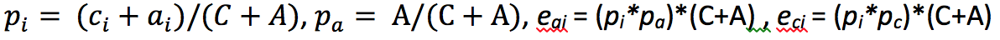

# 统计技术

Analysis Workspace 中的异常检测使用一系列高级统计技术来确定是否应将观测到的情况视为异常。

根据报表中使用的日期粒度，特别针对每小时、每天、每周/每月异常检测，使用了 3 个不同的统计技术。下文概述了每种统计技术。

## 针对每天粒度的异常检测

对于每天粒度报表，算法考虑了多种重要因素以尽可能提供最精确的结果。首先，算法根据算法从两类模型（基于时间序列的模型或异常值检测模型，称为功能过滤）中选择的可用数据，确定要应用的模型类型。

时间序列模型的选择基于 [Hyndman et al. (2008)](https://link.springer.com/book/10.1007/978-3-540-71918-2) 描述的下列误差、趋势和季节性 (ETS) 类型组合。具体来讲，算法会尝试以下组合：

1. ANA（加性误差、无趋势、加性季节性）
1. AAA（加性误差、加性趋势、加性季节性）
1. MNM（乘性误差、无趋势、乘性季节性）
1. MNA（乘性误差、无趋势、加性季节性）
1. AAN（加性误差、加性趋势、无季节性）

该算法通过选择具有最佳平均绝对百分比误差(MAPE)的组合来检验每个组合的适用性。 但如果最优时间序列模型的 MAPE 大于 15%，则采用功能性过滤。通常，具有高重复度的数据（例如，一周中的周或一个月中的月）最适合时间序列模型。

完成模型选择后，算法接着根据假日和每年的季节性调整结果。对于假日，算法会执行相关检查，以确定报告日期范围内是否存在以下假日：

* 阵亡将士纪念日
* 7 月 4 日
* 感恩节
* 黑色星期五
* 网购星期一
* 12 月 24 至 26 日
* 1 月 1 日
* 12 月 31 日

这些假日的选择基于对许多客户数据点的广泛统计分析，旨在确定对客户最高值趋势影响最大的假日。虽然此列表当然不是对所有客户或业务周期都详尽无遗，但应用这些假日可以显着提升几乎所有客户数据集的整体算法性能。

选择了模型并确定了报告日期范围内的假日后，算法即会按照以下方式继续进行下一步：

1. 构建异常参考期。 此期间包括在报告日期范围之前的最多35天，以及1年前的匹配日期范围。 如有需要，会计算闰日并包含上一年不同日历日期可能出现的任何适用假日。
1. 根据最新数据测试当前时间段（不包括上一年）的假日是否存在异常。
1. 如果当前日期范围内的假日存在异常，则基于上一年的假日（考虑前后 2 天），调整当前假日的预期值和置信区间。对当前假日的更正基于以下项的最低平均绝对百分比误差：

   1. 加性影响
   1. 剩性影响
   1. 按年差异

请注意，下面的示例明显提高了圣诞节和元旦的性能：

## 针对每小时粒度的异常分析

每小时数据同样依赖于每日粒度算法所用的时间序列算法。但是，此算法在很大程度上依赖于两个趋势模式：以 24 小时为周期以及以周末/工作日为周期。为了捕获这两种季节性影响，每小时算法使用上述相同方法分别为周末和工作日构建两个不同的模型。

每小时趋势的培训时间范围依赖于 336 小时的回顾窗口。

## 针对每周和每月粒度的异常检测

每周和每月趋势不会呈现与每日或每小时粒度所发现的相同每周或每日趋势，因此采用了单独的算法。对于每周和每月，两步异常检测方法称为广义极端学生化偏差(GESD)测试。 此项测试在确定最大异常数量方面，同时考虑了预期的最大异常数量和调整后的箱线图方法（一种用于发现异常值的非参数方法）。这两个步骤是：

1. 调整后的箱线图功能：此功能确定给定输入数据中的最大异常数。
1. GESD 功能：应用至包含步骤 1 中输出内容的输入数据。

然后，假日和按年季节性异常检测步骤会从今年的数据中减去去年的数据。 然后使用上述两步流程再次遍历数据，以验证异常的发生是否存在季节性。 上述每种日期粒度均使用 15 个回顾周期作为参照，其中包含选择的报告日期范围（15 个月或 15 周）及 1 年前的相应日期范围。

## 贡献分析中使用的统计技术

贡献分析是一个密集型计算机学习过程，专为揭示导致 Adobe Analytics 中所发现异常的因素而设计。意图在于协助用户以远快于其他方式的速度找到焦点领域或时机以供进行其他分析。

贡献分析对可用于用户贡献分析报表的每个维度项目执行一个分为两部分的算法。 此算法以下列顺序运行：

1. 对于每个维度，它会计算克莱姆 V 系数检验统计量。在以下实例中，须考虑列联表中跨越两个时间段的页面查看次数（按国家/地区划分）：

   

   在表1中，克莱姆V系数可用于测量分别对应时间段1（例如历史）和时间段2（例如异常发生的日子）的页面查看次数（按国家/地区划分）之间的关联。 克莱姆 V 系数的值较低意味着低级别的关联。克莱姆 V 系数的范围介于 0（无关联）到 1（完全关联）之间。克莱姆 V 系数统计量是可计算的：

   

1. 对于每个维度项，皮尔逊残差 (PR) 用于测量异常量度和每个维度项之间的关联。PR 遵循标准的正态分布，这允许算法比较两个随机变量的 PR（甚至是在偏差不可比较的情况下）。实际上，错误不是已知的，并可使用有限的样本校正进行预测。

   在表1的上一个示例中，对国家/地区i和时间段2进行了有限样本校正，得出了以下表达式

   

   其中

   

   （对于时间段1，可以得出类似的公式。）

   对于最后结果，每个维度项目的分数将由克莱姆 V 系数测量算得，并重新调整为一个介于 0 和 1 之间的数字，以便提供其贡献得分。
