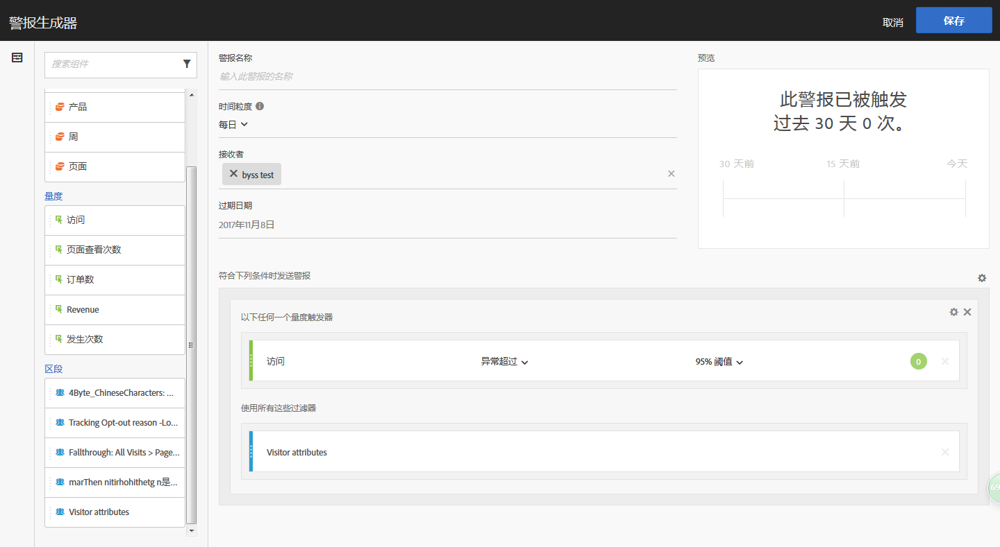
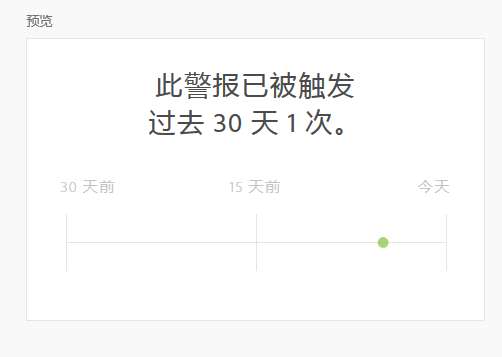

# 警报生成器

>[!IMPORTANT]
>
>智能提醒仅适用于Adobe Analytics Prime和Adobe Analytics Ultimate客户。

## Access Alert Builder

可通过以下四种方法访问警报生成器：

* 在 Analysis Workspace 中使用以下快捷键：

   `ctrl (or cmd) + shift + a`
* By going to **[!UICONTROL Workspace]** &gt; **[!UICONTROL Components]** &gt; **[!UICONTROL New Alert]**.
* By selecting one or more freeform table line items, right-clicking and selecting **[!UICONTROL Create Alert from Selection]**.
* From within a Reports &amp; Analytics report, by going to **[!UICONTROL More]** &gt; **[!UICONTROL Add Alert]**.

## 构建提醒

警报生成器界面与 Analytics 中具有生成区段或计算量度的界面相似：

<!--Meike, I edited this table for validation -->

**警报名称**

指定警报的名称。警报名称可能包含报表名称或量度阈值。

**时间粒度**

指定要何时检查量度：每小时、每天、每周或每月。

>[!NOTE]
>
>对于具有自定义日历的报告套件，我们不支持Alert Builder中的每月粒度。

**收件人**

指定警报的发送地址。可以将警报发送给 Analytics 用户、Analytics 组、原始电子邮件地址或电话号码。

>[!IMPORTANT]
>
>The phone number must be preceded by a "+" and a [country code](https://countrycode.org/).

用户在收到警报后会收到的电子邮件类似于：

**过期日期**

设置警报的过期日期。

**发送警报时间...**

*...以下任何一个量度触发器*

* 将量度拖放到将添加触发器的画布中。

   An **"incompatible components”** message will appear if not all the components (metrics/dimensions/segments) in the alert are compatible with the currently selected report suite.
* 确定触发警报前量度必须超过的阈值。您可以将此值设置为一个阈值，然后设置为下列条件之一：

   * 异常已存在
   * 异常高于预期
   * 异常低于预期
   * 大于或等于
   * 小于或等于
   * 更改百分比
   * 您可以将阈值设置为 90%、95%、99%、99.75% 或 99.9%。
   请注意，您还可以使用计算量度。

*...使用以下过滤器*

* 通过拖放区段或维度来添加过滤器。例如，添加“仅限移动设备”区段表示仅针对移动设备触发规则。
* 其他过滤器将通过 AND 语句添加。

**添加规则**

您可以通过单击齿轮图标添加 AND 或 OR 规则。

## Preview Alerts {#section_10D75BA7B77E4C5FAF58A719C082E070}

交互式警报预览可根据过去的经验显示警报大致的触发频率。

例如，如果将时间粒度设置为每天，则预览会显示某个量度在过去 30 或 31 天中触发了 x 次警报。

如果您发现触发警报的次数过多，则可以在[警报管理器](/help/components/c-alerts/alert-manager.md)中调整阈值。

