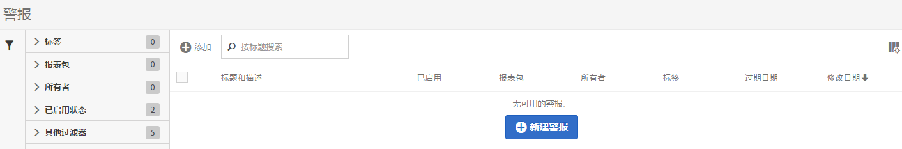

# 管理警报

您可以在警报管理器中管理现有警报。 您可以对警报执行各种管理任务，如标记、重命名、删除等。

警报管理器的结构非常类似于[区段管理器](https://experienceleague.adobe.com/docs/analytics/components/segmentation/segmentation-workflow/seg-manage.html?lang=zh-Hans)和[计算量度管理器](https://experienceleague.adobe.com/docs/analytics/components/calculated-metrics/calcmetric-workflow/cm-manager.html?lang=zh-Hans)。

## 创建警报

要从警报管理器创建警报，请执行以下操作：

1. 选择&#x200B;**[!UICONTROL 组件]** > **[!UICONTROL 警报]**&#x200B;以访问Adobe Analytics中的警报管理器。

   

1. 选择&#x200B;[!UICONTROL **添加**]（如果没有任何现有警报，则选择&#x200B;[!UICONTROL **新建警报**]）。

1. 选择与要创建的警报对应的警报类型：

   * [!UICONTROL **Analytics数据警报**]：当数据中出现异常事件时通知您的警报。

     如果选择此选项，请继续[创建警报](/help/analyze/analysis-workspace/c-intelligent-alerts/alert-builder.md)，了解有关创建警报的更多详细信息。

   * [!UICONTROL **服务器调用使用情况警报**]：一个警报，用于通知您服务器调用使用情况和使用承诺数据中存在超额的风险或发生超额的情况。

     如果选择此选项，请继续[服务器调用使用情况警报](/help/admin/admin/c-server-call-usage/scu-alerts.md)。

     >[!NOTE]
     >
     >您必须是Analytics管理员或具有“服务器调用使用情况”权限的用户才能访问服务器调用使用情况。

## 管理现有警报

要在警报管理器中管理现有警报，请执行以下操作：

1. 选择&#x200B;**[!UICONTROL 组件]** > **[!UICONTROL 警报]**&#x200B;以访问Adobe Analytics中的警报管理器。

   

1. 选择要管理的一个或多个警报。

   

1. 在操作栏中，选择以下任一选项：

   | 操作 | 功能 |
   |---------|----------|
   | [!UICONTROL **标记**] | 将标记应用于警报。 这有助于您组织警报以方便使用。 |
   | [!UICONTROL **删除**] | 删除警报。 |
   | [!UICONTROL **重命名**] | 重命名警报。 |
   | [!UICONTROL **批准**] | 将警报标记为已批准。 |
   | [!UICONTROL **Copy**] | 创建警报的副本（重复）。 |
   | [!UICONTROL **禁用**] | 禁用当前启用的警报。 |
   | [!UICONTROL **启用**] | 启用当前已禁用的警报。 |
   | [!UICONTROL **续订**] | 更新警报到期日期。 这会将过期日期延长一年的时间（从选择此选项之日算起，而不考虑原始过期日期）。 |
   | [!UICONTROL **导出到 CSV**] | 将警报导出到.CSV文件。 |
