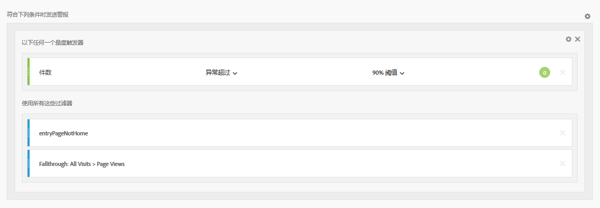
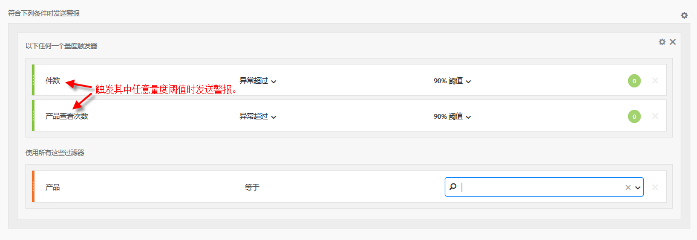

# 智能警报 — 用例

您可以按照[创建警报](/help/analyze/analysis-workspace/c-intelligent-alerts/alert-builder.md)中的说明创建智能警报。

以下各节说明了创建警报时要考虑的示例用例。

## 创建按两个区段过滤的简单警报 {#section_2E96FFFA93D44F7D8DBCEC97203204AA}

<!-- 

Update screenshots for better readability.

 -->

## 合并（堆叠）警报，而不是创建多个警报 {#section_B27B0856BA104B9FB6D0BBB317633F18}

堆叠警报可确保警报得到合并，并且您不会收到大量单独的警报。

