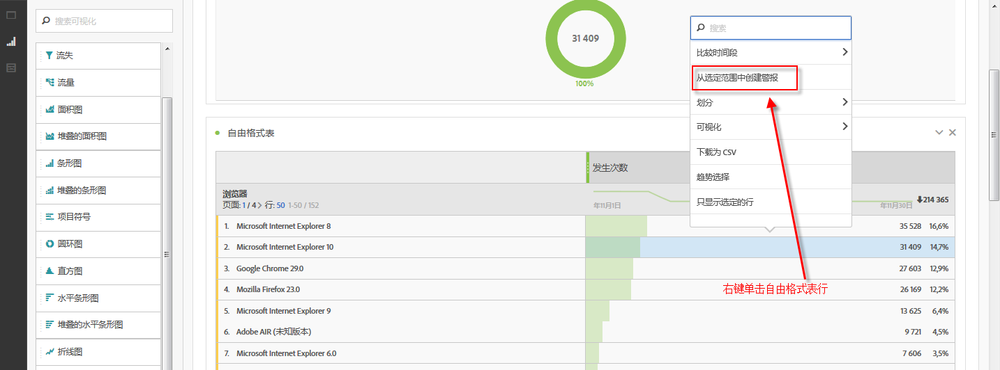
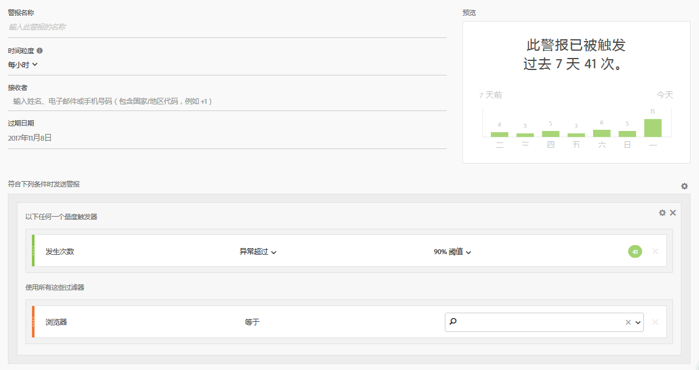

# 智能警报 — 用例

## 创建按两个区段过滤的简单警报 {#section_2E96FFFA93D44F7D8DBCEC97203204AA}

<!-- 

Update screenshots for better readability.

 -->

## 从表选定范围中创建警报 {#section_AE6D42E1255D498D908A2FA60370A419}

在自由格式表中，现在可以通过右键单击表格行并选择&#x200B;**[!UICONTROL 从选定范围中创建警报]**&#x200B;来创建上下文关联警报。

这会立即预填充警报生成器，以便使用正确的量度和过滤器创建警报：

## 合并（堆叠）警报，而不是创建多个警报 {#section_B27B0856BA104B9FB6D0BBB317633F18}

堆叠警报可确保警报得到合并，并且您不会收到大量单独的警报。

