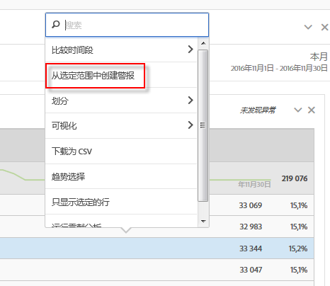
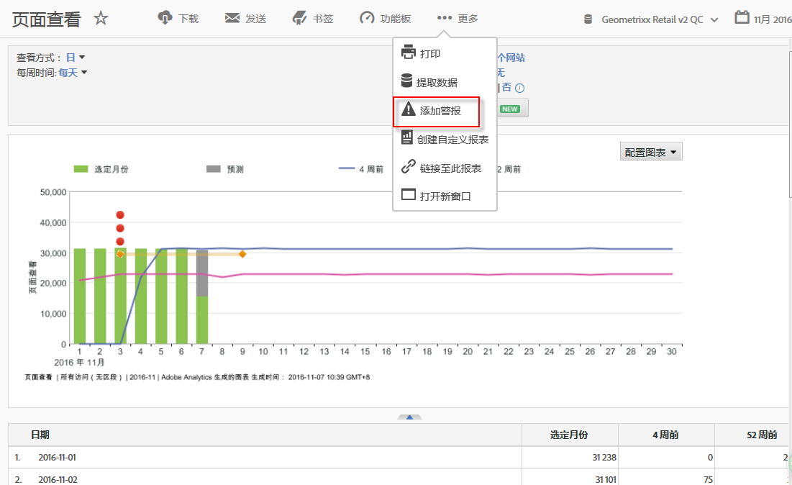

# 智能提醒概述

>[!Important]
>使用戳数据创建提醒可能导致警报不正确。因此，我们建议利用&gt;非时间戳的智能提醒数据。

新的智能警报系统允许对警报进行更多粒度控制，而且还将异常检测与警报系统集成在一起。

[YouTube上的智能提醒](https://www.youtube.com/watch?v=UVH9xr_2REA&list=PL2tCx83mn7GuNnQdYGOtlyCu0V5mEZ8sS&index=65) (5：34)

## 概述 {#section_6AC8CA81DEA94E99B0F192B60D0FDF03}

Analysis Workspace 中新增的警报生成器和警报管理器取代了 Reports &amp; Analytics 中现有的警报功能。智能警报允许您

* 构建基于异常的警报（90%、95%、99%、99.75% 或 99.9% 阈值；% 更改；以上/以下）。
* 预览警报触发的频率。
* 通过含链接的电子邮件或短信将警报发送到自动生成的 Analysis Workspace 项目。
* 创建可在一个警报中捕获了多个量度的“堆栈式”警报。

新警报系统的组件包括：警报生成器、警报管理器、警报预览以及更便于创建警报的上下文关联访问。旧的警报系统用户界面将不再可用，但警报将进行迁移。部分旧版警报功能[将不再可用](https://marketing.adobe.com/resources/help/en_US/sc/user/deprecated_alerts.html)。

可通过四种方式访问警报生成器：

* 在 Analysis Workspace 中使用以下快捷键：

   `ctrl (or cmd) + shift + a`
* By going directly to the Alert Builder:  **[!UICONTROL Workspace]** &gt; **[!UICONTROL Components]** &gt; **[!UICONTROL New Alert]** .
* By selecting one or more freeform table line item/s, right-clicking and selecting **[!UICONTROL Create Alert from Selection]**. 这将打开警报生成器，并在生成器中预填充表格中应用的相应量度和过滤器。然后，您可以根据需要编辑警报。

   

* From within a Reports &amp; Analytics report, by going to  **[!UICONTROL More]** &gt; **[!UICONTROL Add Alert]** . 这将打开新的警报生成器，并在生成器中预填充报表中应用的相应量度和过滤器。然后，您可以根据需要编辑警报。

   

## FAQ: How alerts are calculated and triggered {#section_1F3B1DAF21784306953B49AAD4C3DCAB}

% 阈值代表标准偏差。例如，95% 等于 2 个标准偏差，99% 等于 3 标准偏差。根据您选择的时间粒度，将使用[不同的模型](../../../analyze/analysis-workspace/virtual-analyst/c-anomaly-detection/statistics-anomaly-detection.md#concept_0705DC91F0F44951AC2226EC846E824C)来计算每个数据点和标准值之间的间隔时间（标准偏差个数）。设定的阈值越低，异常会越多。例如，同 99% 的相比，90% 的阈值会产生更多的异常。过去，在时间粒度为每小时的情况下，为了让触发的异常保持低水平，专门设定了 99.75% 和 99.99% 这两个阈值。

<table id="table_B3AA85E1DE3543DCA34966A52E3CE4AB"> 
 <thead> 
  <tr> 
   <th colname="col1" class="entry"> 问题 </th> 
   <th colname="col2" class="entry"> 回答 </th> 
  </tr> 
 </thead>
 <tbody> 
  <tr> 
   <td colname="col1"> 
<b>问题：警报异常检测会将距离标准值多久的数据确定为异常数据？</b> 
 </td> 
   <td colname="col2"> 
培训期因选定的时间粒度而异。（请参阅<a href="../../../analyze/analysis-workspace/virtual-analyst/c-anomaly-detection/statistics-anomaly-detection.md#concept_0705DC91F0F44951AC2226EC846E824C" format="dita" scope="local">异常检测中使用的统计技术</a>，以了解更多详细信息）。下面是小结： 
 
    <ul id="ul_4F8C2A41F06C498DBF5E7AE5DE803773"> 
     <li id="li_E246091A3F1E484C8444AF4052FCA784">每月：15 个月及去年的相应日期范围 </li> 
     <li id="li_CC014FB38AE1492B9647E990C29BFB3C">每周：15 周及去年的相应日期范围 </li> 
     <li id="li_2517EE2097534324BE9C1B54CD181A62">每天：35 天及去年的相应日期范围 </li> 
     <li id="li_710BC8B009354542AA4962A59A646099">每小时：336 个小时 </li> 
    </ul> </td> 
  </tr> 
  <tr> 
   <td colname="col1"> 
<b>问题：如果我只想收到峰值异常行为警报或谷值异常行为警报，我可以使用异常功能吗？还是我需要使用绝对值？</b> 
 </td> 
   <td colname="col2"> 
使用绝对值仍会同时触发谷值警报和峰值警报。您无法将谷值警报和峰值警报分离开来。 
 </td> 
  </tr> 
  <tr> 
   <td colname="col1"> 
<b>问题：我可以将警报配置为仅在一天中的特定时间触发吗（如上班时间与非上班时间）？</b> 
 </td> 
   <td colname="col2"> 
当前还不可以。 
 </td> 
  </tr> 
  <tr> 
   <td colname="col1"> 
<b>问题：我可以获得用虚线制成的“预期值”表格吗？表格中会包含一些预期值的结果吗？</b> 
 </td> 
   <td colname="col2"> 
在工作区中无法实现，但是在 Report Builder 中可以（请观看视频：<a href="https://www.youtube.com/watch?v=-a-8W6GQZnU" format="https" scope="external">Report Builder 中的异常检测</a>)。 
 
请记住，Report Builder 使用的是略微简单的异常检测方法。与 <a href="https://marketing.adobe.com/resources/help/en_US/reference/anomaly.html" format="html" scope="external">Reports &amp; Analytics 异常检测</a>相似，它使用 30 天的固定培训期，和 95% 的固定间隔。 
 </td> 
  </tr> 
 </tbody> 
</table>

