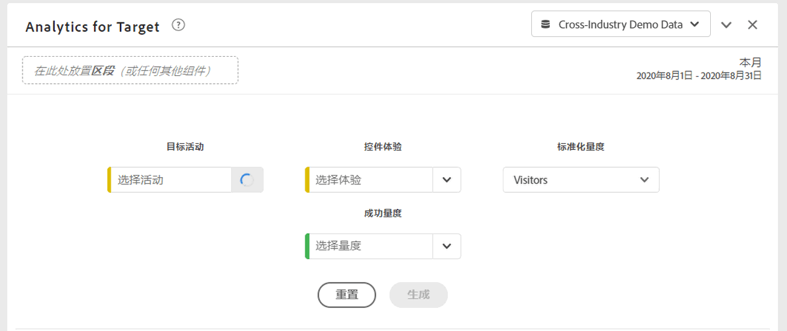
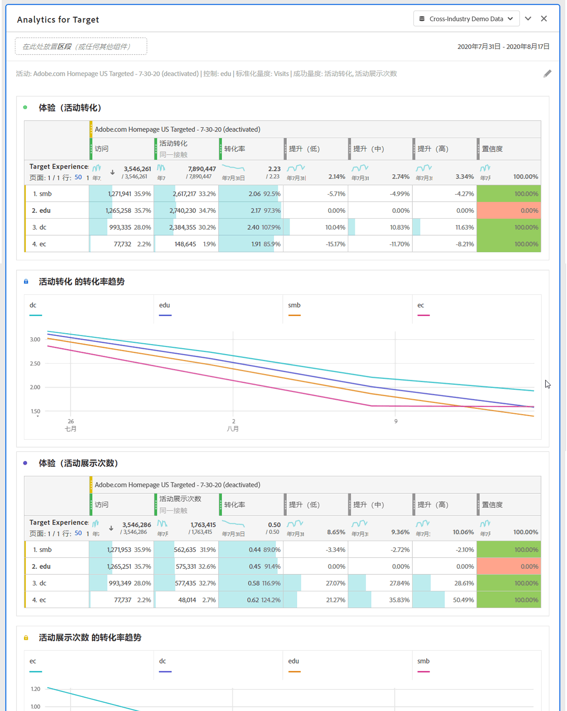

# “Analytics for Target”面板 {#analyze-for-target-panel}

<!-- markdownlint-disable MD034 -->

>[!CONTEXTUALHELP]
>id="workspace_a4t_button"
>title="Analytics for Target"
>abstract="在 Analysis Workspace 中分析 Target 的活动和体验。"

<!-- markdownlint-enable MD034 -->

<!-- markdownlint-disable MD034 -->

>[!CONTEXTUALHELP]
>id="workspace_a4t_panel"
>title="“Analytics for Target”面板"
>abstract="在 Analysis Workspace 中分析 Target 的活动和体验。  **参数&#x200B;** **Target活动**：将分析的Target活动。 **控制体验**：选定Target活动的控制体验。 **标准化量度**：访客数、访问次数或展示次数。 此指标（也称为计数方法）将作为提升计算的分母。此外，它也会在应用置信度计算之前影响数据汇总的方式。 **成功量度**：最多可分析3个用于分析Target活动的标准（非计算）成功量度。"

<!-- markdownlint-enable MD034 -->

>[!BEGINSHADEBOX]

_本文在_  _**Adobe Analytics**&#x200B;中记录了Analytics for Target面板。_ _有关如何比较_  _**用户体验**._中不同Customer Journey Analytics体验、营销或消息传递变化的信息，请参阅[试验面板](https://experienceleague.adobe.com/en/docs/analytics/analyze/analysis-workspace/panels/a4t-panel)

>[!ENDSHADEBOX]

通过Analytics for Target面板，可以在Analysis Workspace中分析Adobe Target活动和体验。 通过该面板，最多还可以查看3个成功量度的提升度和置信度。 要访问Analytics for Target面板，请导航到启用了Analytics for Target组件的报表包。 然后，选择最左侧的面板图标，并将Analytics for Target面板拖动到您的Analysis Workspace项目中。

+++下面是Analytics for Target面板的简短视频概述：

>[!VIDEO](https://video.tv.adobe.com/v/37247/?quality=12)

+++

## 使用

要使用&#x200B;**[!UICONTROL Analytics for Target]**&#x200B;面板，请执行以下操作：

1. 创建&#x200B;**[!UICONTROL Analytics for Target]**&#x200B;面板。 有关如何创建面板的信息，请参阅[创建面板](panels.md#create-a-panel)。

1. 指定面板的[输入](#panel-input)。

1. 观察面板的[输出](#panel-output)。

### 面板输入 {#panel-nput}

您可以使用以下输入设置配置Analytics for Target面板：

| 设置 | 描述 |
|---|---|
| **[!UICONTROL 目标活动]** | 从 Target 活动的列表中选择一个活动，或从左边栏拖放一个活动。注意：该列表填入了过去 6 个月至少被点击 1 次的活动。如果您在列表中未看到某个活动，则可能是因为该活动是在 6 个月前进行的。在这种情况下，仍可从左边栏添加该活动，因为左边栏的回顾时间范围最长为 18 个月。 |
| **[!UICONTROL 控制体验]** | 选择您的控制体验。如有必要，您可以在下拉列表中更改它。 |
| **[!UICONTROL 标准化量度]** | 从“独特访客数”、“访问次数”或“活动展示次数”中进行选择。对于大多数分析用例，建议使用“独特访客数”指标。此指标（也称为计数方法）将作为提升计算的分母。此外，它也会在应用置信度计算之前影响数据汇总的方式。 |
| **[!UICONTROL 成功量度]** | 从下拉列表中最多选择 3 个标准（非计算）成功事件，或从左边栏中拖放指标。每个指标在呈现的面板中都有一个专用表格和可视化图表。 |
| C**[!UICONTROL 日历日期范围]** | 这将根据 Adobe Target 中的活动日期范围自动填充。你可以根据需要进行更改。 |

### 面板输出 {#panel-output}

Analytics for Target 面板可返回丰富的数据和可视化图表，进而帮助您更好地了解 Adobe Target 活动和体验的效果。在该面板顶部，提供了一个摘要行，用于提醒您选择的面板设置。您可以随时通过单击右上方的编辑铅笔图标来编辑该面板。

对于您选择的每个成功指标，将显示一个自由格式表和一个转化率趋势图：

每个自由格式表会显示以下指标列：

| 指标 | 描述 |
|---|---|
| **[!UICONTROL 标准化量度]** | “独特访客数”、“访问次数”或“活动展示次数”。 |
| **[!UICONTROL 成功量度]** | 在生成器中选择的指标 |
| **[!UICONTROL 转化率]** | 成功指标/标准化指标 |
| **[!UICONTROL 提升度]** | 每个体验与对照体验比较转化率。注意：提升是 Target 体验的“固定指标”；无法细分它或将它与其他维度一起使用。 |
| **[!UICONTROL 提升（下限）]** | 表示在置信区间为 95% 的情况下变异体验比对照组可能提升的最差程度。 有关详细信息，请参阅[统计计算](https://experienceleague.adobe.com/docs/target/using/reports/statistical-methodology/statistical-calculations.html)和[完整置信度计算器](https://experienceleague.adobe.com/docs/target/assets/complete_confidence_calculator.xlsx) Excel文件。 |
| **[!UICONTROL 提升(Mid)]** | 代表在 95% 的置信区间内，变量体验相对于控制体验所能达到的中等提升度。 有关详细信息，请参阅[统计计算](https://experienceleague.adobe.com/docs/target/using/reports/statistical-methodology/statistical-calculations.html)和[完整置信度计算器](https://experienceleague.adobe.com/docs/target/assets/complete_confidence_calculator.xlsx) Excel文件。 |
| **[!UICONTROL 提升（上限]**） | 表示在置信区间为 95% 的情况下变异体验比对照组可能提升的最佳程度。 有关详细信息，请参阅[统计计算](https://experienceleague.adobe.com/docs/target/using/reports/statistical-methodology/statistical-calculations.html)和[完整置信度计算器](https://experienceleague.adobe.com/docs/target/assets/complete_confidence_calculator.xlsx) Excel文件。 |
| **[!UICONTROL 置信度]** | t 检验（也称为 Student t 检验）将计算置信度级别，用于指示如果再次运行该检验，出现重复结果的可能性。已对指标应用了 75%/85%/95% 的固定条件格式化范围。如果需要，可以在“列”设置下自定义此格式化范围。注意：置信度是 Target 体验的“固定指标”；无法细分它或将它与其他维度一起使用。 有关详细信息，请参阅[统计计算](https://experienceleague.adobe.com/docs/target/using/reports/statistical-methodology/statistical-calculations.html)和[完整置信度计算器](https://experienceleague.adobe.com/docs/target/assets/complete_confidence_calculator.xlsx) Excel文件。 |

与 Analysis Workspace 中的任何其他面板一样，通过添加其他将帮助您分析 Adobe Target 活动的表和[可视化效果](https://experienceleague.adobe.com/docs/analytics/analyze/analysis-workspace/visualizations/freeform-analysis-visualizations.html?lang=zh-Hans)即可继续进行分析。还可在面板级别或自由格式表内应用区段。请注意，如果在自由格式表内添加它，则必须让它横跨整个表以保留提升和置信度计算结果。目前不支持列级区段。

## 常见问题解答 {#FAQ}

| 问题 | 回答 |
|---|---|
| Analytics for Target支持哪些活动类型？ | [深入了解](https://experienceleague.adobe.com/docs/target/using/integrate/a4t/a4t-faq/a4t-faq-activity-setup.html?lang=zh-Hans)支持的活动类型。 |
| 提升度和置信度计算是否支持计算指标？ | 不支持。[深入了解](https://experienceleague.adobe.com/docs/target/using/integrate/a4t/a4t-faq/a4t-faq-lift-and-confidence.html?lang=zh-Hans)提升度和置信度指标为何不支持计算指标。但是，可以在Analytics for Target报表中使用这些量度以外的计算量度。 |
| 为何 Target 和 Analytics 中的独特访客数会不一样？ | [深入了解](https://experienceleague.adobe.com/docs/target/using/integrate/a4t/a4t-faq/a4t-faq-viewing-reports.html?lang=zh-Hans)不同产品中独特访客数之间的差异。 |
| 当我在分析中为特定 Target 活动应用点击区段时，为何会看到返回的不相关体验？ | Analytics for Target维度是一个列表变量，这意味着它可以同时包含多个活动（和体验）。 [了解详情](https://experienceleague.adobe.com/docs/target/using/integrate/a4t/a4t-faq/a4t-faq-viewing-reports.html?lang=zh-Hans) |
| 置信度指标是否会将极端订单计入在内或对多个产品建议活动应用 Bonferroni 校正？ | 不会。[深入了解](https://experienceleague.adobe.com/docs/target/using/integrate/a4t/a4t-faq/a4t-faq-lift-and-confidence.html?lang=zh-Hans) Analytics 如何计算置信度。 |
| 提升度和置信度指标能否与其他维度或划分一起使用？ | 提升度和置信度是“目标体验”维度的“锁定指标”，因为它们需要一个控件和变量才能计算。因此，不能对这两个指标划分或将这两个指标与其他维度一起使用。 |
| 何时会重新计算提升度和置信度？ | 只要运行（或重新运行）面板、面板日期范围发生变化或将区段应用于面板或表，即重新计算提升和置信度。将区段过滤器应用于自由格式表时，必须横跨所有列应用它，否则无法正确地更新提升和置信度。目前不支持列级区段。 |

有关Analytics for Target报表的更多信息，请访问[Analytics for Target报表](https://experienceleague.adobe.com/docs/target/using/integrate/a4t/reporting.html?lang=zh-Hans)
