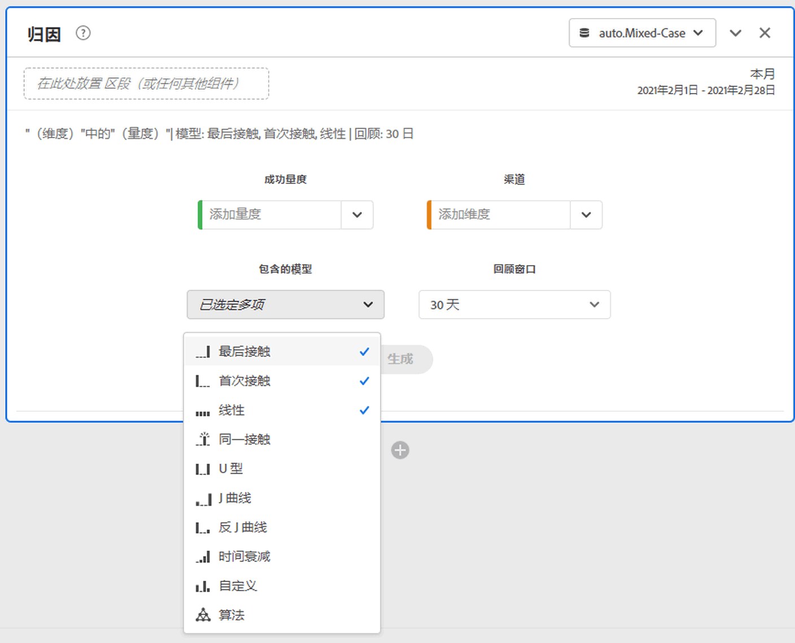
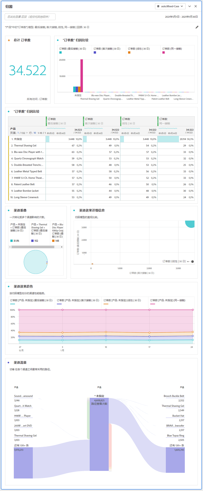

# 归因面板

归因面板是一种用于构建各种归因模型的比较分析的简便方法。它是Attribution IQ中的一 [项功能](../attribution/overview.md) ，可为您提供专用工作区来使用和比较归因模型。

## 创建归因面板

1. 单击左侧的面板图标。
1. 将归因面板拖动到您的 Analysis Workspace 项目中。

   

1. 添加要属性的度量，并添加要属性的任何维。 例如营销渠道或自定义维度，如内部促销。

   

1. 选择 [要比较的归因模型](../attribution/models.md) 和回顾窗口。

1. “归因”面板返回一组丰富的数据和可视化信息，它们可以比较所选维度和度量的归因。

   

## 归因可视化

* **总量度**: 在报告时间窗口内发生的转换总数。 这些是在您所选维度中归因的转化。
* **度量归因比较条形图**: 以可视方式比较选定维度中每个维度项目的属性转换。 每种条形颜色代表一个不同的归因模型。
* **度量归因自由形式表**: 显示与条形图相同的数据（表示为表）。 选择此表中的不同列或行将过滤器条形图以及面板中的若干其他可视化。 此表的作用与工作区中任何其他自由形式表的作用相似，允许您添加度量、细分或细分等组件。
* **维重叠图**: 一个维度图，它显示前三个维度项目及其共同参与转化的频率。 例如，气泡重叠的大小指示访客暴露于两个维度项目时发生转换的频率。 在相邻的自由形式表中选择其他行会更新可视化，以反映您的选择。
* **每个旅程的营销接触点**: 直方图，指示访客在回顾窗口中的接触点数。 这有助于了解多接触点归因对数据集的影响程度。如果几乎所有访客只有一个接触点，则不同的归因模型可能会显示相似的数据。
* **营销渠道绩效详细信息**: 允许您使用散点图以可视方式比较最多三个归因模型。
* **营销渠道流**: 让您了解最常与哪些渠道互动，以及访客旅程中的顺序。
