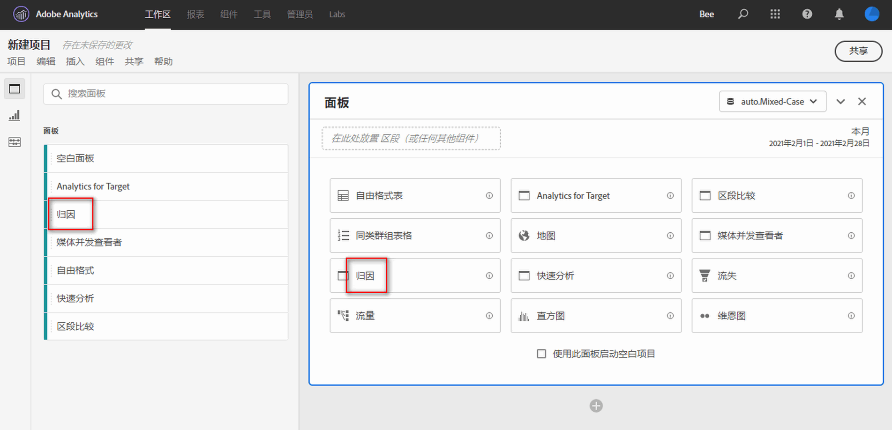

# 归因面板 {#attribution-panel}

<!-- markdownlint-disable MD034 -->

>[!CONTEXTUALHELP]
>id="workspace_attribution_button"
>title="归因"
>abstract="使用任意维度和转化量度，快速比较和可视化任意数量的归因模型"
>additional-url="https://www.youtube.com/watch?v=Yu0hy2klzA0" text="Attribution IQ 面板"

>[!CONTEXTUALHELP]
>id="workspace_attribution_panel"
>title="”归因“面板"
>abstract="使用任意维度和转化量度，快速比较并可视化任意数量的归因模型。  **参数&#x200B;** **渠道** &#x200B;归因的对比维度。该维度可以是营销渠道、营销活动或任何其他维度。 **模型** &#x200B;该模型可以确定如何将点数分配给各个接触点。 **回顾窗口** &#x200B;此设置可以确定应用于每次转化的数据归因窗口。"
>additional-url="https://www.youtube.com/watch?v=Yu0hy2klzA0" text="Attribution IQ 面板"

<!-- markdownlint-enable MD034 -->

>[!BEGINSHADEBOX]

*本文记录了**Adobe Analytics**中的归因面板。 查看本文的**Customer Journey Analytics**版本的[归因面板](https://experienceleague.adobe.com/en/docs/analytics-platform/using/cja-workspace/panels/attribution)。*

>[!ENDSHADEBOX]

**[!UICONTROL 归因]**&#x200B;面板是一种简单的方式，用于构建分析来比较各种归因模型。面板为您提供了一个专用工作区，用于使用和比较归因模型。

Adobe Analytics 通过让您能够执行以下操作来增强归因：

* 定义付费媒体以外的归因：任何维度、量度、渠道或事件都可以应用于模型（例如，内部搜索），而不仅仅是营销活动。
* 使用无限数量的归因模型比较：动态比较任意数量的模型。
* 避免实施更改：通过报表时间处理和上下文感知会话，可以内置客户历程上下文并在运行时应用。
* 构建与您的归因方案最匹配的会话。
* 按区段划分归因：轻松比较营销渠道在任何重要区段中的表现（例如，新客户与老客户、产品X与产品Y、忠诚度级别或CLV）。
* 检查渠道交叉和多接触点分析：使用维恩图和直方图，以及趋势归因结果。
* 直观地分析关键营销序列：通过多节点流量和流失可视化图表，以可视方式探索导致转化的路径。
* 构建计算量度：使用任意数量的归因分配方法。

## 使用

要使用&#x200B;**[!UICONTROL 归因]**&#x200B;面板：

1. 创建&#x200B;**[!UICONTROL 归因]**&#x200B;面板。 有关如何创建面板的信息，请参阅[创建面板](panels.md#create-a-panel)。

1. 指定面板的[输入](#panel-input)。

1. 观察面板的[输出](#panel-output)。

### 面板输入

您可以使用以下输入设置配置“归因”面板：

1. 从&#x200B;**[!UICONTROL 渠道]**&#x200B;添加要归因的&#x200B;**[!UICONTROL 成功量度]**&#x200B;和维度。 例如“营销渠道”或自定义维度，如内部促销。

   

1. 从&#x200B;**[!UICONTROL 包含的模型]**&#x200B;中选择一个或多个[归因模型](#attribution-models)并从&#x200B;**[!UICONTROL 回顾窗口]**&#x200B;中选择一个[回顾窗口](#lookback-window)以进行比较。

1. 选择&#x200B;**[!UICONTROL 生成]**&#x200B;以在面板中生成可视化图表。

### 面板输出

**[!UICONTROL 归因]**&#x200B;面板返回一组丰富的数据和可视化图表，其中对选定维度和量度的归因进行了比较。

### 归因可视化图表

以下可视化图表是面板输出的一部分。

* **总量度**：在报表时间范围内发生并归因到所选维度的转化总数。
* **归因比较条形图**：以可视方式，比较所选维度中各个维度项的归因转化。每种条形颜色代表一个不同的归因模型。
* **归因比较表**：将相同的数据显示为条形图，以表格的形式表示。选择此表中的不同列或行，会筛选条形图以及面板中的其他一些可视化图表。此表的作用与Workspace中的任何其他自由格式表的作用相似，允许您添加量度、区段或细分等组件。
* **重叠图**：一个维恩图可视化图表，显示排名前三的维度项以及它们共同参与转化的频率。 例如，气泡重叠的大小表示当人员出现在两个维度项目中时发生转化的频率。 选择相邻自由格式表中的其他行，会更新可视化图表以反映所选内容。
* **性能详细信息**：用于可视化比较最多三个归因模型的散点可视化图表。
* **趋势化性能**：显示排名最前的维度项的归因转化趋势。选择相邻自由格式表中的其他行，会更新可视化图表以反映所选内容。
* **流量**：让您可以查看在人员历程中与哪个渠道交互得最多，以及按照什么顺序。

## 归因模型

{{attribution-models-details}}

## 回顾时间范围

{{attribution-lookback-window}}

>[!MORELIKETHIS]
>
> [Create a panel](/help/analyze/analysis-workspace/c-panels/panels.md#create-a-panel)
>

<!--
# Attribution panel

The [!UICONTROL Attribution] panel is an easy way to build an analysis comparing various attribution models. It is a feature in [Attribution](/help/analyze/analysis-workspace/attribution/overview.md) that gives you a dedicated workspace to use and compare attribution models.

>[!VIDEO](https://video.tv.adobe.com/v/23139/?quality=12)

## Create an attribution panel

1. Click the panel icon on the left.
1. Drag the [!UICONTROL Attribution] panel into your Analysis Workspace Project.

   

1. Add a metric that you want to attribute and add any dimension to attribute against. Examples include Marketing Channels or custom dimensions, such as internal promotions.

   

1. Select the [attribution models and lookback window](../attribution/models.md) you want to compare.

1. The Attribution panel returns a rich set of data and visualizations that compare attribution for the selected dimension and metric.

   

## Attribution visualizations

* **Total metric**: The total number of conversions that occurred over the reporting time window. These are the conversions that are attributed across the dimension that you selected.
* **Attribution Comparison Bar**: Visually compares the attributed conversions across each of the dimension items from your selected dimension. Each bar color represents a distinct attribution model.
* **Attribution Comparison Table**: Shows the same data as the bar chart, represented as a table. Selecting different columns or rows in this table filters the bar chart as well as several of the other visualizations in the panel. This table acts similar to any other Freeform Table in Workspace - allowing you to add components such as metrics, segments, or breakdowns.
* **Overlap Diagram**: A Venn Diagram showing the top three dimension items and how often they participate jointly in a conversion. For example, the size of the bubble overlap indicates how often conversions occurred when a visitor was exposed to both dimension items. Selecting other rows in the adjacent Freeform table updates the visualization to reflect your selection.
* **Performance Detail**: Lets you to compare up to three attribution models visually using a scatter plot.
* **Trended Performance**: By default, shows the conversion performance trend by attribution model for the first dimension listed in the adjacent Freeform table. You can select different dimension rows in the Freeform table to show the trend for the selected dimensions (such as Total Revenue for each attribution model for Social Campaigns and Paid Search). Alternately, you can select cells in the columns for any metric and attribution type combinations in the Freeform table to see the trended performance by dimension value for the specified attribution models (such as Total Revenue by Marketing Channel using Last Touch and First Touch attribution).
* **Flow**: Lets you see which channels are interacted with most commonly, and in what order across a visitor's journey.

-->