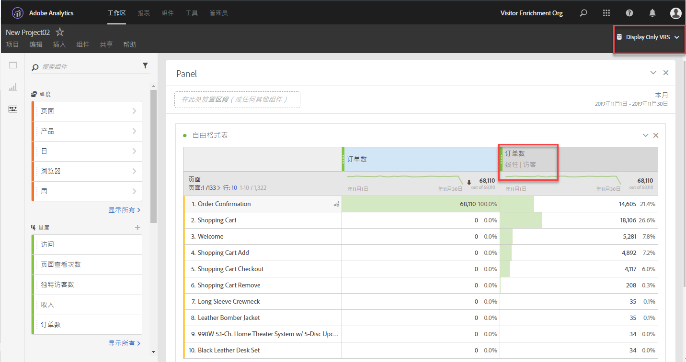

# 归因面板概述

>[!IMPORTANT] 归因面板适用于Adobe Analytics Ultimate、Prime、Select和Foundation SKU上的所有客户。

归因面板是一项归 [因IQ功能](../../attribution-iq.md) ，它允许您向自由格式表、可视化和计算量度中添加许多新类型的归因模型。 所有归因模型都有两个组成部分：

* **** 归因模型：该模型描述了对组中点击量的转换分布。 例如，首次触控或最后一次触摸。
* **** 归因回顾窗口：回顾窗口描述每个模型考虑的点击组。 例如，访问或访客。

## 归因模型

| UI图标 | 归因模型 | 定义 | 何时使用 |
| --- | --- | --- | --- |
|  | 最后接触 | 将100%的积分授予在转化之前最近发生的触点。 | 最基本、最常见的归因模型。 它通常用于转化，并且考虑周期短。 最后接触模型通常由管理搜索营销或分析内部搜索关键字的团队使用。 |
|  | 首次接触 | 将100%的积分授予在归因回顾窗口中首次看到的接触点。 | 另一个常用归因模型可用于分析旨在提升品牌知名度或客户赢取率的营销渠道。 展示广告或社交营销团队经常使用它，但它也非常适合评估现场产品推荐的有效性。 |
|  | 同一接触 | 对发生转化的点击给予100%信用。 如果在转化的同一点击中没有发生接触点，则它将存储在“无”下。 | 评估在转换时立即呈现的内容或用户体验时的有用模型。 产品或设计团队通常使用此模型来评估发生转化的页面的有效性。 |
|  | 线性 | 对于导致转化的每个接触点给予同等评价。 | 对于需要更频繁的客户参与、考虑周期较长或用户体验较长的客户转化非常有用。 团队经常使用它来评估移动应用程序通知有效性或基于订阅的产品。 |
|  | U 型 | 将40%的信用分配给第一次交互，将40%的信用分配给上次交互，将其余20%的信用分配给中间的任何接触点。 对于具有单一接触点的转化，将给予100%积分。 对于具有两个接触点的转化率，两者均获得50%的积分。 | 对于那些重视引入或关闭转化但仍希望识别辅助交互的交互的人来说，这是一个很好的模型。 U形归因通常由采用更平衡方法但希望对发现或关闭转化的渠道给予更多评价的团队使用。 |
|  | J 曲线 | 将60%的信用分配给上次交互，将20%的信用分配给第一次交互，将剩余20%的信用分配给中间的任何接触点。 对于具有单一接触点的转化，将给予100%积分。 对于具有两个接触点的转化，上次互动的信用为75%，第一次互动的信用为25%。 | 这种模式对于那些优先考虑寻找者和关闭者、但希望专注于结束互动的人来说很棒。 J-Shaved归因经常被采用更平衡方法并希望对关闭转化的渠道给予更多评价的团队所使用。 |
|  | 反 J 曲线 | 将60%的信用分配给第一个接触点，将20%的信用分配给最后一个接触点，将剩余20%的信用分配给中间的任何接触点。 对于具有单一接触点的转化，将给予100%积分。 对于具有两个接触点的转化，第一次交互将获得75%的信用，最后一次交互将获得25%的信用。 | 这种模式对于那些优先考虑寻找者和关闭者、但希望专注于寻找互动的人来说是理想的。 反向J归因由采用更平衡方法并希望为启动转化的渠道提供更多信用的团队使用。 |
|  | 自定义 | 允许您指定要给第一个接触点、最后一个接触点和中间的任何接触点赋予的粗细。 即使输入的自定义数字不加100，指定的值也会标准化为100%。 对于具有单一接触点的转化，将给予100%积分。 对于与两个接触点的交互，忽略中间参数。 然后将第一和最后接触点标准化为100%，并相应地分配信用。 | 该模型非常适合那些希望完全控制其归因模型并具有其他归因模型所不具备的特定需求的人。 |
|  | 时间衰减 | 使用自定义的半衰期参数（其中默认值为7天）后跟指数衰减。 每个渠道的权重取决于在触点启动和最终转换之间经过的时间量。 用于确定信用的公式 `2``(-t/halflife)`是，其 `t` 中是接触点与转化之间的时间量。 然后，所有接触点均标准化为100%。 | 非常适合定期运行视频广告或针对预定日期的活动进行营销的团队。 营销活动后发生转化的时间越长，给予的信用就越少。 |
|  | 参与率 | 为所有独特的接触点提供100%的积分。 与其他归因模型相比，转化总数被夸大。 参与会消除多次查看的重复渠道。 | 了解哪些客户经常接触到特定的交互。 媒体组织经常使用此模型来计算内容速度。 零售组织通常使用此模型来了解其网站的哪些部分对于转化至关重要。 |

## 回顾窗口

回顾窗口是转换应回顾以包含接触点的时间。 在查看不同回顾窗口时，能够给予首次交互更多评价的归因模型会发现更大的差异。

* **** 访问回顾窗口：回顾到发生转化的访问的开始。 访问回顾窗口很窄，因为除了访问之外，它们还不会。 访问回顾窗口与虚拟报告套件中修改的访问定义相关。
* **** 访客回顾窗口：查看直到当前日期范围的当月1日的所有访问。 访客回顾窗口很宽，因为他们可以跨多次访问。 例如，如果报表日期范围是9月15日- 9月30日，则访客回顾日期范围包括9月1日- 9月30日。

## 示例

请仔细研究下面的示例：

1. 9月15日，访客通过付费搜索广告到达您的网站，然后离开。
2. 9月18日，访客通过朋友提供的社交媒体链接再次访问您的网站。 他们将多个物品添加到购物车，但不购买任何物品。
3. 9月24日，您的营销团队向他们发送一封电子邮件，其中包含购物车中某些项目的优惠券。 他们会应用优惠券，但会访问其他几个站点，查看是否有其他优惠券可用。 他们通过展示广告找到另一个，然后最终以50美元的价格购买。

根据回顾窗口和归因模型，渠道会收到不同的信用。 以下是一些值得注意的示例：

* 使用 **首次触** 摸和访问回 **顾窗口**，归因仅查看第三次访问。 在电子邮件和展示广告之间，电子邮件是第一位，因此电子邮件在50美元的购买中获得100%的信用。
* 使用 **首次触** 摸和访客回 **顾窗口**，归因可查看所有三次访问。 付费搜索是第一个，因此它在50美元的购买中获得100%的信用。
* 使用 **线性** 、访问回 **顾窗口**，信用在电子邮件和显示之间进行划分。 这两个渠道均可获得25美元的积分。
* 使用 **线性****和访客回顾窗**&#x200B;口，信用在付费搜索、社交、电子邮件和展示广告之间划分。 每个渠道都会获得此购买的12.50美元积分。
* 使用 **J形** ，访客回 **顾窗口**，信用被分为付费搜索、社交、电子邮件和展示广告。
   * 60%的信用被授予展示，30美元。
   * 20%的积分被授予付费搜索，价格为10美元。
   * 其余的20%分为社交和电子邮件，每份提供5美元。
* 使用 **时间衰减** 、访客回 **顾窗口**，信用被分为付费搜索、社交、电子邮件和显示。 使用默认的7天半衰期：
   * 显示触摸点与转换之间的间隔为0天。 `2``(-0/7)` `= 1`
   * 电子邮件接触点与转化之间的间隔为0天。 `2``(-0/7)` `= 1`
   * 社交接触点与转化之间的6天间隔。 `2``(-6/7)` `= 0.552`
   * 付费搜索接触点与转化之间的9天间隔。 `2``(-9/7)` `= 0.41`
   * 将这些值标准化会导致以下结果：
      * 显示：33.8%,16.88美元
      * 电子邮件：33.8%获得16.88美元
      * 社交：18.6%,9.32美元
      * 付费搜索：13.8%,6.92美元

> [!TIP] 如果信用属于多个渠道，则其他转化事件（如订单或自定义事件）也会被分割。 例如，如果两个渠道使用线性归因模型贡献到自定义事件，则两个渠道将获得0.5个自定义事件。 这些事件分数在所有访问中相加，然后四舍五入到最接近的整数以进行报告。

## 将归因用于营销渠道

当营销渠道首次推出时，它们只提供了第一个和最后一个接触维度。 有了这些附加的归因模型，不再需要明确的首次接触／最后接触维度。 Adobe提供通用 **的营销渠道维度** ，以便与您选择的归因模型一起使用。 这些通用营销渠道维度的行为与上次接触渠道维度相同，但标签不同，以防止在使用具有不同归因模型的营销渠道时出现混淆。

由于营销渠道维度取决于传统的访问定义（由其处理规则定义），因此不能使用虚拟报表包更改其访问定义。

## 将归因与多值变量结合使用

Analytics中的某些维度在一次点击时可以包含多个值。 常见示例包括列表变量和产品变量。

当将归因应用于多值点击时，同一点击中的所有值都将获得相同的积分。 由于许多值可以接收此贷项，因此报表总数可能与每个单独行项目相加时不同。 报表总数将消除重复项，而每个维度值将获得适当的积分。

## 将归因与细分结合使用

归因始终在分段之前运行，分段在应用报告过滤器之前运行。 此概念也适用于使用区段的虚拟报表包。

例如，如果创建应用了“显示点击”区段的VRS，则可以使用一些归因模型在表中查看其他渠道。

