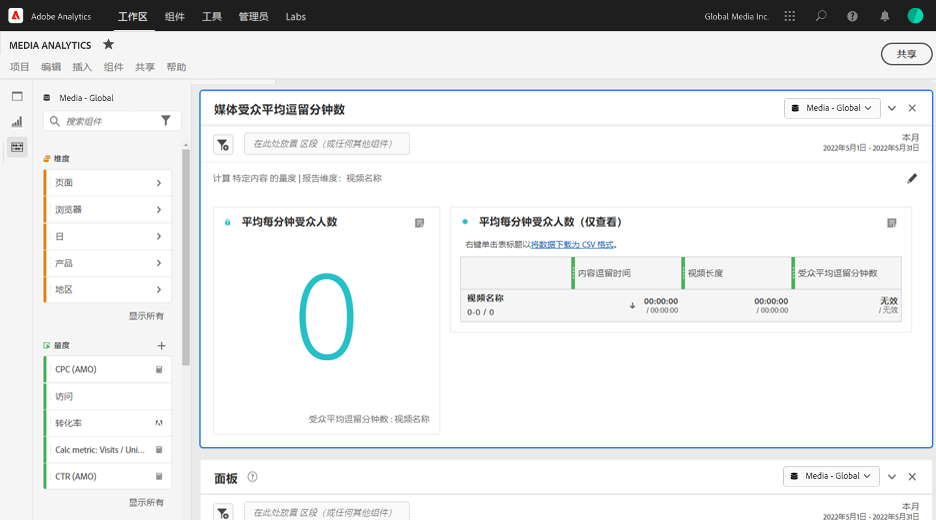
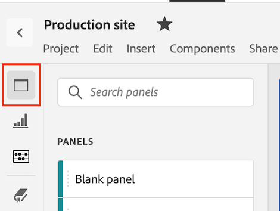
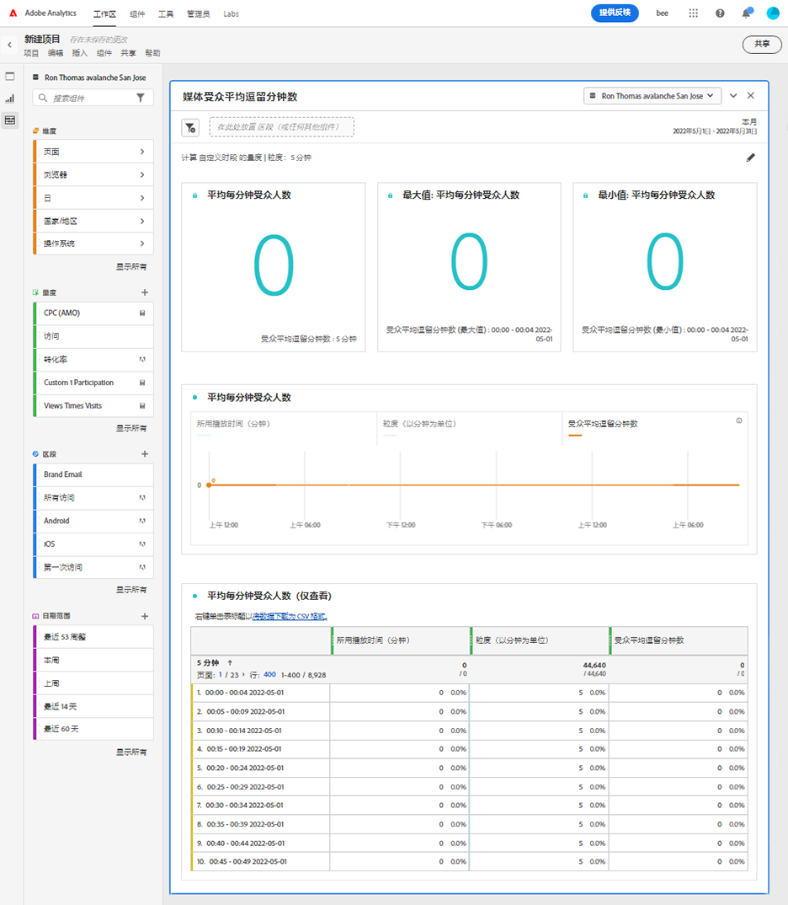

# “媒体平均受众访问分钟数”面板 {#media-average-minute-audience-panel}

<!-- markdownlint-disable MD034 -->

>[!CONTEXTUALHELP]
>id="workspace_mediaminuteaverageaudience_button"
>title="媒体平均受众访问分钟数"
>abstract="创建面板来分析特定内容或特定时间段内的平均受众访问分钟数。"

<!-- markdownlint-enable MD034 -->

<!-- markdownlint-disable MD034 -->

>[!CONTEXTUALHELP]
>id="workspace_mediaaverageminuteaudience_panel"
>title="媒体平均受众访问分钟数"
>abstract="显示特定媒体内容或自定义时间段内的性能。  **常规参数&#x200B;** **计算量度**：选择面板使用的量度。选择&#x200B;**特定内容**&#x200B;以根据内容长度分析特定内容或事件的平均受众访问分钟数。**选择自定义时间段**&#x200B;来分析平均受众访问分钟数在自定义选定时间段内的变化情况。 **报告维度**：选择按&#x200B;**内容 ID** 维度的&#x200B;**视频名称**&#x200B;进行报告。仅当您选择特定内容作为量度时可用。 **粒度**：选择报告的粒度。仅当您选择自定义时间段作为量度时可用。 **按以下条件筛选内容（可选）**：选择特定的节目、季、剧集，或选择自定义维度来筛选内容。  **高级设置&#x200B;** **表格设置**：选择是否在表格中显示计算值。 **逗留时间量度**：选择您想要用于特定内容计算的逗留时间量度。仅当您选择特定内容作为量度时可用。"

<!-- markdownlint-enable MD034 -->

>[!BEGINSHADEBOX]

_本文记录了_  _&#x200B;**Adobe Analytics**&#x200B;_&#x200B;中的“媒体平均受众访问分钟数”面板。 _查看本文的[&#128279;](https://experienceleague.adobe.com/zh-hans/docs/analytics-platform/using/cja-workspace/panels/average-minute-audience-panel)CustomerJourneyAnalytics_ 版本的&#x200B;_&#x200B;**媒体平均受众访问分钟数面板**。_

>[!ENDSHADEBOX]

>[!NOTE]
>
>**[!UICONTROL 媒体平均受众访问分钟数]**&#x200B;面板仅适用于已购买Adobe Analytics for Streaming Media加载项的客户。
>
>请联系您的 Adobe 销售代表或 Adobe 帐户团队以获取更多信息。
>

在 Analysis Workspace 中，平均受众访问分钟数可以提供以下信息

* 查看特定媒体流耗时除以内容持续时间，或
* 在选定粒度的自定义时间段内的查看耗时。

媒体平均受众访问分钟数面板可让您通过比较任意长度或类型的节目来了解内容的平均使用情况。例如，通过比较 30 分钟的情景喜剧和 3 小时的体育赛事，您可以了解平均使用情况。

此外，您还可以使用媒体平均受众访问分钟数面板将此数字平均受众访问分钟数与线性电视平均访问分钟数量度进行比较或附加到其上。

媒体平均受众访问分钟数面板与“平均受众访问分钟数”量度相比具有以下优势：

* 支持自定义时间段

* 允许在处理视图后更新持续时间分类（如果持续时间分类不存在或需要更正）

  如果在使用量度时进行此更新，则持续时间分类不存在（如果不存在分类）。或者持续时间分类已过期（如果分类存在但不正确）。

## 使用

要使用&#x200B;**[!UICONTROL 媒体平均受众访问分钟数]**&#x200B;面板：

1. 创建&#x200B;**[!UICONTROL 媒体平均受众访问分钟数]**&#x200B;面板。有关如何创建面板的信息，请参阅[创建面板](panels.md#create-a-panel)。

1. 确保为面板选择数据视图，该面板具有从Adobe Analytics for Streaming Media加载项配置的组件。

1. 指定面板的[输入](#panel-input)。

1. 观察面板的[输出](#panel-output)。

### 面板输入

使用本节中描述的输入设置来配置媒体平均受众访问分钟数面板。

1. 配置以下输入设置：

   | 设置 | 描述 |
   |---------|------------|
   | **面板日期范围** | 面板日期范围的默认值为&#x200B;[!UICONTROL **本月**]。您可以对其进行编辑以一次查看一天或几个月的数据。  这个可视化图表最多可显示 1440 行数据（例如，以分钟级别的粒度划分 24 小时）。如果日期范围和粒度的组合产生的行数超过了 1440 行，则将自动更新粒度以适应完整的日期范围。 |
   | [!UICONTROL **将某个区段（或任何其他组件）放置到此处**] | 如同其他面板一样，此设置根据您已创建的区段过滤您的选择。此设置是查看特定平台、直播或其他常见媒体区段的一个好方法。 |
   | [!UICONTROL **计算此项的量度**] | 选择是否要了解[**[!UICONTROL 特定内容]**](#specific-content)的平均受众访问分钟数。或者如果您想了解[**[!UICONTROL 自定义时间段]**](#custom-time-period)的平均受众访问分钟数。  选择&#x200B;[!UICONTROL **自定义时间段**]： <ul><li>如果持续时间不可用，或者 </li><li>如果您想查看包含多条内容时间序列的平均受众访问分钟数，或者</li><li>没有指定特定持续时间内容（如在直播或活动期间）的平均受众访问分钟数</li></ul></li></li></ul> 
此设置更改工作流程和报告输出。
 |

1. 继续[特定内容](#specific-content)或[自定义时间段](#custom-time-period)，具体取决于您在&#x200B;[!UICONTROL **计算量度**]&#x200B;下拉列表中选择的选项。

#### 特定内容

1. 如果您在[配置面板输入](#panel-inputs)时在&#x200B;[!UICONTROL **计算量度**]&#x200B;下拉菜单中选择了&#x200B;[!UICONTROL **特定内容**]，请指定以下配置选项：

   | 设置 | 描述 |
   |---------|------------|
   | [!UICONTROL **报告维度**] | 当选择特定内容时，可选择报告输出以使用视频名称或内容 ID 字段显示内容及其相关联的平均受众访问分钟数。 |
   | [!UICONTROL **过滤内容的依据（可选）**] | 可根据所需的查看方式或数据的结构化方式选择如何过滤特定内容。 <ul>[!UICONTROL **节目、季、集**]：将在下拉菜单中显示您可用的节目，从中可使用搜索（或通过从左列拖放节目名称）进行过滤。可在这里结束选择以查看您的各季节目，也可按个别的季过滤，然后按个别的集过滤。此设置显示这些节目、季和集在所选时间段的数据。</li><li>[!UICONTROL **自定义维度**]：如果您的节目名称在自定义维度下，则通过在该维度（可选）下拉菜单中搜索或通过使用左列搜索即可找到它。该维度项根据该选择自动填充，并被视为一集。</li><li>[!UICONTROL **无**]：显示在所选时间段上有平均受众访问分钟数数据的所有视频名称。（此选项默认为选中）。</li></ul> |

1. 继续[特定内容高级设置](#specific-content-advanced-settings)来配置高级设置。

#### 特定内容高级设置

1. 如果在&#x200B;[!UICONTROL **计算量度**]&#x200B;下拉菜单中选择了&#x200B;[!UICONTROL **特定内容**]，请选择&#x200B;[!UICONTROL **显示高级设置**]，然后指定以下配置选项：

   | 选项 | 描述 |
   |---------|------------|
   | **[!UICONTROL 表格设置]** | 默认选项&#x200B;**[!UICONTROL 在表格中显示计算的值]**，其中显示平均受众访问分钟数的分子和分母作为表中的前几列。取消选择此选项将移除这两列。平均受众访问分钟数列仍保留在表中视频名称或内容 ID 的旁边。 |
   | **[!UICONTROL 逗留时间量度]** | 您可以选择默认&#x200B;**[!UICONTROL 内容逗留时间]**&#x200B;选项，其中仅包括内容时间。或者您可以选择使用&#x200B;**[!UICONTROL 媒体逗留时间]**，它将内容和广告时间一起作为平均受众访问分钟数的分子计算。 |

1. 选择&#x200B;[!UICONTROL **生成**]&#x200B;以完成媒体平均受众访问分钟数面板的创建。

1. 继续[面板输出](#panel-output)，了解有关如何使用媒体平均受众访问分钟数面板的信息。

#### 自定义时段

1. 如果您在[配置面板输入](#panel-inputs)时在&#x200B;[!UICONTROL **计算量度**]&#x200B;下拉菜单中选择了&#x200B;[!UICONTROL **自定义时间段**]，请指定以下配置选项：

   | 选项 | 描述 |
   |---------|------------|
   | **[!UICONTROL 粒度]** | 默认粒度为 [!UICONTROL **5 分钟**]，但可选择任何粒度作为选定时间段内时间序列的分母。例如，选择下午12:00点到下午12:30点，粒度为5分钟，将返回这整个半小时的平均受众访问分钟数，以及每5分钟时段的平均受众访问分钟数，共6行。 这些行用作时间序列图的数据点。 |
   | [!UICONTROL **过滤内容的依据（可选）**] | 可根据所需的查看方式或数据的结构化方式选择如何过滤特定内容。 <ul>[!UICONTROL **节目、季、集**]：将在下拉菜单中显示您可用的节目，从中可使用搜索（或通过从左列拖放节目名称）进行过滤。可在这里结束选择以查看您的各季节目，也可按个别的季过滤，然后按个别的集过滤。此设置显示这些节目、季和集在所选时间段的数据。</li><li>[!UICONTROL **自定义维度**]：如果您的节目名称在自定义维度下，则通过在该维度（可选）下拉菜单中搜索或通过使用左列搜索即可找到它。该维度项根据该选择自动填充，并被视为一集。</li><li>[!UICONTROL **无**]：显示在所选时间段上有平均受众访问分钟数数据的所有视频名称。（此选项默认为选中）。</li></ul> |

1. 继续[自定义时间段高级设置](#custom-time-period-advanced-settings)来配置高级设置。

#### 自定义时段高级设置

1. 如果在&#x200B;[!UICONTROL **计算量度**]&#x200B;下拉菜单中选择了&#x200B;[!UICONTROL **自定义时间段**]，请选择&#x200B;[!UICONTROL **显示高级设置**]，然后指定以下配置选项：

   | 选项 | 描述 |
   |---------|------------|
   | **[!UICONTROL 表格设置]** | 默认设置在表格中显示计算的值，其中显示平均受众访问分钟数的分子和分母作为表中的前几列。取消选择此选项将删除这两列，这样在时间段旁仅留下平均受众访问分钟数。 |

1. 选择&#x200B;[!UICONTROL **生成**]&#x200B;以完成媒体平均受众访问分钟数面板的创建。

1. 继续[面板输出](#panel-output)，了解有关如何使用媒体平均受众访问分钟数面板的信息。

### 面板输出

面板输出会有所不同，具体取决于您在[配置面板输入](#panel-inputs)时在&#x200B;[!UICONTROL **计算量度**]&#x200B;下拉菜单中选择了&#x200B;[!UICONTROL **特定内容**]&#x200B;还是&#x200B;[!UICONTROL **自定义时间段**]。

#### 特定内容

媒体平均受众访问分钟数面板返回以下各项：

* 您整个所选时段的总平均受众访问分钟数
* 在表中显示的过滤器和个别视频的平均受众访问分钟数
* 如果选择了高级设置，则返回逗留时间和视频长度（持续时间）

任何时候要编辑和重建面板，请选择右上角的。

#### 特定内容数据源

媒体平均受众访问分钟数面板仅使用平均受众访问分钟数量度来收集数据。面板中不能使用细分或其他量度。

| 量度 | 描述 |
|--------|-------------|
| **[!UICONTROL 平均受众访问分钟数]** | 查看您的媒体流的逗留时间除以通过“分类”提供的视频长度（持续时间）。 |

#### 自定义时段 {#custom-time-period-output}

媒体平均受众访问分钟数面板返回以下各项：

* 您整个所选时间段的总平均受众访问分钟数

* 最高和最低平均受众访问分钟数

* 线序列图显示了整个所选时间段的平均受众访问分钟数。

* 表格显示过滤器以及各粒度的平均受众访问分钟数，还显示每个时间段的内容逗留时间和粒度

  仅当选择了高级设置下的&#x200B;[!UICONTROL **在表中显示计算值**]&#x200B;选项时，才会显示此表。

任何时候要编辑和重建面板，请选择右上角的。

#### 自定义时间段数据源

媒体平均受众访问分钟数面板仅使用平均受众访问分钟数量度来收集数据。面板中不能使用细分或其他量度。

| 量度 | 描述 |
|---|---|
| **[!UICONTROL 平均受众访问分钟数]** | 查看您的媒体流的逗留时间除以所选总时段或所选粒度（分钟）。 |

>[!MORELIKETHIS]
>
> [Create a panel](/help/analyze/analysis-workspace/c-panels/panels.md#create-a-panel)
> &#x200B;> [媒体并行查看者面板](media-concurrent-viewers.md)
> &#x200B;> [媒体播放耗时面板](media-playback-time-spent.md)
>

<!--

# Media average minute audience panel

>[!NOTE]
>
>The Media average minute audience panel is available only to customers who have purchased the Streaming Media Collection Add-on. 
>
>Contact your Adobe Sales Representative or Adobe Account Team to purchase the Streaming Media Collection Add-on. 

In Analysis Workspace, average minute audience is the time spent viewing your media stream divided by the duration of the content or the total selection of the period and selected granularity.

The Media average minute audience panel enables you to better understand average consumption of your content by comparing programs of any length or genre. For example, you can understand average consumption when comparing a 30-minute sitcom with a 3-hour sporting event.

In addition, you can use the Media average minute audience panel to compare or append this digital average minute audience to linear TV average minute metrics. 

The Media average minute audience panel provides the following benefits over the Average Minute Audience metric:

* Supports custom time periods

* Allows for updating the duration classification after views are processed (if it was not present or if it needs to be corrected)

  If you did this when using the metric, it either won't exist (if the classification wasn't present) or it will be out of date (if the classification was present but incorrect).

## Access the Media average minute audience panel

1. In Analysis Workspace, go to a report suite that has streaming media components enabled. 

1. In the left nav, select the **Panels** icon.

   

1. Drag the [!UICONTROL **Media average minute audience**] panel onto the canvas in Analysis Workspace.

1. To configure the panel, continue with [Panel inputs](#panel-inputs).

## Panel inputs {#Input}

Use the input settings described in this section to configure the Media average minute audience panel.

1. Begin creating a Media average minute audience panel, as described in [Access the Media average minute audience panel](#access-the-media-average-minute-audience-panel).

1. Configure the following input settings:

   | Setting | Description |
   |---------|------------|
   | **Panel date range** | The panel date range default is [!UICONTROL **This month**]. You can edit it to view a single day or many months at a time.    This visualization is limited to 1440 rows of data (for example, 24-hours at minute-level granularity). If a date range and granularity combination results in more than 1440 rows, the granularity is automatically updated to accommodate the full date range. |
   | [!UICONTROL **Drop a segment here (or any other component)**] | Like other panels, this setting filters your selections based on segments you've created. This is a great way to look at specific platforms, live streams, or other common media segments. |
   | [!UICONTROL **Calculate metric for**] | Choose whether you want to see the average minute audience for a specific piece of content, or if you want to see the average minute audience for a custom period of time:<ul><li>**Specific content:** This is available only if the duration has been updated using Classifications. If the duration is unavailable, or if you want to view the average minute audience for a time series with multiple pieces of content or content without a specific assigned duration (like during a live stream or event), then you should select [!UICONTROL **Custom time period**]. (Durations can be set using Classifications either before or after processing time.)</li><li>**Custom time period:** This is available regardless of whether the durations is made available using Classifications.</li></ul> 
This setting changes the workflow and report output.
  |

1. Continue with [Specific content](#specific-content) or [Custom time period](#custom-time-period), depending on the option you chose in the [!UICONTROL **Calculate metric for**] drop-down menu.

### Specific content

1. If you selected [!UICONTROL **Specific content**] in the [!UICONTROL **Calculate metric for**] drop-down menu when [configuring panel inputs](#panel-inputs), specify the following configuration options:

   | Setting | Description |
   |---------|------------|
   | [!UICONTROL **Reporting dimension**] | When you choose specific content, you can select the report output to use either the video name or content ID fields to show the content and its associated average minute audience for the time period selected. |
   | [!UICONTROL **Filter content by (optional)**] | Choose how to filter the specific content, depending on the view you want or the way your data is structured. <ul>[!UICONTROL **Show, season, episode**]: Displays your available shows in the drop-down, which you can filter using a search (or by dragging and dropping the show name from the left column). You can end your selection there to see all the seasons of your show, or you can filter by individual seasons and then by individual episodes. This setting shows the data for those shows, seasons, or episodes for the selected time period.</li><li>[!UICONTROL **Custom dimension**]: If your show name is under a custom dimension, you can find it either by searching in the dimension (optional) drop down or by using the left column search. The dimension item automatically populates based on that selection and is treated as an episode.</li><li>[!UICONTROL **None**]: Shows all the video names that have average minute audience data for the selection you've chosen. (This options is selected by default.)</li></ul>  |

1. Continue with [Specific content advanced settings](#specific-content-advanced-settings) to configure advanced settings. 

### Specific content advanced settings

1. With [!UICONTROL **Specific content**] selected in the [!UICONTROL **Calculate metric for**] drop-down menu, select [!UICONTROL **Show advanced settings**], then specify the following configuration options:

   | Setting | Description |
   |---------|------------|
   | Table settings | The default setting shows the calculation values in the table, which shows the numerator and denominator of the average minute audience as the preceding columns in the table. Deselecting this option removes those two columns, leaving only the average minute audience next to the video name or content ID. |
   | Time spent metric | You can choose the default content time spent, which includes only content time, or you can choose to use the media time spent, which includes content and ad time together as the numerator calculation for the average minute audience. |

1. Select [!UICONTROL **Build**] to finish creating the Media average minute audience panel.

1. Continue with [Panel output](#panel-output) for information about how to use the Media average minute audience panel.

### Custom time period

1. If you selected [!UICONTROL **Custom time period**] in the [!UICONTROL **Calculate metric for**] drop-down menu when [configuring panel inputs](#panel-inputs), specify the following configuration options:

   | Setting | Description |
   |---------|------------|
   | Granularity | The default granularity is [!UICONTROL **5-Minute**], but you can choose any of the granularities that are used as the denominator for the time series within your overall time period selection made in the calendar selection. For example, selecting 12:00 pm to 12:30 pm with a 5-minute granularity returns the average minute audience over the full half hour as well as six rows with the average minute audience for each 5-minute period. These rows are used as the datapoints for the time series chart. |
   | [!UICONTROL **Filter content by (optional)**] | Choose how to filter the specific content, depending on the view you want or the way your data is structured. <ul>[!UICONTROL **Show, season, episode**]: Displays your available shows in the drop-down, which you can filter using a search (or by dragging and dropping the show name from the left column). You can end your selection there to see all the seasons of your show, or you can filter by individual seasons and then by individual episodes. This setting shows the data for those shows, seasons, or episodes for the selected time period.</li><li>[!UICONTROL **Custom dimension**]: If your show name is under a custom dimension, you can find it either by searching in the dimension (optional) drop down or by using the left column search. The dimension item automatically populates based on that selection and is treated as an episode.</li><li>[!UICONTROL **None**]: Shows all the video names that have average minute audience data for the selection you've chosen. (This options is selected by default.)</li></ul>  |

1. Continue with [Custom time period advanced settings](#custom-time-period-advanced-settings) to configure advanced settings. 

### Custom time period advanced settings

1. With [!UICONTROL **Custom time period**] selected in the [!UICONTROL **Calculate metric for**] drop-down menu, select [!UICONTROL **Show advanced settings**], then specify the following configuration option:

   | Setting | Description |
   |---------|------------|
   | Table settings | The default setting displays the calculation values in the table, which displays the numerator and denominator of the average minute audience as the preceding columns in the table. Deselecting this option removes those two columns leaving only the average minute audience next to the time period. |

1. Select [!UICONTROL **Build**] to finish creating the Media average minute audience panel.

1. Continue with [Panel output](#panel-output) for information about how to use the Media average minute audience panel.

## Panel output

The panel output differs depending on whether you chose [!UICONTROL **Specific content**] or [!UICONTROL **Custom time period**] in the [!UICONTROL **Calculate metric for**] drop-down menu when [configuring panel inputs](#panel-inputs).

### Specific content

The Media average minute audience panel returns the following:

* Total average minute audience for your entire selection
* Filters and average minute audience for the individual videos displayed in a table 
* Content time spent and video length (duration) if that advanced setting was selected

To edit and rebuild the panel at any time, select the Edit (pencil) icon in the top right.

### Specific content data source

The Media average minute audience panel uses only the Average Minute Audience metric to gather data. Breakdowns or other metrics cannot be used in the panel.

| Metric | Description |
|--------|-------------|
| Average Minute Audience | The time spent viewing your media stream divided by the video length (duration) supplied via Classifications. |

### Custom time period {#custom-time-period-output}

The Media average minute audience panel returns the following:

* The total average minute audience for your entire selection

* The maximum and minimum average minute audience

* The line series graph showing the average minute audience over the entire selection.

* A table that shows the filters and average minute audience for the granularities, as well as the content time spent and granularity for each time period 

  This table displays only if the option under advanced settings called [!UICONTROL **Show calculation values in table**] is selected.

To edit and rebuild the panel at any time, select the Edit (pencil) icon in the top right.

### Custom time period data source

The Media average minute audience panel uses only the Average Minute Audience metric to gather data. Breakdowns or other metrics cannot be used in the panel.

|Metric|Description|
|---|---|
|Average Minute Audience| The time spent viewing your media stream divided by the total selection or selected granularity in minutes.|

-->