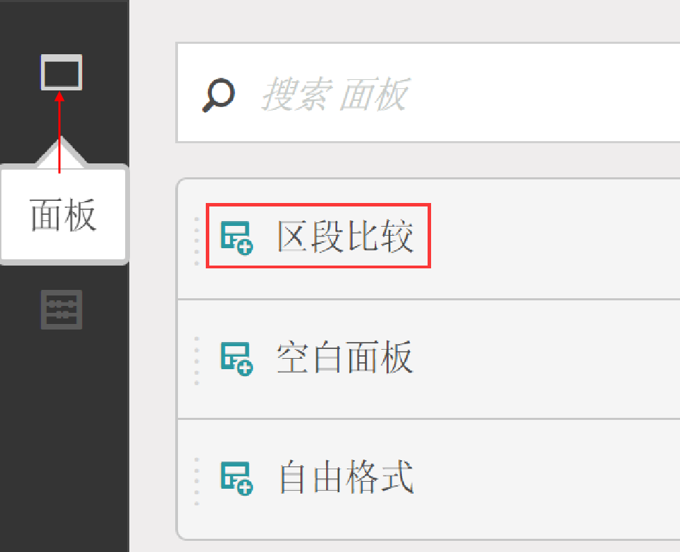
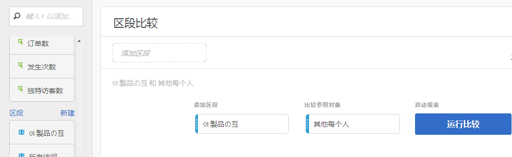
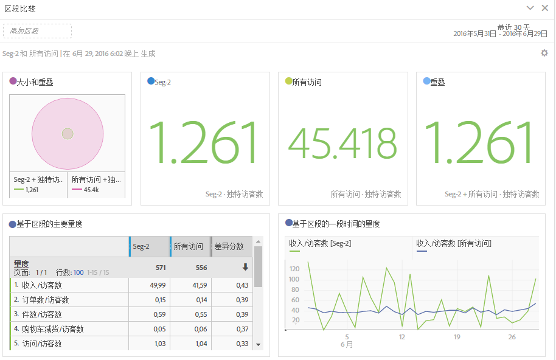
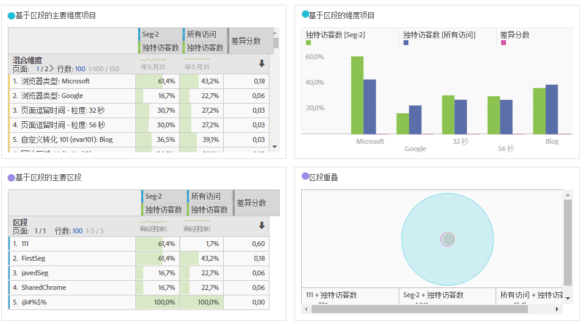
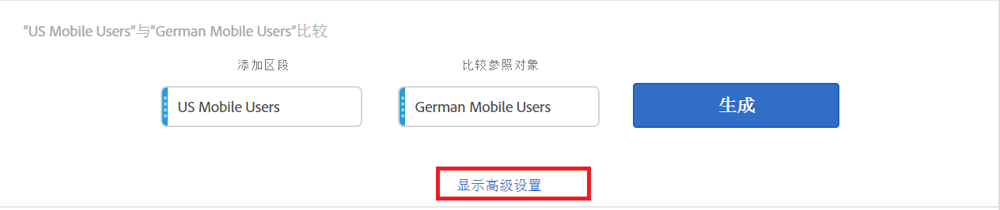
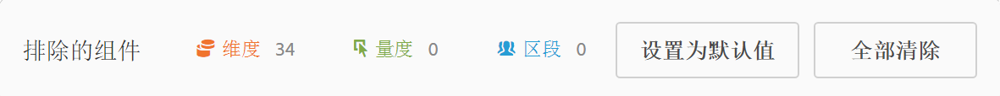
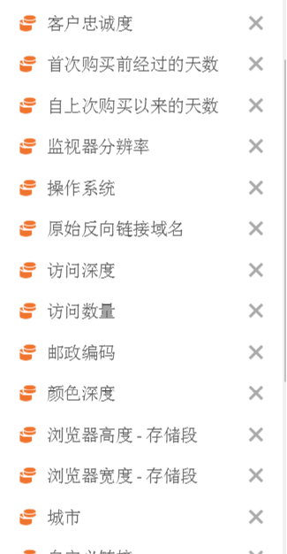

# 比较区段

说明如何在 Analysis Workspace 中比较区段。

>[!NOTE]
>
>You can also compare segments within a [fallout analysis](../../../../analyze/analysis-workspace/visualizations/fallout/compare-segments-fallout.md#section_E0B761A69B1545908B52E05379277B56).

## Compare segments {#section_8F2BFC45131C49B4A2E08A063CD7A91F}

1. Navigate to **[!UICONTROL Analytics]** &gt; **[!UICONTROL Workspace]** and open a project.

1. 从左侧的&#x200B;**[!UICONTROL 面板]**&#x200B;边栏中，选择&#x200B;**区段比较]，并将其拖到新项目或现有项目中。[!UICONTROL **

   

1. 确保已正确设置比较日期范围。
1. 选择要比较的区段，然后将它们拖到面板中。例如，假定您有一个“Super Shoppers”区段。

   

   在将区段拖到面板后，Analytics 会自动创建一个&#x200B;**[!UICONTROL 其他每个人]区段，该区段包含未在所选区段中的每个人，在此示例中为所有“Non Super Shoppers”。**&#x200B;这使您无需再另行创建此区段。“其他每个人”将自动添加到面板的&#x200B;**[!UICONTROL 比较参照对象]字段中。**&#x200B;您可以随时删除此区段，并将“Super Shopper”与任何其他选定区段进行比较。

   

1. 单击&#x200B;**[!UICONTROL 显示高级选项]以从区段比较分析中排除组件（维度、量度或区段）。**&#x200B;有关更多信息，请参阅[从比较中排除组件](../../../../analyze/analysis-workspace/c-panels/c-segment-comparison/compare-segments.md#section_5E98FFA0744140C08D83700E3F025937)。

1. After you've selected the right "Compare Against" segment, click **[!UICONTROL Build]**.

   此操作将启动一个后端进程，它会检查每个维度、量度和其他区段，找出两个区段之间统计上的差异。在该工具的顶部，我们将显示一个进度条，用来指示还剩多少时间才能扫描完每个量度和维度并找到重要差异。此外，我们还会对要首先运行的最常用量度、维度和区段设定优先顺序，以便我们可以尽可能快速地提供最相关的结果。

   在后端进程完成其扫描后，您将看到多个新的可视内容：

   

   

1. 通过查看[新的可视化、表格和概要](../../../../analyze/analysis-workspace/c-panels/c-segment-comparison/segment-comparison.md#concept_74FAC1C6D0204F9190A110B0D9005793)，解读区段比较的结果。

## Exclude components from comparison {#section_5E98FFA0744140C08D83700E3F025937}

有时，您可能希望从区段比较中排除一些维度、量度或区段。例如，假设您想将“美国移动设备用户”区段与“德国移动设备用户”区段进行比较。在这种情况下，包含任何与地理相关的维度都是没有意义的，因为这两个区段显然已在地理位置上体现了差异。为此，您可以排除无关的维度。以下是具体操作方法：

1. 在您把要比较的区段拖至面板后，单击&#x200B;**[!UICONTROL 显示高级选项]，以便从区段比较分析中排除一些组件（维度、量度或区段）。**

   

1. 把任何位置上需要排除的组件拖放到&#x200B;**[!UICONTROL 排除的组件]面板。**（您可以将此视为一个“黑名单”，其中包含了要排除的组件。）您可以将这些组件设置为默认值，或选择&#x200B;**[!UICONTROL 全部清除]以重新开始。**

   

1. 单击&#x200B;**[!UICONTROL 设置为默认值]**&#x200B;可从&#x200B;**所有**&#x200B;区段比较中排除这些组件。

1. 如果您需要修订排除的组件列表，只需双击相应的组件，例如“维度”，系统便会显示排除的维度列表：

   

1. Just delete any unwanted dimensions by clicking the x next to them, then save the list by clicking **[!UICONTROL Set as Default]**.

