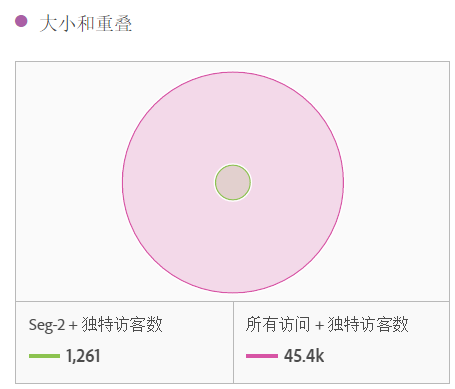
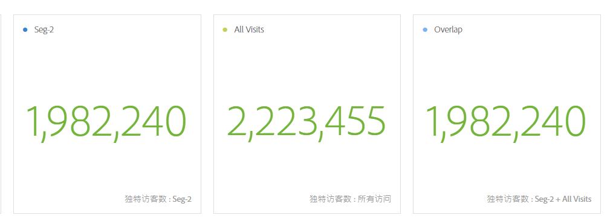
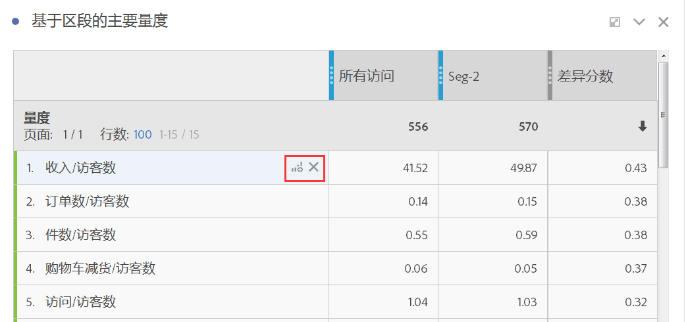
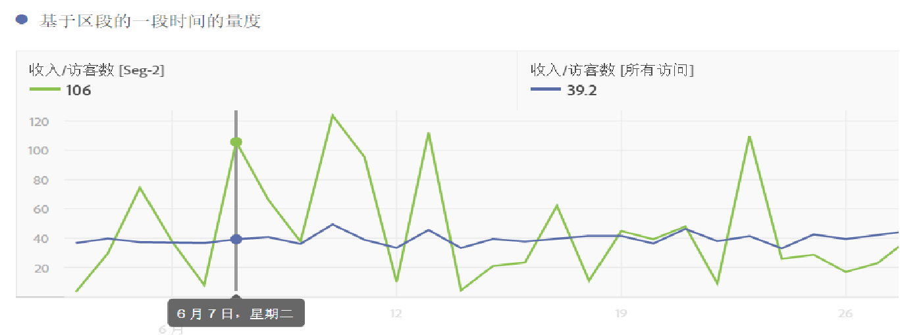
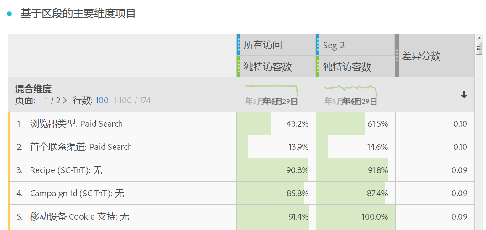
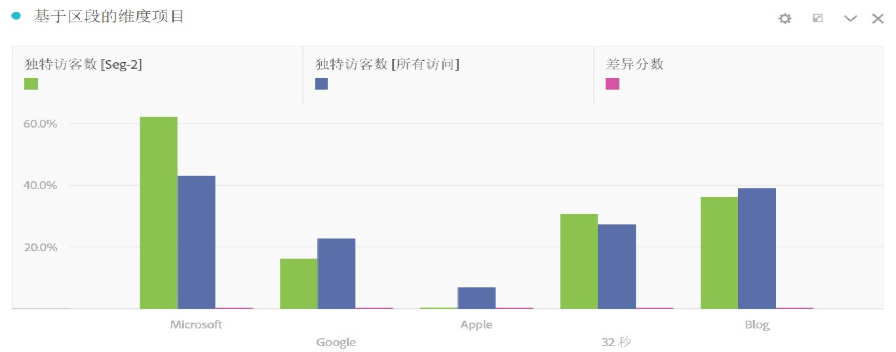
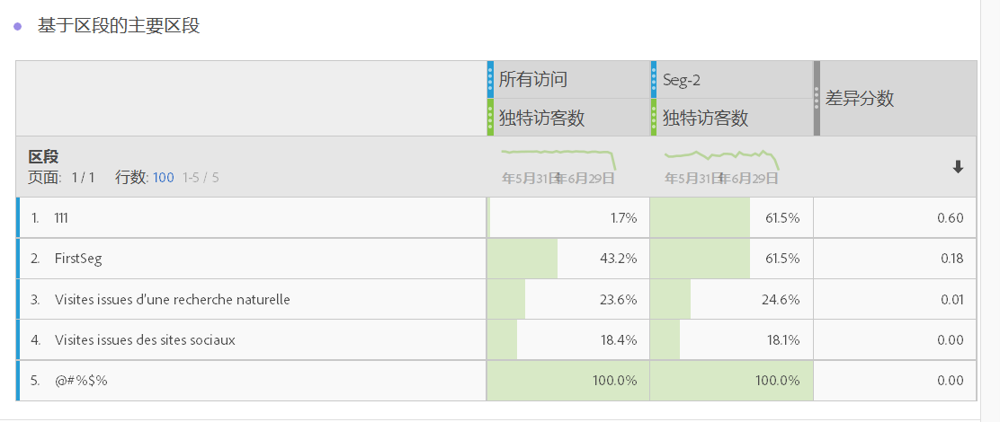
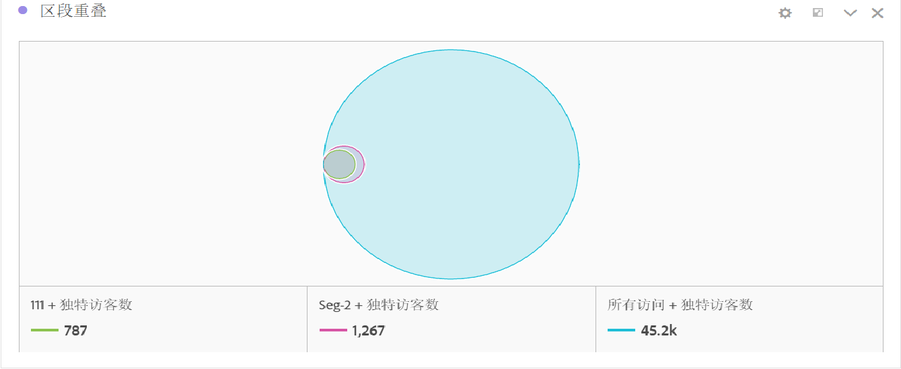

# 细分IQ概述

区段比较（区段 IQ）工具通过自动分析您有权访问的每个量度和维度，可发现无限数量区段之间的最显著统计学差异。它会自动找出受众区段中可提升公司 KPI 的关键特征，并让您了解任意区段的重叠程度。

分析人员可能需要花费几个小时乃至几天时间，在各种公司量度和维度中搜索区段之间的相关差异。这种分析不仅乏味、耗时，而且无法确保不会错过对某个区段的关键差异分析，而错过的这个区段很可能会对目标营销产生重大影响。

[YouTube上的细分比较](https://www.youtube.com/watch?v=fO3PNB93U_w&list=PL2tCx83mn7GuNnQdYGOtlyCu0V5mEZ8sS&index=38) (4：46)

以下是区段比较工具中引入的一些重要的新概念、可视化和表格：

## “Everyone else” segment {#section_30AEE8181E5D46D9AB27F7CA3815D0CD}

为方便起见，我们添加了“所有人”细分，因此您无需手动创建。例如，赢取购买者受众。您不必创建非购买者细分，因为它已经包含在“所有其他人”细分中，如果您希望添加其他区段以进行比较，则可以快速删除。

## Size and overlap {#section_885A71EE458C43189A77B8F552CA346A}

“大小和重叠”可视化显示每个选定区段的相对大小以及这些区段相互之间的重叠程度。您可以将光标悬停在该可视化上，查看每个重叠区域或非重叠区域有多少访客。此外，还可以右键单击重叠以创建全新的区段，以供将来分析之用。如果两个区段不重叠(例如使用“所有人”区段)，您还会看到反映在此可视化中。

## Population summaries {#section_21F2B66C60184A71B89E2982A6FB945D}

在“大小和重叠”可视化的右侧，区段比较工具显示每个区段中的独特访客总数和发生重叠的人数。

## Top metrics {#section_E4A38516424949B79A559DC8793071F2}

>[!NOTE]
>
>在区段比较完成后应用的行项目不会收到差值得分；此表只加载正在比较的两个区段的量度数据

热门量度表显示选定的两个区段之间在统计学上差异最大的量度。此表格中的每一行分别代表一个存在差异的量度，按量度在每个区段中的差异程度排名。量度还会按访客显示，这意味着如果“访问次数”出现在表格中，表格中的相应数字表示每个区段中每个访客的平均访问次数。我们还提供了差异分数，用来指示此量度在这两个区段之间的差异程度。1 分表示存在非常大的统计差异，0 分表示没有统计差异。

有关如何计算每个表的差异分数的详细信息，请参阅 [区段比较中使用的统计测试](../../../../analyze/analysis-workspace/c-panels/c-segment-comparison/statistical-test.md#concept_0B6AC754EAED460283D4626983F838F4).

热门量度表与在 Analysis Workspace 中使用的任何其他表类似。您可以将感兴趣的任何量度拖到表中，然后我们将向您展示该量度的不同之处。

您可以根据需要自定义此表。我们还在表的每一行中添加了一个新的“创建可视化”图标。如果您不想使热门量度表变得杂乱无章，并希望在新表中继续进行更深入的分析，单击此图标可在区段比较工具的上方创建一个全新的表和可视化。对于不相关的量度，可以单击“X”将其从表中完全删除。最后，就像其他自由格式表一样，如果您要查看五行（默认）以上的项目，可以对显示的量度列表进行分页，或显示前 10 个、20 个、50 个等。

量度表的右侧是关联的可视化。默认情况下，区段比较工具将为每个区段显示表中的热门量度在过去 30 天的趋势。如果您希望显示热门量度表中的其他量度，只需通过单击将其选中，右侧的可视化即会更新为显示所选的量度。

## Top dimension items {#section_439C1782B153427CB4FB85E177146EC0}

>[!NOTE]
>
>在区段比较完成后应用的行项目不会收到差值得分；此表只加载正在比较的两个区段的量度数据

与热门量度表类似，区段比较工具提供了一个主要维度项目表，用来说明所有维度中差异最大的维度项目。每一行通过每个区段的百分比来展示此维度项目。

例如，如果比较“区段 A”和“区段 B”，主要维度项目表可能会显示“区段 A”中 100% 的访客具有维度项目“浏览器类型：Google”，而“区段 B”中只有 19.6% 的访客具有此维度项目。

在主要维度项目表右侧，区段比较工具突出显示选定的主要维度项目以及该维度中进行比较的其他主要维度项目：

## Top segments table {#section_6A0C39F930564240AF7A157005C7A80B}

>[!NOTE]
>
>在区段比较完成后应用的行项目不会收到差值得分；此表只加载正在比较的两个区段的量度数据

排名最前的区段表非常有用，可显示哪些区段（选择进行比较的两个区段以外的区段）在与两个选定区段之间的重叠上存在极大差异。例如，在比较区段 A 和区段 B 时，排名最前的区段表可能会显示第三个区段“Repeat Visitors”与区段 A 高度重叠，但与区段 B 不重叠。

此外，还会在表右侧的重叠可视化中显示其他差异最大的区段：

重叠可视化以图形方式表示所有三个区段在重叠方面的差异，而且与其他关联的可视化一样，单击表中的每个其他区段将更新可视化以与选定的区段相对应。

单击此处可了解有关比较区段时使用的[统计测试](../../../../analyze/analysis-workspace/c-panels/c-segment-comparison/statistical-test.md#concept_0B6AC754EAED460283D4626983F838F4)的更多信息。
